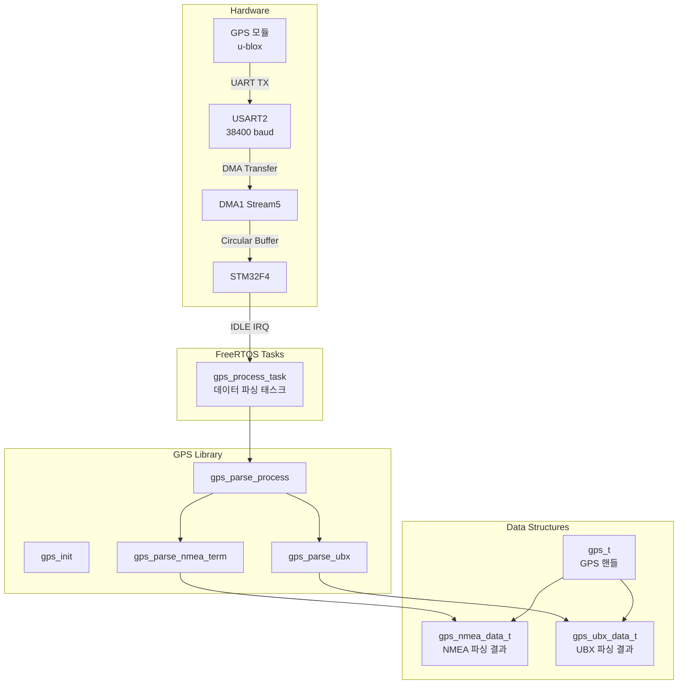
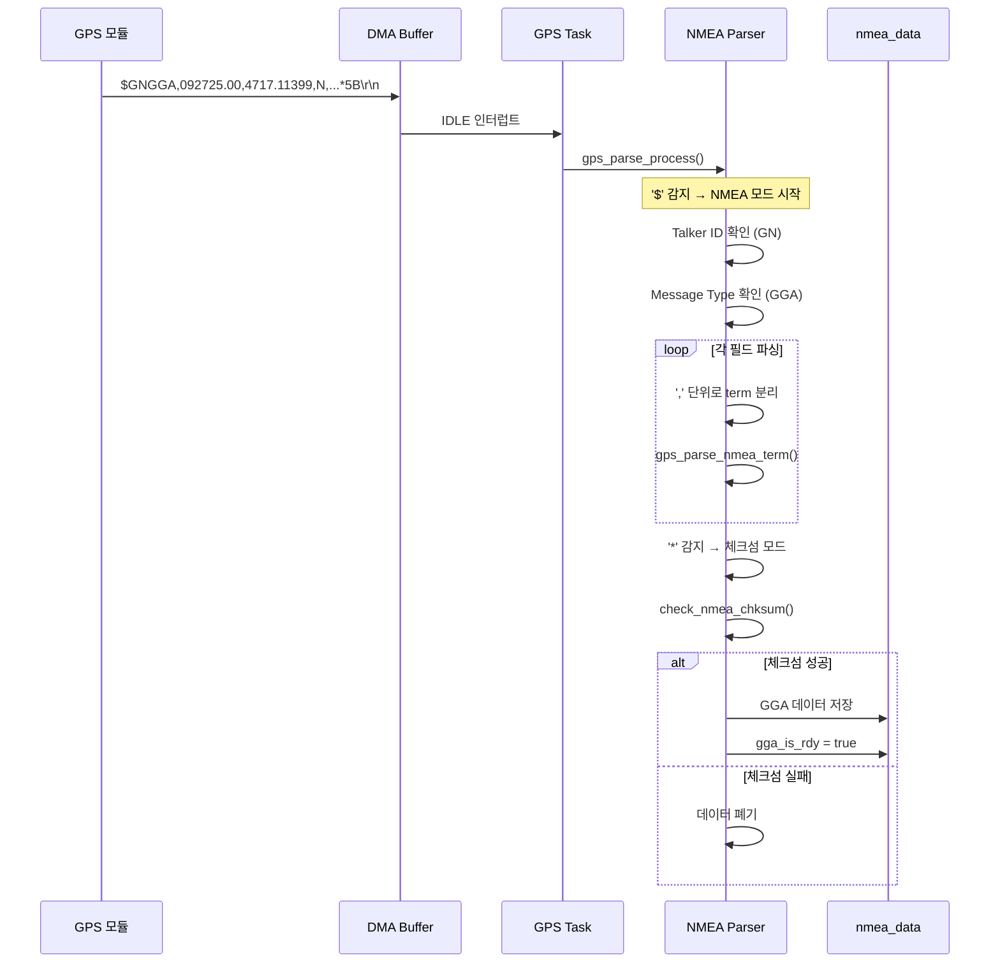
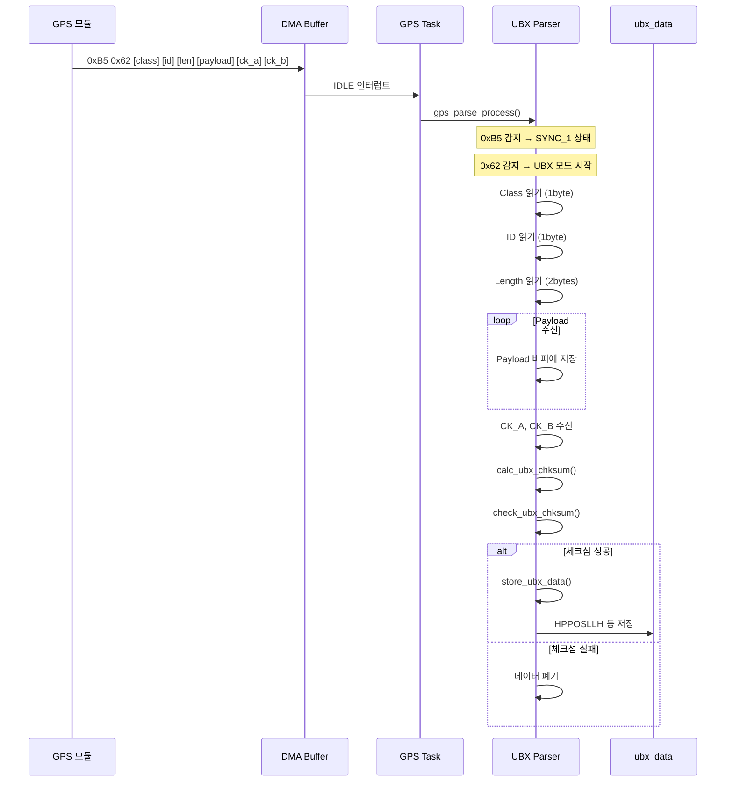
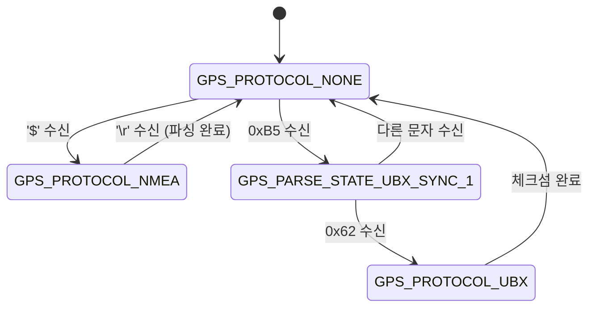
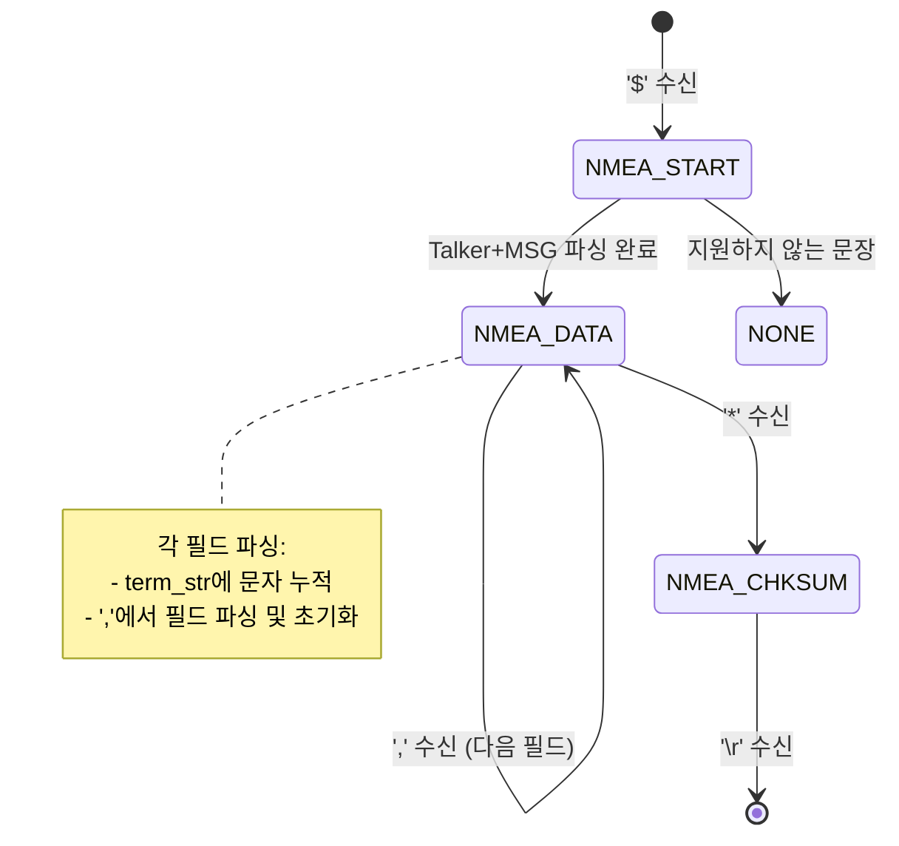
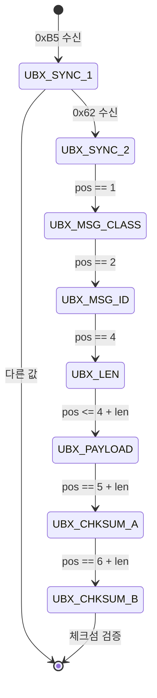
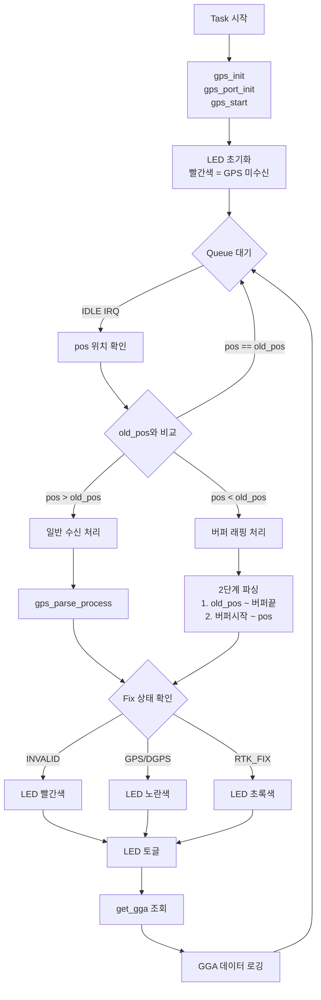

# GPS 라이브러리 기술 문서

## 1. 개요

GPS 라이브러리는 STM32F4 기반 임베디드 시스템에서 GPS 모듈과의 통신 및 위치 데이터 파싱을 담당하는 라이브러리입니다. NMEA-0183 프로토콜과 u-blox UBX 프로토콜을 모두 지원합니다.

### 1.1 주요 특징
- **듀얼 프로토콜 지원**: NMEA-0183 및 UBX 프로토콜 동시 파싱
- **FreeRTOS 기반**: 멀티태스킹 환경에서 안전한 동작
- **DMA 기반 수신**: CPU 오버헤드 최소화
- **고정밀 GPS 지원**: RTK (Real-Time Kinematic) Fix/Float 상태 감지

---

## 2. 아키텍처

### 2.1 계층 구조

```
┌─────────────────────────────────────────────────────────┐
│                    Application Layer                     │
│                     (gps_app.c/h)                        │
├─────────────────────────────────────────────────────────┤
│                    Library Layer                         │
│  ┌──────────────┬──────────────┬──────────────────────┐ │
│  │   gps.c/h    │ gps_nmea.c/h │    gps_ubx.c/h       │ │
│  │  (Core)      │  (NMEA 파서)  │    (UBX 파서)        │ │
│  └──────────────┴──────────────┴──────────────────────┘ │
│  ┌──────────────┬──────────────────────────────────────┐│
│  │gps_parse.c/h │         gps_types.h                  ││
│  │ (공통 파서)   │        (타입 정의)                   ││
│  └──────────────┴──────────────────────────────────────┘│
├─────────────────────────────────────────────────────────┤
│                      HAL Layer                           │
│                    (gps_port.c/h)                        │
│                 (UART + DMA 드라이버)                    │
└─────────────────────────────────────────────────────────┘
```

### 2.2 시스템 구성도



---

## 3. 파일 구조

| 파일 | 경로 | 설명 |
|------|------|------|
| `gps.h` | lib/gps/ | GPS 라이브러리 메인 헤더 |
| `gps.c` | lib/gps/ | GPS 핵심 로직 및 프로토콜 분기 |
| `gps_types.h` | lib/gps/ | 프로토콜 타입 및 상태 정의 |
| `gps_nmea.h/c` | lib/gps/ | NMEA-0183 프로토콜 파서 |
| `gps_ubx.h/c` | lib/gps/ | u-blox UBX 프로토콜 파서 |
| `gps_parse.h/c` | lib/gps/ | 공통 파싱 유틸리티 |
| `gps_port.h/c` | modules/gps/ | 하드웨어 추상화 레이어 |
| `gps_app.h/c` | modules/gps/ | 애플리케이션 레이어 |

---

## 4. 핵심 데이터 구조

### 4.1 GPS 메인 구조체 (`gps_t`)

```c
typedef struct gps_s {
    /* 현재 프로토콜 상태 */
    gps_procotol_t protocol;     // GPS_PROTOCOL_NONE/NMEA/UBX

    /* FreeRTOS 동기화 */
    SemaphoreHandle_t mutex;     // 데이터 접근 보호

    /* HAL 연산 */
    const gps_hal_ops_t* ops;    // 하드웨어 추상화 함수 포인터

    /* 파싱 상태 */
    gps_parse_state_t state;     // 현재 파싱 상태
    char payload[GPS_PAYLOAD_SIZE];  // 파싱 버퍼
    uint32_t pos;                // 버퍼 위치

    /* 프로토콜별 파서 */
    gps_nmea_parser_t nmea;      // NMEA 파서 상태
    gps_ubx_parser_t ubx;        // UBX 파서 상태

    /* 파싱 결과 데이터 */
    gps_nmea_data_t nmea_data;   // NMEA 파싱 결과
    gps_ubx_data_t ubx_data;     // UBX 파싱 결과
} gps_t;
```

### 4.2 GGA 데이터 구조체

```c
typedef struct {
    uint8_t hour;        // 시 (UTC)
    uint8_t min;         // 분
    uint8_t sec;         // 초
    double lat;          // 위도 (도)
    char ns;             // N/S 표시
    double lon;          // 경도 (도)
    char ew;             // E/W 표시
    gps_fix_t fix;       // Fix 품질
    uint8_t sat_num;     // 위성 수
    double hdop;         // 수평 정밀도
    double alt;          // 고도 (m)
    double geo_sep;      // 지오이드 분리
} gps_gga_t;
```

### 4.3 Fix 품질 열거형

```c
typedef enum {
    GPS_FIX_INVALID = 0,    // 무효
    GPS_FIX_GPS = 1,        // 일반 GPS
    GPS_FIX_DGPS = 2,       // 차등 GPS
    GPS_FIX_PPS = 3,        // PPS
    GPS_FIX_RTK_FIX = 4,    // RTK 고정 (cm급 정밀도)
    GPS_FIX_RTK_FLOAT = 5,  // RTK 부동 (dm급 정밀도)
    GPS_FIX_DR = 6          // Dead Reckoning
} gps_fix_t;
```

---

## 5. 프로토콜 처리 흐름

### 5.1 NMEA-0183 프로토콜



### 5.2 NMEA 문장 구조

```
$GNGGA,092725.00,4717.11399,N,00833.91590,E,1,08,1.01,499.6,M,48.0,M,,*5B\r\n
 │  │     │          │     │      │      │ │  │   │    │  │   │  │ │ │
 │  │     │          │     │      │      │ │  │   │    │  │   │  │ │ └─ 체크섬
 │  │     │          │     │      │      │ │  │   │    │  │   │  │ └─── DGPS 기준국 ID
 │  │     │          │     │      │      │ │  │   │    │  │   │  └───── DGPS 데이터 수명
 │  │     │          │     │      │      │ │  │   │    │  │   └──────── 지오이드 분리 단위
 │  │     │          │     │      │      │ │  │   │    │  └──────────── 지오이드 분리
 │  │     │          │     │      │      │ │  │   │    └─────────────── 고도 단위
 │  │     │          │     │      │      │ │  │   └──────────────────── 고도
 │  │     │          │     │      │      │ │  └─────────────────────── HDOP
 │  │     │          │     │      │      │ └────────────────────────── 위성 수
 │  │     │          │     │      │      └──────────────────────────── Fix 품질
 │  │     │          │     │      └─────────────────────────────────── 경도 E/W
 │  │     │          │     └────────────────────────────────────────── 경도
 │  │     │          └──────────────────────────────────────────────── 위도 N/S
 │  │     └─────────────────────────────────────────────────────────── 위도
 │  └───────────────────────────────────────────────────────────────── UTC 시간
 └──────────────────────────────────────────────────────────────────── 문장 타입
```

### 5.3 UBX 프로토콜



### 5.4 UBX 패킷 구조

```
┌────────┬────────┬────────┬────────┬────────────┬────────────┬────────┬────────┐
│ SYNC_1 │ SYNC_2 │ CLASS  │   ID   │   LEN_L    │   LEN_H    │PAYLOAD │CHECKSUM│
│  0xB5  │  0x62  │ 1 byte │ 1 byte │   1 byte   │   1 byte   │ N bytes│ 2 bytes│
└────────┴────────┴────────┴────────┴────────────┴────────────┴────────┴────────┘
                                                               ↓
                                         ┌─────────────────────────────────────┐
                                         │           UBX-NAV-HPPOSLLH          │
                                         │        (고정밀 위치 데이터)          │
                                         ├─────────────────────────────────────┤
                                         │ version    : 1 byte                 │
                                         │ reserved   : 2 bytes                │
                                         │ flag       : 1 byte                 │
                                         │ iTOW       : 4 bytes (ms)           │
                                         │ lon        : 4 bytes (1e-7 deg)     │
                                         │ lat        : 4 bytes (1e-7 deg)     │
                                         │ height     : 4 bytes (mm)           │
                                         │ hMSL       : 4 bytes (mm)           │
                                         │ lonHp      : 1 byte (1e-9 deg)      │
                                         │ latHp      : 1 byte (1e-9 deg)      │
                                         │ heightHp   : 1 byte (0.1 mm)        │
                                         │ hMSLHp     : 1 byte (0.1 mm)        │
                                         │ hAcc       : 4 bytes (0.1 mm)       │
                                         │ vAcc       : 4 bytes (0.1 mm)       │
                                         └─────────────────────────────────────┘
```

---

## 6. 상태 머신

### 6.1 프로토콜 감지 상태 머신



### 6.2 NMEA 파싱 상태 머신



### 6.3 UBX 파싱 상태 머신



---

## 7. API 레퍼런스

### 7.1 초기화 함수

```c
/**
 * @brief GPS 객체 초기화
 * @param[out] gps GPS 핸들 포인터
 */
void gps_init(gps_t *gps);
```

### 7.2 데이터 처리 함수

```c
/**
 * @brief GPS 데이터 파싱 처리
 * @param[inout] gps GPS 핸들
 * @param[in] data 수신된 원시 데이터
 * @param[in] len 데이터 길이
 */
void gps_parse_process(gps_t *gps, const void *data, size_t len);
```

### 7.3 데이터 조회 함수

```c
/**
 * @brief 유효한 GGA 원시 데이터 조회 (스레드 안전)
 * @param[in] gps GPS 핸들
 * @param[out] buf GGA 문장 저장 버퍼
 * @param[out] len GGA 문장 길이
 * @return true: 유효한 데이터 있음, false: 유효하지 않음
 */
bool get_gga(gps_t *gps, char* buf, uint8_t* len);
```

---

## 8. 하드웨어 인터페이스

### 8.1 GPIO 및 UART 설정

| 인터페이스 | 핀 | 설정 |
|-----------|-----|------|
| USART2_TX | PA2 | AF7, Push-Pull |
| USART2_RX | PA3 | AF7, No Pull |
| RTK Reset | PA5 | Output, Push-Pull |

### 8.2 UART 설정

```c
USART_InitStruct.BaudRate = 38400;
USART_InitStruct.DataWidth = LL_USART_DATAWIDTH_8B;
USART_InitStruct.StopBits = LL_USART_STOPBITS_1;
USART_InitStruct.Parity = LL_USART_PARITY_NONE;
USART_InitStruct.TransferDirection = LL_USART_DIRECTION_TX_RX;
```

### 8.3 DMA 설정

```c
// DMA1 Stream5, Channel4 (USART2_RX)
LL_DMA_SetMode(DMA1, LL_DMA_STREAM_5, LL_DMA_MODE_CIRCULAR);
LL_DMA_SetDataLength(DMA1, LL_DMA_STREAM_5, 2048);  // 순환 버퍼 크기
```

---

## 9. GPS 태스크 동작 흐름



---

## 10. 사용 예제

### 10.1 기본 초기화 및 데이터 읽기

```c
#include "gps.h"
#include "gps_port.h"

gps_t gps_handle;
char gga_buf[100];
uint8_t gga_len;

void gps_example(void) {
    // 초기화
    gps_init(&gps_handle);
    gps_port_init();
    gps_start();

    // 데이터 조회 (메인 루프에서)
    if (get_gga(&gps_handle, gga_buf, &gga_len)) {
        printf("GGA: %s\n", gga_buf);
        printf("위도: %.6f %c\n",
               gps_handle.nmea_data.gga.lat,
               gps_handle.nmea_data.gga.ns);
        printf("경도: %.6f %c\n",
               gps_handle.nmea_data.gga.lon,
               gps_handle.nmea_data.gga.ew);
        printf("Fix: %d, 위성: %d\n",
               gps_handle.nmea_data.gga.fix,
               gps_handle.nmea_data.gga.sat_num);
    }
}
```

### 10.2 FreeRTOS 태스크에서 사용

```c
void gps_task(void *param) {
    gps_queue = xQueueCreate(10, 1);
    gps_init(&gps_handle);
    gps_port_init();
    gps_start();

    uint8_t dummy;
    size_t pos, old_pos = 0;

    while (1) {
        xQueueReceive(gps_queue, &dummy, portMAX_DELAY);

        xSemaphoreTake(gps_handle.mutex, portMAX_DELAY);
        pos = gps_get_rx_pos();

        if (pos > old_pos) {
            gps_parse_process(&gps_handle,
                             &gps_recv[old_pos],
                             pos - old_pos);
        }
        old_pos = pos;

        xSemaphoreGive(gps_handle.mutex);
    }
}
```

---

## 11. 디버깅 가이드

### 11.1 일반적인 문제

| 증상 | 원인 | 해결방법 |
|------|------|----------|
| 데이터 수신 안됨 | UART 연결 문제 | 보드레이트, 핀 연결 확인 |
| Fix가 항상 0 | GPS 안테나 문제 | 안테나 연결, 실외 테스트 |
| 체크섬 오류 | 노이즈, 보드레이트 불일치 | 배선 점검, 보드레이트 확인 |
| 파싱 실패 | 지원하지 않는 문장 | GN talker 사용 여부 확인 |

### 11.2 로깅 출력 해석

```
[GPS] RX: 82 bytes                          // 수신된 바이트 수
[GPS] RAW: $GNGGA,123456.00,...*5B\r\n     // 원시 데이터
[GPS] Fix: 4, Satellites: 12                // RTK Fix, 12개 위성
```

---

## 12. 메모리 사용량

| 항목 | 크기 | 설명 |
|------|------|------|
| `gps_t` 구조체 | ~450 bytes | GPS 핸들 |
| DMA 수신 버퍼 | 2048 bytes | 순환 버퍼 |
| 태스크 스택 | 2048 words | FreeRTOS 스택 |
| 총 RAM 사용 | ~10.5 KB | 대략적 추정 |

---

## 13. 참고 자료

- NMEA 0183 Standard
- u-blox Protocol Specification (UBX-CFG-*-*-*)
- STM32F4 Reference Manual (RM0090)
- FreeRTOS API Reference
