# GPS 라이브러리 기술 문서

## 1. 개요

GPS 라이브러리는 STM32F4 기반 임베디드 시스템에서 GPS 모듈과의 통신 및 위치 데이터 파싱을 담당하는 라이브러리입니다. NMEA-0183 프로토콜과 u-blox UBX 프로토콜을 모두 지원합니다.

### 1.1 주요 특징
- **듀얼 프로토콜 지원**: NMEA-0183 및 UBX 프로토콜 동시 파싱
- **FreeRTOS 기반**: 멀티태스킹 환경에서 안전한 동작
- **DMA 기반 수신**: CPU 오버헤드 최소화
- **고정밀 GPS 지원**: RTK (Real-Time Kinematic) Fix/Float 상태 감지
- **스레드 안전**: 뮤텍스를 통한 데이터 접근 보호

### 1.2 지원 GPS 모듈
| 모듈 | 프로토콜 | 정밀도 | 비고 |
|------|----------|--------|------|
| u-blox ZED-F9P | NMEA + UBX | RTK cm급 | 권장 |
| u-blox NEO-M8P | NMEA + UBX | RTK dm급 | 지원 |
| u-blox NEO-M8N | NMEA | 일반 m급 | 지원 |
| 기타 NMEA 호환 | NMEA | 다양함 | GN talker 필요 |

### 1.3 성능 사양
| 항목 | 값 | 설명 |
|------|-----|------|
| 최대 데이터 레이트 | 10 Hz | 초당 10회 위치 업데이트 |
| 파싱 지연 | < 1ms | IDLE 인터럽트 후 파싱 완료까지 |
| 메모리 사용량 | ~10.5 KB | RAM 기준 |
| CPU 사용률 | < 2% | 168MHz STM32F4 기준 |

---

## 2. 아키텍처

### 2.1 계층 구조

```
┌─────────────────────────────────────────────────────────┐
│                    Application Layer                     │
│                     (gps_app.c/h)                        │
│  ┌─────────────────────────────────────────────────────┐│
│  │  - gps_task_create()     : 태스크 생성               ││
│  │  - gps_process_task()    : 메인 처리 태스크          ││
│  │  - gps_get_handle()      : GPS 핸들 조회             ││
│  │  - LED 상태 표시 연동                                 ││
│  └─────────────────────────────────────────────────────┘│
├─────────────────────────────────────────────────────────┤
│                    Library Layer                         │
│  ┌──────────────┬──────────────┬──────────────────────┐ │
│  │   gps.c/h    │ gps_nmea.c/h │    gps_ubx.c/h       │ │
│  │  (Core)      │  (NMEA 파서)  │    (UBX 파서)        │ │
│  │              │              │                      │ │
│  │ - gps_init() │ - GGA 파싱   │ - NAV-HPPOSLLH       │ │
│  │ - parse()    │ - RMC 파싱   │ - 체크섬 검증        │ │
│  │ - 프로토콜   │ - 체크섬     │ - 데이터 저장        │ │
│  │   자동 감지  │   검증       │                      │ │
│  └──────────────┴──────────────┴──────────────────────┘ │
│  ┌──────────────┬──────────────────────────────────────┐│
│  │gps_parse.c/h │         gps_types.h                  ││
│  │ (공통 파서)   │        (타입 정의)                   ││
│  │              │                                      ││
│  │ - 숫자 파싱  │ - gps_protocol_t                     ││
│  │ - float 파싱 │ - gps_parse_state_t                  ││
│  │ - double     │ - gps_fix_t                          ││
│  └──────────────┴──────────────────────────────────────┘│
├─────────────────────────────────────────────────────────┤
│                      HAL Layer                           │
│                    (gps_port.c/h)                        │
│  ┌─────────────────────────────────────────────────────┐│
│  │  - gps_port_init()       : 하드웨어 초기화          ││
│  │  - gps_port_comm_start() : DMA 통신 시작            ││
│  │  - gps_port_gpio_start() : GPIO 제어 (RTK Reset)    ││
│  │  - gps_get_rx_pos()      : DMA 버퍼 위치 조회       ││
│  │  - USART2_IRQHandler()   : IDLE 인터럽트 처리       ││
│  │  - DMA1_Stream5_IRQHandler() : DMA 인터럽트         ││
│  └─────────────────────────────────────────────────────┘│
└─────────────────────────────────────────────────────────┘
```

### 2.2 시스템 구성도

```mermaid
graph TB
    subgraph "Hardware"
        GPS_MODULE[GPS 모듈<br/>u-blox ZED-F9P]
        UART[USART2<br/>38400 baud]
        DMA[DMA1 Stream5<br/>Circular Mode]
        MCU[STM32F4<br/>168MHz]
        ANTENNA[GPS/GNSS 안테나]
    end

    subgraph "FreeRTOS Tasks"
        GPS_TASK[gps_process_task<br/>Priority: 1<br/>Stack: 2048 words]
    end

    subgraph "GPS Library"
        GPS_INIT[gps_init]
        GPS_PARSE[gps_parse_process]
        NMEA_PARSER[gps_parse_nmea_term]
        UBX_PARSER[gps_parse_ubx]
    end

    subgraph "Data Structures"
        GPS_T[gps_t<br/>GPS 핸들]
        NMEA_DATA[gps_nmea_data_t<br/>NMEA 파싱 결과]
        UBX_DATA[gps_ubx_data_t<br/>UBX 파싱 결과]
    end

    subgraph "Synchronization"
        MUTEX[xSemaphore<br/>Mutex]
        QUEUE[xQueue<br/>gps_queue]
    end

    ANTENNA --> GPS_MODULE
    GPS_MODULE -->|UART TX| UART
    UART -->|DMA Transfer| DMA
    DMA -->|Circular Buffer<br/>2048 bytes| MCU
    MCU -->|IDLE IRQ| QUEUE
    QUEUE -->|Wake| GPS_TASK

    GPS_TASK --> GPS_PARSE
    GPS_PARSE --> NMEA_PARSER
    GPS_PARSE --> UBX_PARSER

    NMEA_PARSER --> NMEA_DATA
    UBX_PARSER --> UBX_DATA

    GPS_T --> NMEA_DATA
    GPS_T --> UBX_DATA
    GPS_T --> MUTEX
```

### 2.3 데이터 흐름도

```mermaid
flowchart LR
    subgraph "GPS Module"
        SAT[위성 신호]
        PROC[신호 처리]
        OUT[UART 출력]
    end

    subgraph "DMA"
        BUF[순환 버퍼<br/>2048 bytes]
        POS[write position]
    end

    subgraph "ISR"
        IDLE[IDLE IRQ]
        NOTIFY[Queue Send]
    end

    subgraph "Task"
        RECV[버퍼 읽기]
        PARSE[프로토콜 파싱]
        STORE[데이터 저장]
    end

    subgraph "Application"
        READ[데이터 조회]
        USE[위치 활용]
    end

    SAT --> PROC --> OUT --> BUF
    BUF --> POS
    POS --> IDLE --> NOTIFY --> RECV
    RECV --> PARSE --> STORE --> READ --> USE
```

---

## 3. 파일 구조

| 파일 | 경로 | 크기 | 설명 |
|------|------|------|------|
| `gps.h` | lib/gps/ | ~60줄 | GPS 라이브러리 메인 헤더, 구조체 및 API 선언 |
| `gps.c` | lib/gps/ | ~200줄 | GPS 핵심 로직, 프로토콜 분기, 체크섬 검증 |
| `gps_types.h` | lib/gps/ | ~50줄 | 프로토콜 타입 및 상태 정의 열거형 |
| `gps_nmea.h` | lib/gps/ | ~90줄 | NMEA 데이터 구조체, 메시지 타입 정의 |
| `gps_nmea.c` | lib/gps/ | ~150줄 | NMEA-0183 프로토콜 파서 (GGA, RMC) |
| `gps_ubx.h` | lib/gps/ | ~75줄 | UBX 프로토콜 구조체, 메시지 클래스 정의 |
| `gps_ubx.c` | lib/gps/ | ~120줄 | u-blox UBX 프로토콜 파서 |
| `gps_parse.h` | lib/gps/ | ~15줄 | 공통 파싱 유틸리티 선언 |
| `gps_parse.c` | lib/gps/ | ~100줄 | 숫자/실수 파싱 함수 |
| `gps_port.h` | modules/gps/ | ~20줄 | HAL 함수 선언 |
| `gps_port.c` | modules/gps/ | ~190줄 | UART, DMA, GPIO 드라이버, ISR |
| `gps_app.h` | modules/gps/ | ~35줄 | 애플리케이션 인터페이스 |
| `gps_app.c` | modules/gps/ | ~115줄 | 메인 태스크, LED 연동 |

### 3.1 의존성 관계


---

## 4. 핵심 데이터 구조

### 4.1 GPS 메인 구조체 (`gps_t`)

```c
typedef struct gps_s {
    /* 현재 프로토콜 상태 */
    gps_procotol_t protocol;     // GPS_PROTOCOL_NONE/NMEA/UBX
                                  // 현재 파싱 중인 프로토콜

    /* FreeRTOS 동기화 */
    SemaphoreHandle_t mutex;     // 데이터 접근 보호 뮤텍스
                                  // nmea_data, ubx_data 접근 시 사용

    /* HAL 연산 */
    const gps_hal_ops_t* ops;    // 하드웨어 추상화 함수 포인터
                                  // init, reset, send, recv

    /* 파싱 상태 */
    gps_parse_state_t state;     // 현재 파싱 상태 (상태 머신)
    char payload[GPS_PAYLOAD_SIZE];  // 파싱 버퍼 (256 bytes)
    uint32_t pos;                // payload 버퍼 현재 위치

    /* 프로토콜별 파서 */
    gps_nmea_parser_t nmea;      // NMEA 파서 상태 변수
    gps_ubx_parser_t ubx;        // UBX 파서 상태 변수

    /* 파싱 결과 데이터 */
    gps_nmea_data_t nmea_data;   // NMEA 파싱 결과 (GGA 등)
    gps_ubx_data_t ubx_data;     // UBX 파싱 결과 (HPPOSLLH 등)
} gps_t;
```

### 4.2 HAL 연산 구조체 (`gps_hal_ops_t`)

```c
typedef struct {
    int (*init)(void);                           // 하드웨어 초기화
    int (*reset)(void);                          // GPS 모듈 리셋
    int (*send)(const char *data, size_t len);   // UART 송신
    int (*recv)(char *buf, size_t len);          // UART 수신 (미사용, DMA 사용)
} gps_hal_ops_t;

// 구현 예시 (gps.c)
static const gps_hal_ops_t stm32_hal_ops = {
    .send = gps_uart_send
};
```

### 4.3 NMEA 파서 상태 구조체 (`gps_nmea_parser_t`)

```c
typedef struct {
    char term_str[GPS_NMEA_TERM_SIZE];  // 현재 필드 문자열 (13 bytes)
    uint8_t term_pos;                    // term_str 내 현재 위치
    uint8_t term_num;                    // 현재 파싱 중인 필드 번호 (0부터)

    gps_nmea_msg_t msg_type;            // 메시지 타입 (GGA, RMC 등)
    uint8_t crc;                         // 계산된 체크섬 (XOR)
    uint8_t star;                        // '*' 문자 감지 플래그
} gps_nmea_parser_t;
```

### 4.4 GGA 데이터 구조체 (상세)

```c
typedef struct {
    uint8_t hour;        // 시 (UTC, 0-23)
    uint8_t min;         // 분 (0-59)
    uint8_t sec;         // 초 (0-59, 소수점 이하는 무시)

    double lat;          // 위도 (십진수 도, -90 ~ +90)
                         // 원본: ddmm.mmmm → 변환: dd.dddddd
    char ns;             // 'N' = 북위, 'S' = 남위

    double lon;          // 경도 (십진수 도, -180 ~ +180)
                         // 원본: dddmm.mmmm → 변환: ddd.dddddd
    char ew;             // 'E' = 동경, 'W' = 서경

    gps_fix_t fix;       // Fix 품질 (아래 상세)
    uint8_t sat_num;     // 사용 중인 위성 수 (0-12+)

    double hdop;         // 수평 정밀도 희석 (Horizontal DOP)
                         // 1.0 = 이상적, <2 = 좋음, >5 = 나쁨

    double alt;          // 안테나 고도 (미터, MSL 기준)
    double geo_sep;      // 지오이드 분리 (WGS84와 MSL 차이, 미터)
} gps_gga_t;
```

### 4.5 Fix 품질 열거형 (상세)

```c
typedef enum {
    GPS_FIX_INVALID = 0,    // 무효 - 위치 계산 불가
                            // 원인: 위성 부족, 실내, 초기화 중

    GPS_FIX_GPS = 1,        // 일반 GPS (SPS)
                            // 정밀도: 수평 2-5m, 수직 3-10m

    GPS_FIX_DGPS = 2,       // 차등 GPS (SBAS/WAAS/EGNOS)
                            // 정밀도: 수평 1-3m, 수직 2-5m

    GPS_FIX_PPS = 3,        // PPS (Precise Positioning Service)
                            // 군용, 일반적으로 사용 안 함

    GPS_FIX_RTK_FIX = 4,    // RTK 고정해 (Integer Ambiguity Resolved)
                            // 정밀도: 수평 1-2cm, 수직 2-3cm
                            // 최고 정밀도, 측량/정밀 농업에 사용

    GPS_FIX_RTK_FLOAT = 5,  // RTK 부동해 (Float Ambiguity)
                            // 정밀도: 수평 10-30cm, 수직 20-50cm
                            // RTK 수렴 중 또는 기준국 신호 약함

    GPS_FIX_DR = 6          // Dead Reckoning (추측 항법)
                            // IMU 센서 기반 추정, GPS 신호 없을 때
} gps_fix_t;
```

### 4.6 Fix 품질별 상세 비교

```
┌──────────────────────────────────────────────────────────────────────────────┐
│                           GPS Fix 품질 비교표                                 │
├─────────────┬─────────────┬─────────────┬─────────────┬──────────────────────┤
│    Fix      │   수평 정밀도│   수직 정밀도│   신뢰도    │       용도           │
├─────────────┼─────────────┼─────────────┼─────────────┼──────────────────────┤
│ INVALID (0) │     N/A     │     N/A     │    0%       │ 사용 불가            │
│ GPS (1)     │   2-5 m     │   3-10 m    │   60-80%    │ 일반 내비게이션      │
│ DGPS (2)    │   1-3 m     │   2-5 m     │   80-90%    │ 차량 내비게이션      │
│ PPS (3)     │   <1 m      │   <2 m      │   90%+      │ 군용 (제한적)        │
│ RTK_FIX (4) │   1-2 cm    │   2-3 cm    │   99%+      │ 측량, 정밀 농업      │
│ RTK_FLOAT(5)│   10-30 cm  │   20-50 cm  │   85-95%    │ RTK 수렴 중          │
│ DR (6)      │   가변       │   가변       │   50-70%    │ 터널, 지하          │
└─────────────┴─────────────┴─────────────┴─────────────┴──────────────────────┘
```

### 4.7 UBX 고정밀 위치 구조체 (`gps_ubx_nav_hpposllh_t`)

```c
typedef struct {
    uint8_t version;    // 메시지 버전 (0x00)
    uint8_t reserved[2];// 예약
    uint8_t flag;       // 유효성 플래그 (0: valid, 1: invalid)

    uint32_t tow;       // GPS Time of Week [ms]
                        // 일요일 자정 기준 경과 밀리초

    int32_t lon;        // 경도 [1e-7 deg]
                        // 실제 값 = lon * 1e-7 + lonHp * 1e-9

    int32_t lat;        // 위도 [1e-7 deg]
                        // 실제 값 = lat * 1e-7 + latHp * 1e-9

    int32_t height;     // 타원체 높이 [mm]
    int32_t msl;        // 평균 해수면 높이 [mm]

    int8_t lon_hp;      // 경도 고정밀 부분 [1e-9 deg]
    int8_t lat_hp;      // 위도 고정밀 부분 [1e-9 deg]
    int8_t height_hp;   // 높이 고정밀 부분 [0.1 mm]
    int8_t msl_hp;      // MSL 고정밀 부분 [0.1 mm]

    uint32_t hacc;      // 수평 정밀도 [0.1 mm]
    uint32_t vacc;      // 수직 정밀도 [0.1 mm]
} gps_ubx_nav_hpposllh_t;

// 고정밀 좌표 계산 예시
// double longitude = (double)lon * 1e-7 + (double)lon_hp * 1e-9;
// double latitude  = (double)lat * 1e-7 + (double)lat_hp * 1e-9;
// double height_m  = (double)height * 0.001 + (double)height_hp * 0.0001;
```

### 4.8 NMEA 데이터 저장 구조체

```c
typedef struct {
    gps_gga_t gga;          // 파싱된 GGA 데이터
    char gga_raw[100];      // GGA 원시 문장 (NTRIP 전송용)
    uint8_t gga_raw_pos;    // gga_raw 현재 위치
    bool gga_is_rdy;        // GGA 데이터 유효 플래그
} gps_nmea_data_t;
```

---

## 5. NMEA-0183 프로토콜 상세

### 5.1 지원 문장 타입

| 문장 | 설명 | 지원 여부 | 비고 |
|------|------|----------|------|
| GGA | Global Positioning System Fix Data | **지원** | 위치, Fix, 위성 수 |
| RMC | Recommended Minimum Specific GPS Data | 부분 지원 | 속도, 방향 (파서 존재) |
| GSA | GPS DOP and Active Satellites | 미지원 | 향후 추가 가능 |
| GSV | GPS Satellites in View | 미지원 | 위성 상세 정보 |
| VTG | Track Made Good and Ground Speed | 미지원 | 속도/방향 |
| GLL | Geographic Position | 미지원 | 간단한 위치 |

### 5.2 Talker ID 설명

```
$GNGGA  →  GN = GNSS (GPS + GLONASS + Galileo 등 복합)
$GPGGA  →  GP = GPS 전용
$GLGGA  →  GL = GLONASS 전용
$GAGGA  →  GA = Galileo 전용
$BDGGA  →  BD = BeiDou 전용
```

> **참고**: 현재 라이브러리는 `GN` (GNSS) talker만 처리합니다. 다른 talker의 GGA는 무시됩니다.

### 5.3 GGA 문장 필드 상세

```
$GNGGA,092725.00,4717.11399,N,00833.91590,E,4,08,1.01,499.6,M,48.0,M,1.0,0001*5B\r\n
```

| 필드 # | 예시 값 | 설명 | 파싱 함수 |
|--------|---------|------|-----------|
| 0 | GNGGA | 문장 식별자 | strncmp |
| 1 | 092725.00 | UTC 시간 (hhmmss.ss) | parse_time() |
| 2 | 4717.11399 | 위도 (ddmm.mmmmm) | parse_lat_lon() |
| 3 | N | 위도 방향 (N/S) | direct assign |
| 4 | 00833.91590 | 경도 (dddmm.mmmmm) | parse_lat_lon() |
| 5 | E | 경도 방향 (E/W) | direct assign |
| 6 | 4 | Fix 품질 (0-6) | gps_parse_number() |
| 7 | 08 | 사용 위성 수 | gps_parse_number() |
| 8 | 1.01 | HDOP | gps_parse_float() |
| 9 | 499.6 | 고도 (m) | gps_parse_float() |
| 10 | M | 고도 단위 | (무시) |
| 11 | 48.0 | 지오이드 분리 | gps_parse_float() |
| 12 | M | 지오이드 단위 | (무시) |
| 13 | 1.0 | DGPS 데이터 수명 (초) | (무시) |
| 14 | 0001 | DGPS 기준국 ID | (무시) |
| CS | 5B | 체크섬 | check_nmea_chksum() |

### 5.4 좌표 변환 알고리즘

NMEA 좌표는 도분(度分) 형식으로 전송됩니다. 이를 십진수 도(DD) 형식으로 변환해야 합니다.

```
NMEA 형식:  ddmm.mmmm (위도), dddmm.mmmm (경도)
            dd = 도, mm.mmmm = 분

변환 공식:  DD = dd + (mm.mmmm / 60)
```

**구현 코드 (gps_nmea.c:14-24)**:
```c
static double parse_lat_lon(gps_t *gps) {
    double val, deg, min;

    // 문자열을 부동소수점으로 변환
    val = gps_parse_float(gps);  // 예: 4717.11399

    // 도 추출: 4717.11399 / 100 = 47 (정수 부분)
    deg = (double)((int)(((int)val / 100)));

    // 분 추출: 4717.11399 - 4700 = 17.11399
    min = val - (deg * (double)100);

    // 십진수 도 변환: 47 + (17.11399 / 60) = 47.285233...
    val = deg + (min / (double)(60));

    return val;
}
```

**변환 예시**:
```
입력:  4717.11399 N, 00833.91590 E

위도 계산:
  val = 4717.11399
  deg = 47
  min = 17.11399
  결과 = 47 + (17.11399 / 60) = 47.285233°N

경도 계산:
  val = 833.91590
  deg = 8
  min = 33.91590
  결과 = 8 + (33.91590 / 60) = 8.565265°E
```

### 5.5 체크섬 계산 알고리즘

NMEA 체크섬은 `$`와 `*` 사이의 모든 문자를 XOR 연산한 결과입니다.

```
$GNGGA,092725.00,...*5B
 ^--- 시작 (제외) ---^ 끝 (제외)
      이 범위를 XOR
```

**구현 코드 (gps.c:43-65)**:
```c
// 체크섬 누적 (문자 수신 시마다 호출)
static inline void add_nmea_chksum(gps_t *gps, char ch) {
    gps->nmea.crc ^= (uint8_t)ch;
}

// 체크섬 검증 ('*' 이후 2자리 HEX와 비교)
static inline uint8_t check_nmea_chksum(gps_t *gps) {
    uint8_t crc = 0;

    // HEX 문자열을 숫자로 변환 (예: "5B" → 0x5B)
    crc = (uint8_t)((((PARSER_CHAR_HEX_TO_NUM(gps->nmea.term_str[0])) & 0x0FU)
                     << 0x04U) |
                    ((PARSER_CHAR_HEX_TO_NUM(gps->nmea.term_str[1])) & 0x0FU));

    if (gps->nmea.crc != crc) {
        return 0;  // 체크섬 불일치
    }
    return 1;  // 체크섬 일치
}
```

**체크섬 계산 예시**:
```c
// $GNGGA*xx 의 체크섬 계산
char msg[] = "GNGGA,123456.00,3724.0000,N,12700.0000,E,1,08,1.0,10.0,M,0.0,M,,";
uint8_t crc = 0;
for (int i = 0; msg[i] != '\0'; i++) {
    crc ^= msg[i];
}
// crc = 0x5B (예시)
printf("체크섬: %02X\n", crc);  // 출력: 5B
```

---

## 6. UBX 프로토콜 상세

### 6.1 UBX 패킷 구조

```
┌────────┬────────┬────────┬────────┬────────────┬────────────┬──────────────┬────────┬────────┐
│ SYNC 1 │ SYNC 2 │ CLASS  │   ID   │  LENGTH_L  │  LENGTH_H  │   PAYLOAD    │  CK_A  │  CK_B  │
│  0xB5  │  0x62  │ 1 byte │ 1 byte │   1 byte   │   1 byte   │  N bytes     │ 1 byte │ 1 byte │
└────────┴────────┴────────┴────────┴────────────┴────────────┴──────────────┴────────┴────────┘
         │<---------------------------- 체크섬 계산 범위 ---------------------------->│
```

### 6.2 지원 메시지 클래스

| 클래스 | 값 | 설명 | 지원 ID |
|--------|-----|------|---------|
| NAV | 0x01 | Navigation Results | HPPOSLLH (0x14) |
| RXM | 0x02 | Receiver Manager | 미지원 |
| INF | 0x04 | Information | 미지원 |
| ACK | 0x05 | ACK/NAK | 미지원 |
| CFG | 0x06 | Configuration | 미지원 |
| MON | 0x0A | Monitoring | 미지원 |
| TIM | 0x0D | Timing | 미지원 |

### 6.3 NAV-HPPOSLLH (0x01 0x14) 상세

고정밀 위치 데이터를 제공하는 UBX 메시지입니다.

```
┌─────────────────────────────────────────────────────────────────────────────┐
│                        UBX-NAV-HPPOSLLH (36 bytes)                          │
├───────────┬─────────┬────────────────────────────────────────────────────────┤
│ Offset    │ Size    │ Description                                           │
├───────────┼─────────┼────────────────────────────────────────────────────────┤
│ 0         │ 1       │ version = 0                                           │
│ 1         │ 2       │ reserved                                              │
│ 3         │ 1       │ flags (bit0: invalidLlh)                              │
│ 4         │ 4       │ iTOW [ms] - GPS Time of Week                          │
│ 8         │ 4       │ lon [1e-7 deg] - Longitude                            │
│ 12        │ 4       │ lat [1e-7 deg] - Latitude                             │
│ 16        │ 4       │ height [mm] - Height above ellipsoid                  │
│ 20        │ 4       │ hMSL [mm] - Height above mean sea level               │
│ 24        │ 1       │ lonHp [1e-9 deg] - High precision longitude           │
│ 25        │ 1       │ latHp [1e-9 deg] - High precision latitude            │
│ 26        │ 1       │ heightHp [0.1 mm] - High precision height             │
│ 27        │ 1       │ hMSLHp [0.1 mm] - High precision hMSL                 │
│ 28        │ 4       │ hAcc [0.1 mm] - Horizontal accuracy estimate          │
│ 32        │ 4       │ vAcc [0.1 mm] - Vertical accuracy estimate            │
└───────────┴─────────┴────────────────────────────────────────────────────────┘
```

### 6.4 UBX 체크섬 알고리즘 (Fletcher-8)

```c
static inline void calc_ubx_chksum(gps_t *gps) {
    gps->ubx.cal_chksum_a = 0;
    gps->ubx.cal_chksum_b = 0;

    // CLASS + ID + LENGTH + PAYLOAD 를 순회
    for (int i = 0; i < gps->ubx.len + 4; i++) {
        gps->ubx.cal_chksum_a += gps->payload[i];
        gps->ubx.cal_chksum_b += gps->ubx.cal_chksum_a;
    }
}

static inline uint8_t check_ubx_chksum(gps_t *gps) {
    calc_ubx_chksum(gps);

    if (gps->ubx.cal_chksum_a == gps->ubx.chksum_a &&
        gps->ubx.cal_chksum_b == gps->ubx.chksum_b) {
        return 1;  // 성공
    }
    return 0;  // 실패
}
```

### 6.5 고정밀 좌표 계산 예시

```c
// UBX-NAV-HPPOSLLH에서 고정밀 좌표 추출
gps_ubx_nav_hpposllh_t *hp = &gps->ubx_data.hpposllh;

// 경도 계산 (1e-9 도 정밀도)
double longitude = (double)hp->lon * 1e-7 + (double)hp->lon_hp * 1e-9;

// 위도 계산 (1e-9 도 정밀도)
double latitude = (double)hp->lat * 1e-7 + (double)hp->lat_hp * 1e-9;

// 높이 계산 (0.1mm 정밀도)
double height_mm = (double)hp->height + (double)hp->height_hp * 0.1;
double height_m = height_mm / 1000.0;

// 정밀도 추정치 (0.1mm 단위)
double h_accuracy_m = (double)hp->hacc / 10000.0;  // mm → m
double v_accuracy_m = (double)hp->vacc / 10000.0;

printf("위치: %.9f, %.9f\n", latitude, longitude);
printf("높이: %.4f m (±%.4f m)\n", height_m, v_accuracy_m);
printf("수평 정밀도: ±%.4f m\n", h_accuracy_m);
```

---

## 7. 상태 머신 상세

### 7.1 프로토콜 감지 상태 머신

```mermaid
stateDiagram-v2
    [*] --> GPS_PROTOCOL_NONE : 초기화

    GPS_PROTOCOL_NONE --> GPS_PROTOCOL_NMEA : '$' (0x24) 수신
    GPS_PROTOCOL_NONE --> GPS_PARSE_STATE_UBX_SYNC_1 : 0xB5 수신
    GPS_PROTOCOL_NONE --> GPS_PROTOCOL_NONE : 기타 문자

    GPS_PARSE_STATE_UBX_SYNC_1 --> GPS_PROTOCOL_UBX : 0x62 수신
    GPS_PARSE_STATE_UBX_SYNC_1 --> GPS_PROTOCOL_NONE : 기타 문자

    GPS_PROTOCOL_NMEA --> GPS_PROTOCOL_NONE : '\r' 수신 (파싱 완료/실패)

    GPS_PROTOCOL_UBX --> GPS_PROTOCOL_NONE : 체크섬 검증 후

    note right of GPS_PROTOCOL_NONE
        프로토콜 미정 상태
        시작 문자 대기 중
    end note

    note right of GPS_PROTOCOL_NMEA
        NMEA 문장 수신 중
        '\r' 까지 계속
    end note

    note right of GPS_PROTOCOL_UBX
        UBX 패킷 수신 중
        길이만큼 수신 후 종료
    end note
```

### 7.2 NMEA 파싱 상태 머신 (상세)

```mermaid
stateDiagram-v2
    [*] --> NONE : 초기 상태

    NONE --> NMEA_START : '$' 수신

    NMEA_START --> NMEA_DATA : Talker+MSG 파싱 완료<br/>(GN + GGA)
    NMEA_START --> NONE : 지원하지 않는 문장<br/>(GP, GL 등)

    NMEA_DATA --> NMEA_DATA : ',' 수신<br/>(필드 파싱 후 다음)
    NMEA_DATA --> NMEA_CHKSUM : '*' 수신

    NMEA_CHKSUM --> NMEA_END : 체크섬 2자리 수신

    NMEA_END --> NONE : '\r' 수신<br/>(데이터 저장 또는 폐기)

    note right of NMEA_START
        첫 번째 ',' 까지:
        - Talker ID 확인 (GN?)
        - Message Type 확인 (GGA?)
        - gga_raw 초기화
    end note

    note right of NMEA_DATA
        각 ',' 마다:
        - term_str 파싱
        - 해당 필드 저장
        - CRC 누적
        - term 초기화
    end note

    note right of NMEA_CHKSUM
        '*' 이후:
        - star 플래그 설정
        - CRC 누적 중단
        - 체크섬 문자 수집
    end note
```

### 7.3 UBX 파싱 상태 머신 (상세)

```mermaid
stateDiagram-v2
    [*] --> NONE

    NONE --> UBX_SYNC_1 : 0xB5 수신

    UBX_SYNC_1 --> UBX_SYNC_2 : 0x62 수신
    UBX_SYNC_1 --> NONE : 기타 값

    UBX_SYNC_2 --> UBX_MSG_CLASS : pos==1<br/>class 저장

    UBX_MSG_CLASS --> UBX_MSG_ID : pos==2<br/>id 저장

    UBX_MSG_ID --> UBX_LEN : pos==4<br/>length 저장 (2bytes)

    UBX_LEN --> UBX_PAYLOAD : pos <= 4+len

    UBX_PAYLOAD --> UBX_CHKSUM_A : pos == 5+len

    UBX_CHKSUM_A --> UBX_CHKSUM_B : pos == 6+len

    UBX_CHKSUM_B --> NONE : 체크섬 검증<br/>store_ubx_data()

    note right of UBX_PAYLOAD
        페이로드 수집 중
        pos가 4+len 될 때까지
    end note

    note right of UBX_CHKSUM_B
        검증 성공: 데이터 저장
        검증 실패: 폐기
        항상 NONE으로 복귀
    end note
```

---

## 8. API 레퍼런스 (상세)

### 8.1 gps_init

```c
/**
 * @brief GPS 객체 초기화
 *
 * gps_t 구조체의 모든 멤버를 0으로 초기화하고,
 * FreeRTOS 뮤텍스를 생성합니다.
 *
 * @param[out] gps GPS 핸들 포인터 (NULL 불가)
 *
 * @pre 없음
 * @post gps->mutex가 유효한 세마포어
 * @post gps->ops가 HAL 함수 테이블을 가리킴
 *
 * @note 이 함수는 gps_port_init() 이전에 호출해야 합니다.
 *
 * @code
 * gps_t gps_handle;
 * gps_init(&gps_handle);
 * @endcode
 */
void gps_init(gps_t *gps);
```

### 8.2 gps_parse_process

```c
/**
 * @brief GPS 데이터 파싱 처리
 *
 * 수신된 원시 바이트 스트림을 파싱하여 NMEA 또는 UBX 프로토콜을
 * 자동 감지하고 해당 파서로 전달합니다.
 *
 * @param[inout] gps GPS 핸들
 * @param[in] data 수신된 원시 데이터 포인터
 * @param[in] len 데이터 길이 (바이트)
 *
 * @pre gps가 gps_init()으로 초기화됨
 * @post 유효한 데이터면 gps->nmea_data 또는 gps->ubx_data 업데이트
 *
 * @note 이 함수는 태스크 컨텍스트에서만 호출해야 합니다 (ISR 불가)
 * @note 뮤텍스 보호 없이 호출됨 - 호출자가 뮤텍스 관리
 *
 * @code
 * xSemaphoreTake(gps->mutex, portMAX_DELAY);
 * gps_parse_process(&gps_handle, rx_buffer, rx_len);
 * xSemaphoreGive(gps->mutex);
 * @endcode
 */
void gps_parse_process(gps_t *gps, const void *data, size_t len);
```

### 8.3 get_gga

```c
/**
 * @brief 유효한 GGA 원시 데이터 조회
 *
 * 가장 최근에 파싱된 유효한 GGA 문장을 조회합니다.
 * 이 함수는 스레드 안전합니다 (내부 뮤텍스 사용).
 *
 * @param[in] gps GPS 핸들
 * @param[out] buf GGA 문장 저장 버퍼 (최소 100 bytes)
 * @param[out] len 저장된 GGA 문장 길이
 *
 * @return true: 유효한 GGA 데이터가 복사됨
 * @return false: 유효한 데이터 없음 (Fix가 INVALID)
 *
 * @pre gps가 초기화되고 파싱이 진행 중
 * @post buf에 GGA 원시 문장이 NULL 종료 문자열로 저장됨
 *
 * @note NTRIP 서버로 GGA를 전송할 때 이 함수 사용
 * @note Fix가 GPS_FIX_INVALID이면 false 반환
 *
 * @code
 * char gga[100];
 * uint8_t len;
 * if (get_gga(&gps_handle, gga, &len)) {
 *     ntrip_send_gga(gga, len);
 * }
 * @endcode
 */
bool get_gga(gps_t *gps, char* buf, uint8_t* len);
```

### 8.4 HAL 함수들

```c
// gps_port.h

/**
 * @brief GPS 하드웨어 초기화
 * DMA 및 UART 초기화
 */
void gps_port_init(void);

/**
 * @brief GPS 통신 시작
 * DMA 스트림 활성화, UART 인터럽트 활성화
 */
void gps_port_comm_start(void);

/**
 * @brief GPS GPIO 제어
 * RTK Reset 핀 등 제어
 */
void gps_port_gpio_start(void);

/**
 * @brief GPS 활성화 (통신 + GPIO)
 */
void gps_start(void);

/**
 * @brief DMA 버퍼 현재 위치 조회
 * @return 현재 수신된 바이트 위치 (0 ~ buffer_size-1)
 */
uint32_t gps_get_rx_pos(void);
```

---

## 9. 하드웨어 인터페이스 상세

### 9.1 GPIO 및 UART 핀 맵

| 기능 | STM32 핀 | AF | 설명 | 전기적 특성 |
|------|----------|-----|------|-------------|
| USART2_TX | PA2 | AF7 | GPS로 데이터 전송 | Push-Pull, VHigh |
| USART2_RX | PA3 | AF7 | GPS에서 데이터 수신 | Input, No Pull |
| RTK_RESET | PA5 | GPIO | RTK 모듈 리셋 | Push-Pull, Output |

### 9.2 UART 설정 상세

```c
// gps_port.c 에서 발췌

LL_USART_InitTypeDef USART_InitStruct = {0};

USART_InitStruct.BaudRate = 38400;              // u-blox 기본값
USART_InitStruct.DataWidth = LL_USART_DATAWIDTH_8B;
USART_InitStruct.StopBits = LL_USART_STOPBITS_1;
USART_InitStruct.Parity = LL_USART_PARITY_NONE;
USART_InitStruct.TransferDirection = LL_USART_DIRECTION_TX_RX;
USART_InitStruct.HardwareFlowControl = LL_USART_HWCONTROL_NONE;
USART_InitStruct.OverSampling = LL_USART_OVERSAMPLING_16;

LL_USART_Init(USART2, &USART_InitStruct);
LL_USART_ConfigAsyncMode(USART2);
LL_USART_Enable(USART2);
```

### 9.3 DMA 설정 상세

```c
// DMA1 Stream5, Channel4 (USART2_RX)

// 채널 선택
LL_DMA_SetChannelSelection(DMA1, LL_DMA_STREAM_5, LL_DMA_CHANNEL_4);

// 전송 방향: 주변장치 → 메모리
LL_DMA_SetDataTransferDirection(DMA1, LL_DMA_STREAM_5,
                                LL_DMA_DIRECTION_PERIPH_TO_MEMORY);

// 우선순위
LL_DMA_SetStreamPriorityLevel(DMA1, LL_DMA_STREAM_5, LL_DMA_PRIORITY_LOW);

// 순환 모드 (버퍼 끝에서 처음으로 자동 복귀)
LL_DMA_SetMode(DMA1, LL_DMA_STREAM_5, LL_DMA_MODE_CIRCULAR);

// 주변장치 주소 고정 (USART2->DR)
LL_DMA_SetPeriphIncMode(DMA1, LL_DMA_STREAM_5, LL_DMA_PERIPH_NOINCREMENT);

// 메모리 주소 증가
LL_DMA_SetMemoryIncMode(DMA1, LL_DMA_STREAM_5, LL_DMA_MEMORY_INCREMENT);

// 데이터 크기: 바이트
LL_DMA_SetPeriphSize(DMA1, LL_DMA_STREAM_5, LL_DMA_PDATAALIGN_BYTE);
LL_DMA_SetMemorySize(DMA1, LL_DMA_STREAM_5, LL_DMA_MDATAALIGN_BYTE);

// FIFO 비활성화 (직접 모드)
LL_DMA_DisableFifoMode(DMA1, LL_DMA_STREAM_5);
```

### 9.4 인터럽트 설정

```c
// NVIC 설정 (Priority Group 4 기준)
NVIC_SetPriority(DMA1_Stream5_IRQn,
                 NVIC_EncodePriority(NVIC_GetPriorityGrouping(), 5, 0));
NVIC_EnableIRQ(DMA1_Stream5_IRQn);

NVIC_SetPriority(USART2_IRQn,
                 NVIC_EncodePriority(NVIC_GetPriorityGrouping(), 5, 0));
NVIC_EnableIRQ(USART2_IRQn);

// 활성화할 인터럽트
LL_DMA_EnableIT_TE(DMA1, LL_DMA_STREAM_5);   // 전송 에러
LL_DMA_EnableIT_FE(DMA1, LL_DMA_STREAM_5);   // FIFO 에러
LL_DMA_EnableIT_DME(DMA1, LL_DMA_STREAM_5);  // 직접 모드 에러

LL_USART_EnableIT_IDLE(USART2);   // IDLE 라인 감지 (핵심!)
LL_USART_EnableIT_PE(USART2);     // 패리티 에러
LL_USART_EnableIT_ERROR(USART2);  // 기타 에러
```

### 9.5 IDLE 인터럽트 메커니즘


**IDLE 인터럽트 핸들러 (gps_port.c:171-180)**:
```c
void USART2_IRQHandler(void) {
    if (LL_USART_IsActiveFlag_IDLE(USART2)) {
        LL_USART_ClearFlag_IDLE(USART2);

        BaseType_t xHigherPriorityTaskWoken = pdFALSE;
        uint8_t dummy = 0;
        xQueueSendFromISR(gps_queue, &dummy, &xHigherPriorityTaskWoken);
        portYIELD_FROM_ISR(xHigherPriorityTaskWoken);
    }
}
```

### 9.6 순환 버퍼 처리

```mermaid
graph TB
    subgraph "Circular Buffer (2048 bytes)"
        B0[0]
        B1[...]
        OLD[old_pos]
        B2[...]
        POS[pos<br/>DMA write]
        B3[...]
        BEND[2047]
    end

    subgraph "Case 1: pos > old_pos"
        direction LR
        C1_DATA[처리할 데이터<br/>old_pos ~ pos]
    end

    subgraph "Case 2: pos < old_pos (Wrap)"
        direction LR
        C2_DATA1[데이터 1<br/>old_pos ~ 2047]
        C2_DATA2[데이터 2<br/>0 ~ pos]
    end

    OLD -->|pos > old_pos| C1_DATA
    OLD -->|pos < old_pos| C2_DATA1
    B0 -->|pos < old_pos| C2_DATA2
```

**순환 버퍼 처리 코드 (gps_app.c:76-104)**:
```c
pos = gps_get_rx_pos();

if (pos != old_pos) {
    if (pos > old_pos) {
        // Case 1: 정상 순서
        size_t len = pos - old_pos;
        gps_parse_process(&gps_handle, &gps_recv[old_pos], len);
    } else {
        // Case 2: 버퍼 래핑 발생
        // 파트 1: old_pos부터 버퍼 끝까지
        size_t len1 = sizeof(gps_recv) - old_pos;
        gps_parse_process(&gps_handle, &gps_recv[old_pos], len1);

        // 파트 2: 버퍼 시작부터 pos까지
        if (pos > 0) {
            gps_parse_process(&gps_handle, gps_recv, pos);
        }
    }
    old_pos = pos;
    if (old_pos == sizeof(gps_recv)) {
        old_pos = 0;
    }
}
```

---

## 10. 상세 동작 방식

### 10.1 전체 시스템 동작 개요

GPS 라이브러리는 **인터럽트 기반 비동기 수신** + **태스크 기반 파싱** 구조로 동작합니다.

```mermaid
sequenceDiagram
    autonumber
    participant SAT as 🛰️ GPS 위성
    participant ANT as 📡 안테나
    participant MOD as 📟 GPS 모듈<br/>(u-blox)
    participant UART as 🔌 USART2
    participant DMA as 💾 DMA1<br/>(Stream5)
    participant BUF as 📦 순환버퍼<br/>(2048B)
    participant ISR as ⚡ IDLE IRQ
    participant QUEUE as 📬 gps_queue
    participant TASK as 🔄 gps_task
    participant PARSER as 🔍 파서
    participant DATA as 📊 gps_t

    Note over SAT,DATA: 【 Phase 1: 위성 → GPS 모듈 】
    SAT->>ANT: RF 신호 (L1/L2 주파수)
    ANT->>MOD: 증폭된 신호
    MOD->>MOD: 신호 처리, 위치 계산

    Note over SAT,DATA: 【 Phase 2: GPS 모듈 → DMA 버퍼 】
    MOD->>UART: NMEA/UBX 데이터 전송<br/>($GNGGA,... 또는 0xB5 0x62...)
    UART->>DMA: 바이트 단위 전송 트리거
    DMA->>BUF: CPU 개입 없이 자동 저장<br/>(Circular Mode)

    Note over SAT,DATA: 【 Phase 3: 인터럽트 → 태스크 깨우기 】
    Note over UART: 1 바이트 시간 동안<br/>데이터 없음 감지
    UART->>ISR: IDLE 플래그 설정
    ISR->>ISR: LL_USART_ClearFlag_IDLE()
    ISR->>QUEUE: xQueueSendFromISR()
    ISR->>ISR: portYIELD_FROM_ISR()

    Note over SAT,DATA: 【 Phase 4: 태스크 파싱 】
    QUEUE->>TASK: xQueueReceive() 깨어남
    TASK->>TASK: pos = gps_get_rx_pos()
    TASK->>TASK: 새 데이터 범위 계산
    TASK->>PARSER: gps_parse_process(data, len)

    Note over SAT,DATA: 【 Phase 5: 데이터 저장 】
    PARSER->>PARSER: 프로토콜 자동 감지<br/>('$' → NMEA, 0xB5 → UBX)
    PARSER->>DATA: nmea_data / ubx_data 업데이트
    PARSER->>DATA: gga_is_rdy = true
```

### 10.2 DMA 순환 버퍼 동작 원리

GPS 모듈은 지속적으로 데이터를 전송하므로, DMA 순환 버퍼를 사용하여 데이터 손실을 방지합니다.

```
┌─────────────────────────────────────────────────────────────────────────────┐
│                        DMA 순환 버퍼 동작 원리 (2048 bytes)                   │
├─────────────────────────────────────────────────────────────────────────────┤
│                                                                              │
│   ┌──────┬──────┬──────┬──────┬──────┬──────┬──────┬──────┬──────┬──────┐  │
│   │  0   │  1   │ ...  │ old  │ ...  │ pos  │ ...  │ ...  │ ...  │ 2047 │  │
│   │      │      │      │ _pos │      │      │      │      │      │      │  │
│   └──────┴──────┴──────┴──┬───┴──────┴──┬───┴──────┴──────┴──────┴──────┘  │
│                           │             │                                   │
│                           │             └── DMA 현재 쓰기 위치              │
│                           └── 마지막으로 읽은 위치                          │
│                                                                              │
│   Case 1: pos > old_pos (정상)              Case 2: pos < old_pos (래핑)    │
│   ┌─────────────────────────┐               ┌─────────────────────────┐     │
│   │     ████████████        │               │ ███              ██████ │     │
│   │     ↑          ↑        │               │ ↑ pos        old_pos ↑ │     │
│   │  old_pos      pos       │               │                        │     │
│   │                         │               │  처리: 1) old→끝       │     │
│   │  처리: old_pos ~ pos    │               │        2) 0→pos        │     │
│   └─────────────────────────┘               └─────────────────────────┘     │
│                                                                              │
│   ★ 핵심: pos = 2048 - LL_DMA_GetDataLength(DMA1, LL_DMA_STREAM_5)          │
│                                                                              │
└─────────────────────────────────────────────────────────────────────────────┘
```

### 10.3 NMEA 파싱 상세 시퀀스

```mermaid
sequenceDiagram
    autonumber
    participant IN as 📥 입력 바이트
    participant STATE as 🔄 상태머신
    participant TERM as 📝 term_str
    participant CRC as 🔐 체크섬
    participant GGA as 📊 gga_t
    participant RAW as 📜 gga_raw

    Note over IN,RAW: 예시: $GNGGA,092725.00,3724.0000,N,12700.0000,E,4,08,1.01,10.0,M,0.0,M,,*5B

    IN->>STATE: '$' 수신
    STATE->>STATE: protocol = NMEA<br/>state = NMEA_START
    STATE->>CRC: crc = 0 초기화
    STATE->>TERM: term_str 초기화

    loop 각 문자 처리
        IN->>STATE: 문자 수신

        alt 문자 == ','
            STATE->>STATE: gps_parse_nmea_term()<br/>현재 필드 파싱
            STATE->>CRC: crc ^= ','
            STATE->>TERM: term_num++, term_str 초기화
        else 문자 == '*'
            STATE->>STATE: gps_parse_nmea_term()<br/>마지막 필드 파싱
            STATE->>STATE: star = 1 (체크섬 시작)
        else 일반 문자
            alt star == 0
                STATE->>CRC: crc ^= ch
            end
            STATE->>TERM: term_str에 추가
        end

        Note over STATE,RAW: GGA 문장이면
        STATE->>RAW: _gps_gga_raw_add(ch)
    end

    IN->>STATE: '\r' 수신
    STATE->>STATE: check_nmea_chksum()

    alt 체크섬 일치
        STATE->>RAW: gga_raw에 \r\n 추가
        STATE->>GGA: gga_is_rdy = true
    else 체크섬 불일치
        STATE->>STATE: 데이터 폐기
    end

    STATE->>STATE: protocol = NONE<br/>state = NONE
```

### 10.4 NMEA 필드별 파싱 흐름

```
┌─────────────────────────────────────────────────────────────────────────────┐
│                      GGA 문장 필드별 파싱 과정                               │
├─────────────────────────────────────────────────────────────────────────────┤
│                                                                              │
│  $GNGGA,092725.00,3724.0000,N,12700.0000,E,4,08,1.01,10.0,M,0.0,M,,*5B      │
│  │    │ │        │ │        │ │          │ │ │  │    │    │ │    │          │
│  │    │ │        │ │        │ │          │ │ │  │    │    │ │    └─ Field 14│
│  │    │ │        │ │        │ │          │ │ │  │    │    │ └───── Field 13 │
│  │    │ │        │ │        │ │          │ │ │  │    │    └─────── Field 12 │
│  │    │ │        │ │        │ │          │ │ │  │    └──────────── Field 11 │
│  │    │ │        │ │        │ │          │ │ │  └────────────────── Field 10│
│  │    │ │        │ │        │ │          │ │ └───────────────────── Field 9 │
│  │    │ │        │ │        │ │          │ └──────────────────────── Field 8│
│  │    │ │        │ │        │ │          └─────────────────────────── Field 7│
│  │    │ │        │ │        │ └──────────────────────────────────── Field 6 │
│  │    │ │        │ │        └──────────────────────────────────────── Field 5│
│  │    │ │        │ └─────────────────────────────────────────────── Field 4 │
│  │    │ │        └──────────────────────────────────────────────── Field 3  │
│  │    │ └───────────────────────────────────────────────────────── Field 2  │
│  │    └──────────────────────────────────────────────────────────── Field 1 │
│  └────────────────────────────────────────────────────────────────── Field 0│
│                                                                              │
│  Field 0: "GNGGA" → msg_type = GPS_NMEA_MSG_GGA                             │
│  Field 1: "092725.00" → hour=09, min=27, sec=25                             │
│  Field 2: "3724.0000" → parse_lat_lon() → 37.400000°                        │
│  Field 3: "N" → ns = 'N' (북위)                                              │
│  Field 4: "12700.0000" → parse_lat_lon() → 127.000000°                      │
│  Field 5: "E" → ew = 'E' (동경)                                              │
│  Field 6: "4" → fix = GPS_FIX_RTK_FIX                                        │
│  Field 7: "08" → sat_num = 8                                                 │
│  Field 8: "1.01" → hdop = 1.01                                               │
│  Field 9: "10.0" → alt = 10.0 (미터)                                         │
│  Field 11: "0.0" → geo_sep = 0.0                                            │
│                                                                              │
└─────────────────────────────────────────────────────────────────────────────┘
```

### 10.5 UBX 프로토콜 파싱 상세 시퀀스

```mermaid
sequenceDiagram
    autonumber
    participant IN as 📥 입력 바이트
    participant STATE as 🔄 상태머신
    participant BUF as 📦 payload[]
    participant CHK as 🔐 체크섬
    participant UBX as 📊 ubx_data

    Note over IN,UBX: UBX 패킷 구조: [0xB5][0x62][CLASS][ID][LEN_L][LEN_H][PAYLOAD...][CK_A][CK_B]

    IN->>STATE: 0xB5 수신
    STATE->>STATE: state = UBX_SYNC_1

    IN->>STATE: 0x62 수신
    STATE->>STATE: protocol = UBX<br/>state = UBX_SYNC_2
    STATE->>BUF: payload[], pos 초기화

    rect rgb(230, 245, 255)
        Note over IN,UBX: 헤더 파싱 (4 bytes)
        IN->>STATE: CLASS 수신 (예: 0x01 = NAV)
        STATE->>BUF: payload[0] = CLASS

        IN->>STATE: ID 수신 (예: 0x14 = HPPOSLLH)
        STATE->>BUF: payload[1] = ID

        IN->>STATE: LEN_L 수신
        STATE->>BUF: payload[2] = LEN_L

        IN->>STATE: LEN_H 수신
        STATE->>BUF: payload[3] = LEN_H
        STATE->>STATE: len = LEN_L | (LEN_H << 8)
    end

    rect rgb(255, 245, 230)
        Note over IN,UBX: 페이로드 수신 (len bytes)
        loop pos < 4 + len
            IN->>STATE: 데이터 바이트
            STATE->>BUF: payload[pos++] = byte
        end
    end

    rect rgb(230, 255, 230)
        Note over IN,UBX: 체크섬 검증
        IN->>STATE: CK_A 수신
        STATE->>CHK: chksum_a = CK_A

        IN->>STATE: CK_B 수신
        STATE->>CHK: chksum_b = CK_B

        STATE->>CHK: calc_ubx_chksum()<br/>Fletcher-8 계산

        alt 체크섬 일치
            STATE->>UBX: store_ubx_data()<br/>CLASS/ID별 데이터 저장
        else 체크섬 불일치
            STATE->>STATE: 데이터 폐기
        end
    end

    STATE->>STATE: protocol = NONE
```

### 10.6 애플리케이션 데이터 접근 시퀀스

```mermaid
sequenceDiagram
    autonumber
    participant APP as 🖥️ 애플리케이션<br/>(NTRIP 등)
    participant API as 📡 get_gga()
    participant MUTEX as 🔒 mutex
    participant DATA as 📊 gps_t

    Note over APP,DATA: NTRIP 서버에 GGA 전송 시나리오

    APP->>API: get_gga(&gps, buf, &len)

    API->>MUTEX: xSemaphoreTake(mutex)
    Note over MUTEX: 뮤텍스 획득 대기<br/>(파싱 중이면 대기)
    MUTEX-->>API: 획득 성공

    API->>DATA: gga_is_rdy 확인

    alt gga_is_rdy == true && fix != INVALID
        API->>DATA: gga_raw 복사
        API->>DATA: len = gga_raw_pos
        API->>API: return true
    else 데이터 없음 또는 Invalid
        API->>API: return false
    end

    API->>MUTEX: xSemaphoreGive(mutex)

    API-->>APP: 결과 반환

    alt 성공
        APP->>APP: NTRIP 서버로 GGA 전송
    else 실패
        APP->>APP: 재시도 대기
    end
```

### 10.7 Fix 품질 변화에 따른 LED 상태 시퀀스

```mermaid
sequenceDiagram
    autonumber
    participant GPS as 📡 GPS 모듈
    participant TASK as 🔄 gps_task
    participant FIX as 📊 fix 상태
    participant LED as 💡 LED 2

    Note over GPS,LED: 시나리오: 콜드 스타트 → RTK Fix 달성

    GPS->>TASK: GGA (fix=0, INVALID)
    TASK->>FIX: fix = GPS_FIX_INVALID
    FIX->>LED: led_set_color(RED)
    LED->>LED: 🔴 빨강 점멸
    Note over LED: "GPS 신호 없음"

    Note over GPS,LED: 위성 4개 이상 포착
    GPS->>TASK: GGA (fix=1, GPS)
    TASK->>FIX: fix = GPS_FIX_GPS
    FIX->>LED: led_set_color(YELLOW)
    LED->>LED: 🟡 노랑 점멸
    Note over LED: "일반 GPS (2-5m)"

    Note over GPS,LED: SBAS 보정 수신
    GPS->>TASK: GGA (fix=2, DGPS)
    TASK->>FIX: fix = GPS_FIX_DGPS
    FIX->>LED: led_set_color(YELLOW)
    LED->>LED: 🟡 노랑 점멸
    Note over LED: "차등 GPS (1-3m)"

    Note over GPS,LED: RTK 보정 데이터 수신 시작
    GPS->>TASK: GGA (fix=5, RTK_FLOAT)
    TASK->>FIX: fix = GPS_FIX_RTK_FLOAT
    FIX->>LED: led_set_color(GREEN)
    LED->>LED: 🟢 초록 점멸
    Note over LED: "RTK Float (10-30cm)"

    Note over GPS,LED: RTK 수렴 완료
    GPS->>TASK: GGA (fix=4, RTK_FIX)
    TASK->>FIX: fix = GPS_FIX_RTK_FIX
    FIX->>LED: led_set_color(GREEN)
    LED->>LED: 🟢 초록 점멸
    Note over LED: "RTK Fix (1-2cm) ✓"
```

---

## 11. GPS 태스크 동작 흐름

### 10.1 초기화 시퀀스

```mermaid
sequenceDiagram
    participant MAIN as main()
    participant TASK as gps_task_create
    participant GPS_TASK as gps_process_task
    participant GPS_LIB as GPS Library
    participant PORT as gps_port
    participant LED as LED Library

    MAIN->>TASK: gps_task_create(NULL)
    TASK->>GPS_TASK: xTaskCreate(..., 2048, priority+1)

    Note over GPS_TASK: 태스크 시작

    GPS_TASK->>GPS_TASK: gps_queue = xQueueCreate(10, 1)
    GPS_TASK->>GPS_LIB: gps_init(&gps_handle)
    GPS_LIB->>GPS_LIB: memset(gps, 0, sizeof)
    GPS_LIB->>GPS_LIB: mutex = xSemaphoreCreateMutex()

    GPS_TASK->>PORT: gps_port_init()
    PORT->>PORT: gps_dma_init()
    PORT->>PORT: gps_uart_init()

    GPS_TASK->>PORT: gps_start()
    PORT->>PORT: gps_port_comm_start()
    PORT->>PORT: gps_port_gpio_start()

    GPS_TASK->>LED: led_set_color(2, RED)
    GPS_TASK->>LED: led_set_state(2, true)

    Note over GPS_TASK: 메인 루프 진입
```

### 10.2 데이터 처리 루프

```mermaid
flowchart TD
    START[Task 시작] --> INIT[초기화 완료]
    INIT --> WAIT{xQueueReceive<br/>portMAX_DELAY}

    WAIT -->|IDLE IRQ| MUTEX_TAKE[xSemaphoreTake<br/>gps_handle.mutex]
    MUTEX_TAKE --> GET_POS[pos = gps_get_rx_pos]
    GET_POS --> COMPARE{pos vs old_pos}

    COMPARE -->|pos > old_pos| NORMAL[일반 처리]
    COMPARE -->|pos < old_pos| WRAP[래핑 처리]
    COMPARE -->|pos == old_pos| MUTEX_GIVE

    NORMAL --> PARSE[gps_parse_process<br/>한 번 호출]
    WRAP --> PARSE_1[gps_parse_process<br/>old_pos ~ 끝]
    PARSE_1 --> PARSE_2[gps_parse_process<br/>시작 ~ pos]

    PARSE --> UPDATE_OLD[old_pos = pos]
    PARSE_2 --> UPDATE_OLD

    UPDATE_OLD --> MUTEX_GIVE[xSemaphoreGive<br/>gps_handle.mutex]

    MUTEX_GIVE --> CHECK_FIX{fix 상태 확인}

    CHECK_FIX -->|INVALID| LED_RED[led_set_color<br/>RED]
    CHECK_FIX -->|GPS/DGPS| LED_YELLOW[led_set_color<br/>YELLOW]
    CHECK_FIX -->|RTK_FIX| LED_GREEN[led_set_color<br/>GREEN]
    CHECK_FIX -->|RTK_FLOAT+| LED_NONE[led_set_color<br/>NONE]

    LED_RED --> TOGGLE[led_set_toggle]
    LED_YELLOW --> TOGGLE
    LED_GREEN --> TOGGLE
    LED_NONE --> TOGGLE

    TOGGLE --> GET_GGA{get_gga 유효?}
    GET_GGA -->|true| LOG[LOG_ERR GGA 출력]
    GET_GGA -->|false| WAIT

    LOG --> WAIT
```

### 10.3 LED 상태 매핑

| Fix 상태 | LED 색상 | 점멸 | 의미 |
|----------|----------|------|------|
| INVALID (0) | 빨강 | O | GPS 신호 없음 |
| GPS (1) | 노랑 | O | 일반 GPS |
| DGPS (2) | 노랑 | O | 차등 GPS |
| PPS (3) | 노랑 | O | PPS |
| RTK_FIX (4) | 초록 | O | RTK 고정 (최고) |
| RTK_FLOAT (5) | 초록 | O | RTK 부동 |
| DR (6) | 없음 | X | Dead Reckoning |

---

## 11. 사용 예제

### 11.1 기본 초기화 및 데이터 읽기

```c
#include "gps.h"
#include "gps_port.h"
#include "gps_app.h"

gps_t gps_handle;
char gga_buf[100];
uint8_t gga_len;

void gps_example(void) {
    // 초기화
    gps_init(&gps_handle);
    gps_port_init();
    gps_start();

    // 데이터 조회 (메인 루프에서)
    while (1) {
        if (get_gga(&gps_handle, gga_buf, &gga_len)) {
            printf("GGA: %s\n", gga_buf);
            printf("위도: %.6f %c\n",
                   gps_handle.nmea_data.gga.lat,
                   gps_handle.nmea_data.gga.ns);
            printf("경도: %.6f %c\n",
                   gps_handle.nmea_data.gga.lon,
                   gps_handle.nmea_data.gga.ew);
            printf("Fix: %d, 위성: %d\n",
                   gps_handle.nmea_data.gga.fix,
                   gps_handle.nmea_data.gga.sat_num);
            printf("고도: %.1f m\n",
                   gps_handle.nmea_data.gga.alt);
            printf("HDOP: %.2f\n",
                   gps_handle.nmea_data.gga.hdop);
        }
        vTaskDelay(pdMS_TO_TICKS(1000));
    }
}
```

### 11.2 FreeRTOS 태스크 전체 구현

```c
#include "FreeRTOS.h"
#include "task.h"
#include "queue.h"
#include "gps.h"
#include "gps_port.h"
#include "led.h"

extern char gps_recv[2048];  // DMA 수신 버퍼
QueueHandle_t gps_queue;
gps_t gps_handle;

void gps_process_task(void *pvParameter) {
    size_t pos = 0;
    size_t old_pos = 0;
    uint8_t dummy = 0;
    char gga[100];
    uint8_t gga_len;

    // 1. 큐 생성
    gps_queue = xQueueCreate(10, 1);

    // 2. GPS 초기화
    gps_init(&gps_handle);
    gps_port_init();
    gps_start();

    // 3. LED 초기 상태 (빨강 = GPS 없음)
    led_set_color(2, LED_COLOR_RED);
    led_set_state(2, true);

    // 4. 메인 루프
    while (1) {
        // IDLE 인터럽트 대기
        xQueueReceive(gps_queue, &dummy, portMAX_DELAY);

        // 뮤텍스 획득
        xSemaphoreTake(gps_handle.mutex, portMAX_DELAY);

        pos = gps_get_rx_pos();

        if (pos != old_pos) {
            if (pos > old_pos) {
                gps_parse_process(&gps_handle,
                                 &gps_recv[old_pos],
                                 pos - old_pos);
            } else {
                // 버퍼 래핑
                gps_parse_process(&gps_handle,
                                 &gps_recv[old_pos],
                                 sizeof(gps_recv) - old_pos);
                if (pos > 0) {
                    gps_parse_process(&gps_handle, gps_recv, pos);
                }
            }
            old_pos = pos;
            if (old_pos == sizeof(gps_recv)) {
                old_pos = 0;
            }
        }

        // 뮤텍스 해제
        xSemaphoreGive(gps_handle.mutex);

        // LED 상태 업데이트
        update_gps_led(&gps_handle);

        // GGA 데이터 출력/전송
        if (get_gga(&gps_handle, gga, &gga_len)) {
            // NTRIP 서버로 GGA 전송 등
            printf("%s", gga);
        }
    }
}

void update_gps_led(gps_t *gps) {
    gps_fix_t fix = gps->nmea_data.gga.fix;

    if (fix == GPS_FIX_INVALID) {
        led_set_color(2, LED_COLOR_RED);
    } else if (fix < GPS_FIX_RTK_FIX) {
        led_set_color(2, LED_COLOR_YELLOW);
    } else if (fix <= GPS_FIX_RTK_FLOAT) {
        led_set_color(2, LED_COLOR_GREEN);
    } else {
        led_set_color(2, LED_COLOR_NONE);
    }
    led_set_toggle(2);
}
```

### 11.3 NTRIP 클라이언트와 연동

```c
#include "gps.h"
#include "ntrip_client.h"

extern gps_t gps_handle;

// NTRIP 서버에 GGA 전송 (보정 데이터 요청)
void send_gga_to_ntrip(void) {
    char gga[100];
    uint8_t len;

    if (get_gga(&gps_handle, gga, &len)) {
        // NTRIP 서버로 GGA 전송
        ntrip_send_nmea(gga, len);
    }
}

// 보정 데이터 수신 시 GPS 모듈로 전달
void ntrip_rtcm_callback(uint8_t *data, size_t len) {
    // RTK 보정 데이터(RTCM)를 GPS 모듈로 전송
    gps_handle.ops->send((char*)data, len);
}
```

### 11.4 고정밀 UBX 데이터 활용

```c
#include "gps.h"

extern gps_t gps_handle;

void print_high_precision_position(void) {
    gps_ubx_nav_hpposllh_t *hp = &gps_handle.ubx_data.hpposllh;

    // 유효성 검사
    if (hp->flag & 0x01) {
        printf("위치 데이터 무효\n");
        return;
    }

    // 고정밀 좌표 계산
    double lat = (double)hp->lat * 1e-7 + (double)hp->lat_hp * 1e-9;
    double lon = (double)hp->lon * 1e-7 + (double)hp->lon_hp * 1e-9;
    double height = (double)hp->height * 0.001 + (double)hp->height_hp * 0.0001;

    // 정밀도
    double h_acc = (double)hp->hacc / 10000.0;  // m
    double v_acc = (double)hp->vacc / 10000.0;  // m

    printf("고정밀 위치:\n");
    printf("  위도: %.9f°\n", lat);
    printf("  경도: %.9f°\n", lon);
    printf("  높이: %.4f m\n", height);
    printf("  수평 정밀도: ±%.4f m\n", h_acc);
    printf("  수직 정밀도: ±%.4f m\n", v_acc);
    printf("  GPS 시간: %u ms\n", hp->tow);
}
```

---

## 12. 디버깅 가이드

### 12.1 일반적인 문제

| 증상 | 원인 | 확인 방법 | 해결방법 |
|------|------|-----------|----------|
| 데이터 수신 안됨 | UART 연결 문제 | 오실로스코프로 TX/RX 확인 | 배선, 보드레이트 확인 |
| 데이터 수신 안됨 | DMA 설정 오류 | DMA 카운터 확인 | DMA 채널/스트림 확인 |
| Fix가 항상 0 | GPS 안테나 문제 | 다른 GPS 앱으로 테스트 | 안테나 연결, 실외 테스트 |
| Fix가 항상 0 | GPS 모듈 Cold Start | 수 분 대기 | 개활지에서 5-10분 대기 |
| 체크섬 오류 | 노이즈 | 에러 카운트 확인 | 배선 점검, 쉴드 케이블 |
| 체크섬 오류 | 보드레이트 불일치 | 오실로스코프 | GPS 모듈 설정 확인 |
| 파싱 실패 | 지원하지 않는 Talker | 원시 데이터 로깅 | GN talker 사용 확인 |
| RTK 안됨 | 보정 데이터 미수신 | NTRIP 연결 확인 | NTRIP 설정 확인 |

### 12.2 디버그 로깅 추가

```c
// gps_app.c에 디버그 로깅 추가 예시

#define GPS_DEBUG 1

#if GPS_DEBUG
#define GPS_LOG(fmt, ...) printf("[GPS] " fmt "\n", ##__VA_ARGS__)
#define GPS_LOG_HEX(data, len) do { \
    for(int i=0; i<len; i++) printf("%02X ", data[i]); \
    printf("\n"); \
} while(0)
#else
#define GPS_LOG(fmt, ...)
#define GPS_LOG_HEX(data, len)
#endif

// 사용 예
GPS_LOG("RX: %u bytes", len);
GPS_LOG("Fix: %d, Sats: %d", gps->nmea_data.gga.fix, gps->nmea_data.gga.sat_num);
GPS_LOG_HEX(rx_buffer, 20);
```

### 12.3 로깅 출력 해석

```
[GPS] RX: 82 bytes                          // UART로 수신된 바이트 수
[GPS] RAW: $GNGGA,123456.00,3724.00000,N,12700.00000,E,4,12,0.8,10.0,M,0.0,M,1.0,0001*5B
                                            // 원시 NMEA 문장
[GPS] Parse: GGA detected                   // GGA 문장 감지
[GPS] Term[1]: 123456.00 -> 12:34:56 UTC   // 시간 파싱
[GPS] Term[2]: 3724.00000 -> 37.40000°     // 위도 파싱 (변환 후)
[GPS] Term[6]: 4 -> RTK_FIX                 // Fix 품질
[GPS] Checksum: calc=5B, recv=5B -> OK      // 체크섬 검증
[GPS] Data stored: lat=37.400000, lon=127.000000, fix=4, sats=12
```

### 12.4 에러 코드

| 에러 | 값 | 설명 | 원인 |
|------|-----|------|------|
| PARSE_ERR_CHECKSUM | -1 | 체크섬 불일치 | 노이즈, 보드레이트 |
| PARSE_ERR_OVERFLOW | -2 | 버퍼 오버플로우 | 비정상적으로 긴 문장 |
| PARSE_ERR_INVALID | -3 | 유효하지 않은 데이터 | 형식 오류 |
| PARSE_ERR_UNSUPPORTED | -4 | 지원하지 않는 문장 | GP, GL 등 talker |

### 12.5 성능 모니터링

```c
// 파싱 성능 측정
uint32_t start_tick = xTaskGetTickCount();
gps_parse_process(&gps_handle, data, len);
uint32_t elapsed_ms = xTaskGetTickCount() - start_tick;

if (elapsed_ms > 1) {
    printf("[GPS] WARNING: Parse took %u ms\n", elapsed_ms);
}

// 수신 통계
static uint32_t total_bytes = 0;
static uint32_t parse_count = 0;
static uint32_t error_count = 0;

total_bytes += len;
parse_count++;

printf("[GPS] Stats: %u bytes, %u parses, %u errors\n",
       total_bytes, parse_count, error_count);
```

---

## 13. 메모리 사용량 상세

### 13.1 정적 메모리

| 항목 | 크기 | 위치 | 설명 |
|------|------|------|------|
| `gps_t` 구조체 | ~450 bytes | .bss | GPS 핸들 |
| `gps_recv[2048]` | 2048 bytes | .bss | DMA 순환 버퍼 |
| `gps_queue` | ~80 bytes | FreeRTOS Heap | 큐 제어 블록 + 아이템 |
| `gps_handle.mutex` | ~80 bytes | FreeRTOS Heap | 세마포어 |
| `my_test[100]` | 100 bytes | .bss | GGA 버퍼 |

### 13.2 태스크 스택

```c
// 권장 스택 크기
#define GPS_TASK_STACK_SIZE  2048  // words (8192 bytes)

// 스택 사용량 모니터링
UBaseType_t stack_high_water = uxTaskGetStackHighWaterMark(NULL);
printf("GPS Task Stack remaining: %u words\n", stack_high_water);
```

### 13.3 총 메모리 요약

| 카테고리 | 크기 | 비고 |
|----------|------|------|
| 정적 데이터 | ~2.7 KB | .bss 섹션 |
| FreeRTOS 객체 | ~160 bytes | 힙에서 할당 |
| 태스크 스택 | 8 KB | FreeRTOS 힙 |
| **총 RAM** | **~10.9 KB** | |
| 코드 크기 | ~4 KB | .text 섹션 (추정) |
| 상수 데이터 | ~500 bytes | .rodata 섹션 |
| **총 Flash** | **~4.5 KB** | |

---

## 14. 성능 최적화

### 14.1 CPU 사용률 최적화

- **IDLE 인터럽트 사용**: 폴링 대신 IDLE 인터럽트로 CPU 절약
- **DMA 순환 모드**: CPU 개입 없이 데이터 수신
- **필요한 문장만 파싱**: GN talker의 GGA만 처리

### 14.2 메모리 최적화

```c
// 불필요한 구조체 멤버 제거 (필요 시)
// gps_gga_t에서 사용하지 않는 필드 주석 처리

// 버퍼 크기 조정 (GPS 데이터 레이트에 따라)
#define GPS_RECV_BUF_SIZE  1024  // 5Hz 이하면 충분
#define GPS_PAYLOAD_SIZE   128   // GGA만 처리하면 충분
```

### 14.3 실시간 요구사항

| 요구사항 | 달성 값 | 비고 |
|----------|---------|------|
| 파싱 지연 | < 500µs | GGA 한 문장 기준 |
| 태스크 주기 | ~100ms | 10Hz 데이터 기준 |
| CPU 사용률 | < 2% | 168MHz STM32F4 |

---

## 15. 확장 가이드

### 15.1 새로운 NMEA 문장 추가

```c
// 1. gps_nmea.h에 메시지 타입 추가
typedef enum {
    GPS_NMEA_MSG_NONE = 0,
    GPS_NMEA_MSG_GGA = 1,
    GPS_NMEA_MSG_RMC = 2,
    GPS_NMEA_MSG_GSA = 3,  // 추가
    GPS_NMEA_MSG_INVALID = UINT8_MAX
} gps_nmea_msg_t;

// 2. gps_nmea.h에 데이터 구조체 추가
typedef struct {
    uint8_t mode;       // A=Automatic, M=Manual
    uint8_t fix_type;   // 1=None, 2=2D, 3=3D
    uint8_t prn[12];    // 사용 위성 PRN
    double pdop;
    double hdop;
    double vdop;
} gps_gsa_t;

// 3. gps_nmea.c에 파싱 함수 추가
static void parse_nmea_gsa(gps_t *gps) {
    switch (gps->nmea.term_num) {
    case 1:  // Mode
        gps->nmea_data.gsa.mode = gps->nmea.term_str[0];
        break;
    case 2:  // Fix type
        gps->nmea_data.gsa.fix_type = gps_parse_number(gps);
        break;
    // ... 나머지 필드
    }
}

// 4. gps_parse_nmea_term()에서 호출
if (gps->nmea.msg_type == GPS_NMEA_MSG_GSA) {
    parse_nmea_gsa(gps);
}
```

### 15.2 새로운 UBX 메시지 추가

```c
// 1. gps_ubx.h에 ID 추가
typedef enum {
    GPS_UBX_NAV_ID_NONE = 0,
    GPS_UBX_NAV_ID_HPPOSLLH = 0x14,
    GPS_UBX_NAV_ID_PVT = 0x07,  // 추가
} gps_ubx_nav_id_t;

// 2. 데이터 구조체 추가
typedef struct {
    uint32_t iTOW;
    uint16_t year;
    uint8_t month;
    uint8_t day;
    // ... 기타 필드
} gps_ubx_nav_pvt_t;

// 3. gps_ubx_data_t에 추가
typedef struct {
    gps_ubx_nav_hpposllh_t hpposllh;
    gps_ubx_nav_pvt_t pvt;  // 추가
} gps_ubx_data_t;

// 4. store_ubx_nav_data()에서 처리
case GPS_UBX_NAV_ID_PVT:
    memcpy(&gps->ubx_data.pvt, &gps->payload[4],
           sizeof(gps_ubx_nav_pvt_t));
    break;
```

---

## 16. 테스트 가이드

### 16.1 단위 테스트 예시

```c
// 좌표 변환 테스트
void test_lat_lon_conversion(void) {
    gps_t gps;
    gps_init(&gps);

    // 테스트 케이스 1: 서울 (약 37°N, 127°E)
    strcpy(gps.nmea.term_str, "3724.0000");
    double lat = parse_lat_lon(&gps);
    assert(fabs(lat - 37.4) < 0.0001);

    // 테스트 케이스 2: 적도
    strcpy(gps.nmea.term_str, "0000.0000");
    lat = parse_lat_lon(&gps);
    assert(lat == 0.0);

    printf("좌표 변환 테스트 통과\n");
}

// 체크섬 테스트
void test_nmea_checksum(void) {
    // $GPGGA,...*67 의 체크섬이 0x67인지 확인
    uint8_t crc = 0;
    char *msg = "GPGGA,123519,4807.038,N,01131.000,E,1,08,0.9,545.4,M,47.0,M,,";
    for (int i = 0; msg[i]; i++) {
        crc ^= msg[i];
    }
    printf("Calculated CRC: 0x%02X\n", crc);
}
```

### 16.2 통합 테스트 시나리오

| 테스트 | 입력 | 예상 결과 | 확인 방법 |
|--------|------|-----------|-----------|
| 정상 GGA 파싱 | 유효한 GGA 문장 | nmea_data 업데이트 | get_gga() == true |
| 잘못된 체크섬 | 손상된 GGA | nmea_data 미변경 | gga_is_rdy == false |
| UBX HPPOSLLH | 유효한 UBX 패킷 | ubx_data 업데이트 | hpposllh.flag == 0 |
| 버퍼 래핑 | 버퍼 경계 데이터 | 정상 파싱 | 데이터 일치 |
| 혼합 프로토콜 | NMEA + UBX | 둘 다 파싱 | 각 데이터 확인 |

---

## 17. 참고 자료

### 17.1 표준 문서
- NMEA 0183 Standard (Version 4.11)
- u-blox Protocol Specification (UBX-18010854)
- u-blox ZED-F9P Interface Description (UBX-18010802)

### 17.2 하드웨어 문서
- STM32F4 Reference Manual (RM0090)
- STM32F4 Datasheet
- u-blox ZED-F9P Datasheet

### 17.3 소프트웨어 문서
- FreeRTOS API Reference
- STM32 HAL/LL Driver User Manual
- CMSIS-RTOS2 API

### 17.4 관련 프로젝트
- [minmea](https://github.com/kosma/minmea) - NMEA 파서 라이브러리
- [ubxlib](https://github.com/u-blox/ubxlib) - u-blox 공식 라이브러리

---

## 18. 버전 히스토리

| 버전 | 날짜 | 변경 내용 |
|------|------|-----------|
| 1.0 | 2025-01-01 | 초기 버전 |
| 1.1 | 2025-01-15 | UBX HPPOSLLH 지원 추가 |
| 1.2 | 2025-02-01 | RTK 상태 LED 표시 추가 |

---

## 19. 라이선스

이 라이브러리는 프로젝트 내부용으로 개발되었습니다.

---

## 20. 연락처

문의사항이나 버그 리포트는 프로젝트 관리자에게 연락하세요.
