# GSM/LTE 라이브러리 기술 문서

## 1. 개요

GSM 라이브러리는 Quectel EC25 LTE 모듈과의 통신을 담당하는 라이브러리입니다. AT 명령어 기반 제어, TCP/IP 소켓 통신, 비동기 이벤트 처리를 지원하며 **lwcell 라이브러리의 Producer-Consumer 패턴**을 참고하여 설계되었습니다.

### 1.1 주요 특징

| 특징 | 설명 |
|------|------|
| **AT 명령어 프레임워크** | 동기/비동기 AT 명령 실행 지원 |
| **TCP/IP 스택** | pbuf 기반 메모리 관리로 효율적인 데이터 처리 |
| **URC 핸들링** | Unsolicited Result Code 자동 파싱 및 이벤트 발생 |
| **Producer-Consumer 패턴** | 명령 순차 처리 및 응답 혼선 방지 |
| **FreeRTOS 기반** | 멀티태스킹 안전성 보장 |
| **실시간 스트리밍** | NTRIP 등 실시간 데이터 수신 최적화 |

### 1.2 지원 모듈

| 모듈 | 네트워크 | 특징 |
|------|---------|------|
| **Quectel EC25** | LTE Cat.4 | 최대 150Mbps DL, 50Mbps UL |
| **Quectel EC21** | LTE Cat.1 | 저전력, 10Mbps DL |

### 1.3 성능 사양

| 항목 | 값 | 비고 |
|------|-----|------|
| UART 속도 | 115200 bps | 8N1 |
| AT 명령 큐 | 5개 | 동시 대기 가능 |
| TCP 소켓 | 최대 2개 | (EC25는 12개 지원) |
| TCP MTU | 1460 bytes | 단일 전송 최대 |
| pbuf 최대 | 16KB/소켓 | 오버플로우 방지 |
| LTE 부팅 | ~13초 | RDY까지 |

---

## 2. 아키텍처

### 2.1 계층 구조

```
┌─────────────────────────────────────────────────────────────────────┐
│                       Application Layer                              │
│                        (gsm_app.c/h)                                 │
│  ┌─────────────────┐  ┌─────────────────┐  ┌─────────────────────┐ │
│  │   lte_init.c    │  │   ntrip_app.c   │  │   사용자 앱 ...     │ │
│  │ (LTE 초기화)     │  │ (NTRIP 클라이언트)│  │                     │ │
│  └─────────────────┘  └─────────────────┘  └─────────────────────┘ │
├─────────────────────────────────────────────────────────────────────┤
│                       Library Layer (gsm.c/h)                        │
│  ┌────────────────────────────────────────────────────────────────┐ │
│  │                    AT Command Framework                         │ │
│  │  ┌──────────────┬──────────────┬──────────────────────────┐   │ │
│  │  │  AT Parser   │  URC Handler │     Response Handler     │   │ │
│  │  │ (응답 파서)   │ (비동기 이벤트)│    (OK/ERROR 처리)       │   │ │
│  │  └──────────────┴──────────────┴──────────────────────────┘   │ │
│  ├────────────────────────────────────────────────────────────────┤ │
│  │                      TCP/IP Stack                               │ │
│  │  ┌──────────────┬──────────────┬──────────────────────────┐   │ │
│  │  │ Socket Mgmt  │  pbuf Chain  │     Event Queue          │   │ │
│  │  │ (소켓 관리)   │ (메모리 관리) │    (TCP 이벤트)           │   │ │
│  │  └──────────────┴──────────────┴──────────────────────────┘   │ │
│  └────────────────────────────────────────────────────────────────┘ │
├─────────────────────────────────────────────────────────────────────┤
│                         HAL Layer (gsm_port.c/h)                     │
│  ┌──────────────┬──────────────┬──────────────┬────────────────┐   │
│  │   USART1     │   DMA2       │    GPIO      │   Interrupts   │   │
│  │  (115200)    │  (Stream2)   │  (PWR/RST)   │  (IDLE/DMA)    │   │
│  └──────────────┴──────────────┴──────────────┴────────────────┘   │
└─────────────────────────────────────────────────────────────────────┘
```

### 2.2 파일 구조 및 의존성

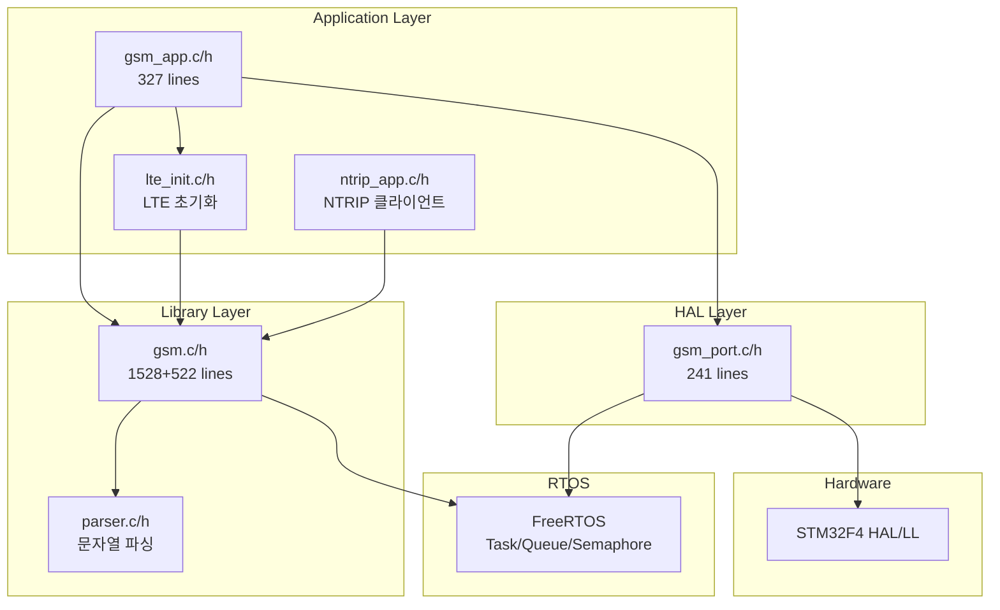
```mermaid
graph TB
    subgraph "Application Layer"
        GSM_APP[gsm_app.c/h<br/>327 lines]
        LTE_INIT[lte_init.c/h<br/>LTE 초기화]
        NTRIP[ntrip_app.c/h<br/>NTRIP 클라이언트]
    end

    subgraph "Library Layer"
        GSM[gsm.c/h<br/>1528+522 lines]
        PARSER[parser.c/h<br/>문자열 파싱]
    end

    subgraph "HAL Layer"
        GSM_PORT[gsm_port.c/h<br/>241 lines]
    end

    subgraph "RTOS"
        FREERTOS[FreeRTOS<br/>Task/Queue/Semaphore]
    end

    subgraph "Hardware"
        STM32[STM32F4 HAL/LL]
    end

    GSM_APP --> GSM
    GSM_APP --> GSM_PORT
    GSM_APP --> LTE_INIT
    LTE_INIT --> GSM
    NTRIP --> GSM

    GSM --> PARSER
    GSM --> FREERTOS
    GSM_PORT --> STM32
    GSM_PORT --> FREERTOS
```

### 2.3 파일 상세

| 파일 | 경로 | 크기 | 설명 |
|------|------|------|------|
| `gsm.h` | lib/gsm/ | 522 lines | 메인 헤더, 구조체/API 정의 |
| `gsm.c` | lib/gsm/ | 1528 lines | AT 파서, URC 핸들러, TCP 관리 |
| `gsm_port.h` | modules/gsm/ | - | HAL 헤더 |
| `gsm_port.c` | modules/gsm/ | 241 lines | UART, DMA, GPIO 드라이버 |
| `gsm_app.h` | modules/gsm/ | - | 애플리케이션 헤더 |
| `gsm_app.c` | modules/gsm/ | 327 lines | 태스크 관리, 이벤트 핸들러 |

---

## 3. Producer-Consumer 아키텍처 (핵심)

### 3.1 왜 Producer-Consumer 패턴인가?

AT 명령어 기반 통신의 근본적인 문제:
1. **응답 혼선**: 여러 태스크가 동시에 AT 명령을 보내면 응답이 섞임
2. **타이밍 이슈**: 명령-응답 매칭이 어려움
3. **블로킹 문제**: 동기식 호출 시 전체 시스템 블로킹

**해결책: lwcell 스타일 Producer-Consumer 패턴**

```
┌──────────────────────────────────────────────────────────────────┐
│  문제: 여러 태스크가 동시에 AT 명령 전송                            │
│                                                                   │
│   Task A ──► AT+COPS?  ──┐                                        │
│   Task B ──► AT+CPIN?  ──┼──► UART ──► EC25                      │
│   Task C ──► AT+QIOPEN ──┘                                        │
│                                                                   │
│   EC25 응답: +COPS: 0,0,"SKT",7\r\nOK\r\n                         │
│             +CPIN: READY\r\nOK\r\n                                │
│             +QIOPEN: 0,0\r\nOK\r\n                                │
│                                                                   │
│   ❌ 어떤 응답이 어떤 명령의 것인지 알 수 없음!                      │
└──────────────────────────────────────────────────────────────────┘

┌──────────────────────────────────────────────────────────────────┐
│  해결: Producer-Consumer 패턴으로 순차 처리                        │
│                                                                   │
│   Task A ──┐                                                      │
│   Task B ──┼──► [Queue] ──► Producer ──► UART ──► EC25           │
│   Task C ──┘       │                        │                     │
│                    │                        ▼                     │
│                    │       Consumer ◄── UART RX                   │
│                    │           │                                  │
│                    └───────────┴──► 응답 매칭 완벽!                │
└──────────────────────────────────────────────────────────────────┘
```

### 3.2 3개 Task 구조

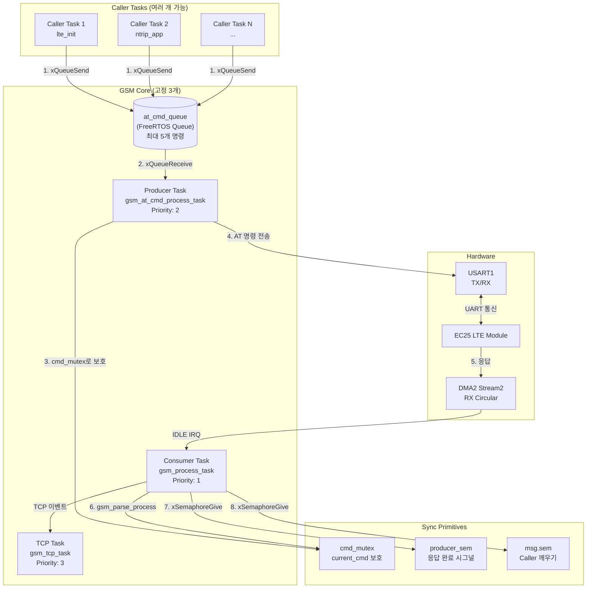
```mermaid
graph TB
    subgraph "Caller Tasks (여러 개 가능)"
        CALLER1[Caller Task 1<br/>lte_init]
        CALLER2[Caller Task 2<br/>ntrip_app]
        CALLER3[Caller Task N<br/>...]
    end

    subgraph "GSM Core (고정 3개)"
        QUEUE[("at_cmd_queue<br/>(FreeRTOS Queue)<br/>최대 5개 명령")]
        PRODUCER[Producer Task<br/>gsm_at_cmd_process_task<br/>Priority: 2]
        CONSUMER[Consumer Task<br/>gsm_process_task<br/>Priority: 1]
        TCP_TASK[TCP Task<br/>gsm_tcp_task<br/>Priority: 3]
    end

    subgraph "Sync Primitives"
        CMD_MUTEX[cmd_mutex<br/>current_cmd 보호]
        PRODUCER_SEM[producer_sem<br/>응답 완료 시그널]
        CALLER_SEM[msg.sem<br/>Caller 깨우기]
    end

    subgraph "Hardware"
        UART[USART1<br/>TX/RX]
        DMA[DMA2 Stream2<br/>RX Circular]
        EC25[EC25 LTE Module]
    end

    CALLER1 -->|1. xQueueSend| QUEUE
    CALLER2 -->|1. xQueueSend| QUEUE
    CALLER3 -->|1. xQueueSend| QUEUE

    QUEUE -->|2. xQueueReceive| PRODUCER
    PRODUCER -->|3. cmd_mutex로 보호| CMD_MUTEX
    PRODUCER -->|4. AT 명령 전송| UART

    UART <-->|UART 통신| EC25
    EC25 -->|5. 응답| DMA
    DMA -->|IDLE IRQ| CONSUMER

    CONSUMER -->|6. gsm_parse_process| CMD_MUTEX
    CONSUMER -->|7. xSemaphoreGive| PRODUCER_SEM
    CONSUMER -->|8. xSemaphoreGive| CALLER_SEM

    CONSUMER -->|TCP 이벤트| TCP_TASK
```

### 3.3 동기화 메커니즘 상세

| 동기화 객체 | 타입 | 용도 | 소유자 |
|------------|------|------|--------|
| `at_cmd_queue` | Queue(5) | Caller → Producer 명령 전달 | gsm_t |
| `cmd_mutex` | Mutex | current_cmd 접근 보호 | gsm_t |
| `producer_sem` | Binary Sem | Consumer → Producer 응답 완료 | gsm_t |
| `msg.sem` | Binary Sem | Consumer → Caller 응답 완료 (동기식) | gsm_at_cmd_t |
| `tcp_mutex` | Mutex | TCP 소켓 접근 보호 | gsm_tcp_t |
| `event_queue` | Queue(10) | URC → TCP Task 이벤트 전달 | gsm_tcp_t |

### 3.4 동기식 AT 명령 실행 흐름 (상세)

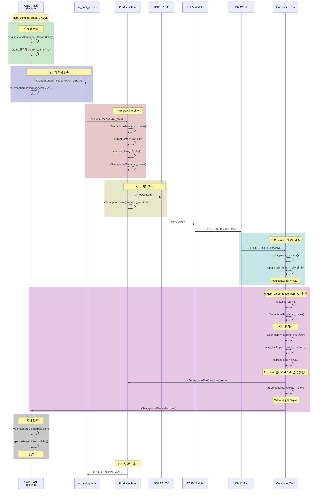
```mermaid
sequenceDiagram
    participant CALLER as Caller Task<br/>(lte_init)
    participant QUEUE as at_cmd_queue
    participant PRODUCER as Producer Task
    participant UART as USART1 TX
    participant EC25 as EC25 Module
    participant DMA as DMA2 RX
    participant CONSUMER as Consumer Task

    Note over CALLER: gsm_send_at_cmd(..., NULL)

    rect rgb(200, 230, 200)
        Note over CALLER: 1. 명령 준비
        CALLER->>CALLER: msg.sem = xSemaphoreCreateBinary()
        CALLER->>CALLER: status 초기화 (is_ok=0, is_err=0)
    end

    rect rgb(200, 200, 230)
        Note over CALLER,QUEUE: 2. 큐에 명령 전송
        CALLER->>QUEUE: xQueueSend(&msg, portMAX_DELAY)
        CALLER->>CALLER: xSemaphoreTake(msg.sem) 대기...
    end

    rect rgb(230, 200, 200)
        Note over PRODUCER: 3. Producer가 명령 수신
        QUEUE->>PRODUCER: xQueueReceive(&at_cmd)
        PRODUCER->>PRODUCER: xSemaphoreTake(cmd_mutex)
        PRODUCER->>PRODUCER: current_cmd = &at_cmd
        PRODUCER->>PRODUCER: memset(&msg, 0) 초기화
        PRODUCER->>PRODUCER: xSemaphoreGive(cmd_mutex)
    end

    rect rgb(230, 230, 200)
        Note over PRODUCER,UART: 4. AT 명령 전송
        PRODUCER->>UART: "AT+COPS?\r\n"
        PRODUCER->>PRODUCER: xSemaphoreTake(producer_sem) 대기...
    end

    UART->>EC25: AT+COPS?
    EC25->>DMA: +COPS: 0,0,"SKT",7\r\nOK\r\n

    rect rgb(200, 230, 230)
        Note over CONSUMER: 5. Consumer가 응답 파싱
        DMA->>CONSUMER: IDLE IRQ → xQueueReceive
        CONSUMER->>CONSUMER: gsm_parse_process()
        CONSUMER->>CONSUMER: handle_urc_cops() - 데이터 파싱
        Note over CONSUMER: msg.cops.oper = "SKT"
    end

    rect rgb(230, 200, 230)
        Note over CONSUMER: 6. gsm_parse_response() - OK 감지
        CONSUMER->>CONSUMER: status.is_ok = 1
        CONSUMER->>CONSUMER: xSemaphoreTake(cmd_mutex)

        Note over CONSUMER: 백업 및 정리
        CONSUMER->>CONSUMER: caller_sem = current_cmd->sem
        CONSUMER->>CONSUMER: msg_backup = current_cmd->msg
        CONSUMER->>CONSUMER: current_cmd = NULL

        Note over CONSUMER: Producer 먼저 깨우기 (다음 명령 준비)
        CONSUMER->>PRODUCER: xSemaphoreGive(producer_sem)
        CONSUMER->>CONSUMER: xSemaphoreGive(cmd_mutex)

        Note over CONSUMER: Caller 나중에 깨우기
        CONSUMER->>CALLER: xSemaphoreGive(caller_sem)
    end

    rect rgb(200, 200, 200)
        Note over CALLER: 7. 결과 확인
        CALLER->>CALLER: vSemaphoreDelete(msg.sem)
        CALLER->>CALLER: gsm->status.is_ok == 1 확인
        Note over CALLER: 성공!
    end

    Note over PRODUCER: 8. 다음 명령 대기
    PRODUCER->>QUEUE: xQueueReceive() 대기...
```

### 3.5 비동기식 AT 명령 실행 흐름

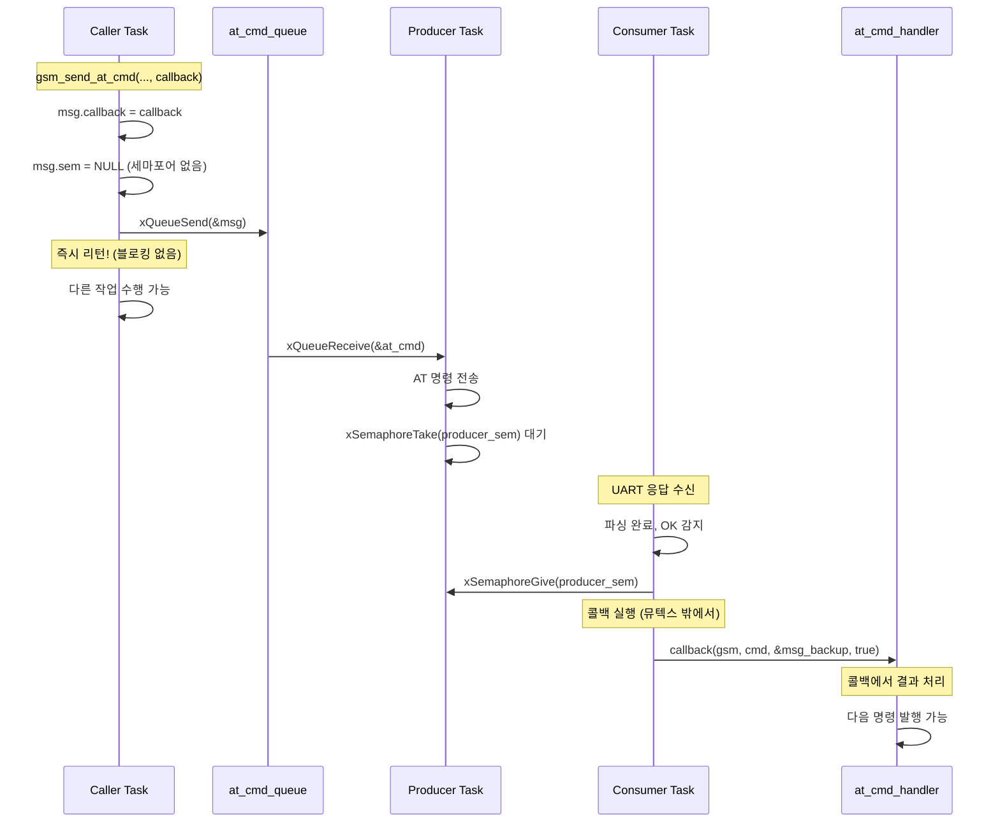
```mermaid
sequenceDiagram
    participant CALLER as Caller Task
    participant QUEUE as at_cmd_queue
    participant PRODUCER as Producer Task
    participant CONSUMER as Consumer Task
    participant CALLBACK as at_cmd_handler

    Note over CALLER: gsm_send_at_cmd(..., callback)

    CALLER->>CALLER: msg.callback = callback
    CALLER->>CALLER: msg.sem = NULL (세마포어 없음)
    CALLER->>QUEUE: xQueueSend(&msg)

    Note over CALLER: 즉시 리턴! (블로킹 없음)
    CALLER->>CALLER: 다른 작업 수행 가능

    QUEUE->>PRODUCER: xQueueReceive(&at_cmd)
    PRODUCER->>PRODUCER: AT 명령 전송
    PRODUCER->>PRODUCER: xSemaphoreTake(producer_sem) 대기

    Note over CONSUMER: UART 응답 수신

    CONSUMER->>CONSUMER: 파싱 완료, OK 감지
    CONSUMER->>PRODUCER: xSemaphoreGive(producer_sem)

    Note over CONSUMER: 콜백 실행 (뮤텍스 밖에서)
    CONSUMER->>CALLBACK: callback(gsm, cmd, &msg_backup, true)

    Note over CALLBACK: 콜백에서 결과 처리
    CALLBACK->>CALLBACK: 다음 명령 발행 가능
```

### 3.6 핵심 설계 결정 (Q&A)

```
┌─────────────────────────────────────────────────────────────────┐
│ Q1: current_cmd_buf가 필요한가? (별도 버퍼에 복사)               │
├─────────────────────────────────────────────────────────────────┤
│ A: 아니오. Producer Task는 producer_sem을 받을 때까지           │
│    블로킹되므로 at_cmd 스택 변수가 덮어써질 위험이 없음.         │
│    직접 포인터 사용으로 메모리 절약.                             │
│                                                                  │
│    Producer Task:                                                │
│    while(1) {                                                    │
│        xQueueReceive(&at_cmd);     // 스택에 at_cmd 생성         │
│        current_cmd = &at_cmd;       // 포인터로 참조              │
│        send_at_command();                                        │
│        xSemaphoreTake(producer_sem); // ★ 여기서 블로킹!         │
│        // at_cmd는 아직 스택에 유효                               │
│    }                                                             │
└─────────────────────────────────────────────────────────────────┘

┌─────────────────────────────────────────────────────────────────┐
│ Q2: producer_sem과 msg.sem 순서는?                               │
├─────────────────────────────────────────────────────────────────┤
│ A: producer_sem을 먼저 Give                                      │
│                                                                  │
│    1. xSemaphoreGive(producer_sem)  // Producer 먼저 깨움        │
│       → Producer가 다음 명령 준비 시작                           │
│    2. xSemaphoreGive(msg.sem)       // Caller 나중에 깨움        │
│       → Caller가 새 명령을 보내도 Producer가 준비된 상태          │
│                                                                  │
│    이유: Caller가 깨어나서 즉시 새 명령을 보내면                   │
│          Producer가 이미 큐에서 대기 중이어야 함                   │
└─────────────────────────────────────────────────────────────────┘

┌─────────────────────────────────────────────────────────────────┐
│ Q3: TaskNotify 대신 세마포어를 쓰는 이유?                        │
├─────────────────────────────────────────────────────────────────┤
│ A: Producer Task는 두 가지를 동시에 대기해야 함:                 │
│    - 새 명령 (큐)                                                │
│    - 응답 완료 (시그널)                                          │
│                                                                  │
│    TaskNotify는 단일 알림만 가능하고,                            │
│    xQueueReceive와 동시 대기 시 어느 것이 먼저 깨어날지 예측 불가.│
│                                                                  │
│    세마포어 + 큐 조합이 명확한 흐름 제어 가능.                    │
└─────────────────────────────────────────────────────────────────┘
```

---

## 4. 데이터 구조

### 4.1 GSM 메인 구조체 (`gsm_t`)

```c
typedef struct gsm_s {
    /* ========== 수신 버퍼 ========== */
    gsm_recv_t recv;                    // 수신 데이터 버퍼 (128 bytes)
    // - data[128]: 현재 파싱 중인 라인
    // - len: 현재 라인 길이
    // - data_offset: 실제 데이터 시작 위치

    /* ========== 상태 플래그 ========== */
    gsm_status_t status;                // 상태 플래그
    // - is_ok: OK 응답 수신
    // - is_err: ERROR 응답 수신
    // - is_timeout: 타임아웃 발생
    // - is_powerd: 모듈 전원 상태
    // - is_sim_rdy: SIM 준비 상태
    // - is_network_registered: 네트워크 등록 상태
    // - is_send_rdy: 전송 준비 완료

    /* ========== 이벤트 핸들러 ========== */
    gsm_evt_handler_t evt_handler;      // 사용자 이벤트 콜백
    // - handler: 콜백 함수 포인터
    // - args: 콜백 인자

    /* ========== AT 명령 처리 (Producer-Consumer) ========== */
    gsm_at_cmd_t *current_cmd;          // 현재 처리중인 AT 명령
                                        // Producer Task 스택 변수를 직접 가리킴
    SemaphoreHandle_t cmd_mutex;        // current_cmd 접근 보호
    SemaphoreHandle_t producer_sem;     // Producer 응답 대기용

    /* ========== HAL 및 테이블 ========== */
    const gsm_hal_ops_t *ops;           // HAL 함수 포인터 (send, reset)
    const gsm_at_cmd_entry_t *at_tbl;   // AT 명령 테이블 (타임아웃 등)
    const urc_handler_entry_t *urc_stat_tbl;  // 상태 URC 핸들러
    const urc_handler_entry_t *urc_info_tbl;  // 정보 URC 핸들러
    QueueHandle_t at_cmd_queue;         // AT 명령 큐 (5개)

    /* ========== TCP 관리 ========== */
    gsm_tcp_t tcp;                      // TCP 소켓 관리 구조체
} gsm_t;
```

### 4.2 AT 명령 구조체 (`gsm_at_cmd_t`)

```c
typedef struct {
    /* ========== 명령 정보 ========== */
    gsm_cmd_t cmd;                      // 명령 타입 (GSM_CMD_COPS 등)
    char params[64];                    // 파라미터 문자열 ("1,0,\"SKT\"")
    gsm_at_mode_t at_mode;              // 실행 모드
    // - GSM_AT_EXECUTE: AT+CMD
    // - GSM_AT_WRITE:   AT+CMD=params
    // - GSM_AT_READ:    AT+CMD?
    // - GSM_AT_TEST:    AT+CMD=?

    /* ========== 대기 타입 ========== */
    gsm_wait_type_t wait_type;          // 대기 타입
    // - GSM_WAIT_NONE:     OK/ERROR만 대기
    // - GSM_WAIT_EXPECTED: +PREFIX: 응답 대기
    // - GSM_WAIT_PROMPT:   '>' 프롬프트 대기 (QISEND)

    /* ========== 동기화 ========== */
    SemaphoreHandle_t sem;              // 동기식 대기 세마포어
                                        // NULL이면 비동기식
    at_cmd_handler callback;            // 비동기 완료 콜백
    uint32_t timeout_ms;                // 타임아웃 (테이블에서 참조)

    /* ========== 파싱 결과 ========== */
    gsm_msg_t msg;                      // 파싱 결과 (Union)

    /* ========== TCP 전송용 ========== */
    tcp_pbuf_t *tx_pbuf;                // 전송 데이터 버퍼 (QISEND 전용)
                                        // 전송 완료/에러 시 자동 해제
} gsm_at_cmd_t;
```

### 4.3 메시지 Union (`gsm_msg_t`) - 메모리 효율적 파싱 결과

```c
typedef union {
    /* ========== AT+CGDCONT? 결과 ========== */
    struct {
        gsm_pdp_context_t contexts[5]; // 최대 5개 PDP context
        // - cid: Context ID
        // - type: IP/PPP/IPV6/IPV4V6
        // - apn[32]: APN 문자열
        size_t count;                   // 파싱된 context 수
    } cgdcont;

    /* ========== AT+COPS? 결과 ========== */
    struct {
        uint8_t mode;                   // 0:자동, 1:수동, 2:해제
        uint8_t format;                 // 0:긴형식, 1:짧은형식, 2:숫자
        char oper[32];                  // "SKT", "KT", "LGU+"
        uint8_t act;                    // 접속 기술 (7=LTE)
    } cops;

    /* ========== AT+CPIN? 결과 ========== */
    struct {
        char code[16];                  // "READY", "SIM PIN", "SIM PUK"
    } cpin;

    /* ========== AT+QIOPEN 결과 ========== */
    struct {
        uint8_t connect_id;             // 소켓 ID (0-11)
        int32_t result;                 // 0: 성공, 기타: 에러 코드
    } qiopen;

    /* ========== AT+QICLOSE 결과 ========== */
    struct {
        uint8_t connect_id;
        int32_t result;
    } qiclose;

    /* ========== AT+QISEND 결과 ========== */
    struct {
        uint8_t connect_id;
        uint16_t sent_length;           // 전송 요청 길이
        uint16_t acked_length;          // ACK 받은 길이
    } qisend;

    /* ========== AT+QIRD 결과 ========== */
    struct {
        uint8_t connect_id;
        uint16_t read_actual_length;    // 실제 읽은 길이
        uint8_t *data;                  // TCP RX 버퍼 포인터
    } qird;

    /* ========== AT+QISTATE 결과 ========== */
    struct {
        uint8_t connect_id;
        char service_type[8];           // "TCP", "UDP"
        char remote_ip[64];
        uint16_t remote_port;
        uint16_t local_port;
        uint8_t socket_state;           // 0:Initial, 2:Connected, 4:Closing
        uint8_t context_id;
        uint8_t access_mode;            // 0:버퍼, 1:푸시, 2:다이렉트
        char at_port[16];               // "usbmodem", "uart1"
    } qistate;
} gsm_msg_t;
```

### 4.4 TCP 소켓 구조체 (`gsm_tcp_socket_t`)

```c
typedef struct {
    /* ========== 소켓 정보 ========== */
    uint8_t connect_id;                 // 소켓 ID (0-11)
    gsm_tcp_state_t state;              // 연결 상태
    // - GSM_TCP_STATE_CLOSED:    닫힘
    // - GSM_TCP_STATE_OPENING:   연결 중
    // - GSM_TCP_STATE_CONNECTED: 연결됨
    // - GSM_TCP_STATE_CLOSING:   종료 중

    char remote_ip[64];                 // 원격 IP 주소
    uint16_t remote_port;               // 원격 포트
    uint16_t local_port;                // 로컬 포트 (0=자동)

    /* ========== 수신 버퍼 큐 (lwcell pbuf 방식) ========== */
    tcp_pbuf_t *pbuf_head;              // 수신 pbuf 체인 헤드
    tcp_pbuf_t *pbuf_tail;              // 수신 pbuf 체인 테일
    size_t pbuf_total_len;              // 큐에 쌓인 총 바이트
                                        // 최대 16KB (GSM_TCP_PBUF_MAX_LEN)

    /* ========== 콜백 ========== */
    tcp_recv_callback_t on_recv;        // 데이터 수신 콜백
    tcp_close_callback_t on_close;      // 연결 종료 콜백

    /* ========== 동기화 ========== */
    SemaphoreHandle_t open_sem;         // 연결 완료 대기 (동기식 QIOPEN)
} gsm_tcp_socket_t;
```

### 4.5 pbuf 구조체 (`tcp_pbuf_t`) - 체인 방식 메모리 관리

```c
typedef struct tcp_pbuf_s {
    uint8_t *payload;                   // 데이터 포인터 (pvPortMalloc)
    size_t len;                         // 현재 pbuf 데이터 길이
    size_t tot_len;                     // 전체 체인 길이 (다음 pbuf 포함)
    struct tcp_pbuf_s *next;            // 다음 pbuf (체인 연결)
} tcp_pbuf_t;
```

**pbuf 체인 구조 시각화:**

```
┌──────────────────────────────────────────────────────────────────┐
│  Socket 0의 pbuf 체인 (예: 3개 pbuf)                              │
│                                                                   │
│  pbuf_head ───►┌─────────┐    ┌─────────┐    ┌─────────┐         │
│                │ pbuf 1  │───►│ pbuf 2  │───►│ pbuf 3  │───► NULL│
│                │len:1460 │    │len:1460 │    │len: 512 │         │
│  pbuf_tail ────┼─────────┼────┼─────────┼───►│         │         │
│                └─────────┘    └─────────┘    └─────────┘         │
│                                                                   │
│  pbuf_total_len = 1460 + 1460 + 512 = 3432 bytes                 │
│                                                                   │
│  ★ 최대 16KB 도달 시 가장 오래된 pbuf(head)부터 자동 삭제          │
│    → 실시간 스트리밍(NTRIP)에서 최신 데이터 우선                   │
└──────────────────────────────────────────────────────────────────┘
```

---

## 5. AT 명령어 처리 동작방식

### 5.1 AT 명령 테이블

```c
const gsm_at_cmd_entry_t gsm_at_cmd_handlers[] = {
    /* 명령           AT문자열       응답prefix     타임아웃(ms) */
    {GSM_CMD_NONE,    NULL,         NULL,          0},

    /* 3GPP 기본 명령어 */
    {GSM_CMD_AT,      "AT",         NULL,          300},      // 동작 확인
    {GSM_CMD_ATE,     "ATE",        NULL,          300},      // 에코 설정
    {GSM_CMD_CMEE,    "AT+CMEE",    "+CMEE: ",     300},      // 에러 모드
    {GSM_CMD_CGDCONT, "AT+CGDCONT", "+CGDCONT: ",  300},      // APN 설정
    {GSM_CMD_CPIN,    "AT+CPIN",    "+CPIN: ",     5000},     // SIM 확인
    {GSM_CMD_COPS,    "AT+COPS",    "+COPS: ",     180000},   // 네트워크 (3분!)

    /* EC25 TCP 명령어 */
    {GSM_CMD_QIOPEN,  "AT+QIOPEN",  "+QIOPEN: ",   150000},   // TCP 연결 (2.5분)
    {GSM_CMD_QICLOSE, "AT+QICLOSE", "+QICLOSE: ",  10000},    // TCP 종료
    {GSM_CMD_QISEND,  "AT+QISEND",  "+QISEND: ",   5000},     // TCP 전송
    {GSM_CMD_QIRD,    "AT+QIRD",    "+QIRD: ",     5000},     // TCP 읽기
    {GSM_CMD_QISDE,   "AT+QISDE",   "+QISDE: ",    300},      // 데이터 에코
    {GSM_CMD_QISTATE, "AT+QISTATE", "+QISTATE: ",  300},      // 소켓 상태

    {GSM_CMD_NONE,    NULL,         NULL,          0}
};
```

### 5.2 AT 명령 모드

```
┌─────────────────────────────────────────────────────────────────┐
│  AT 명령 모드별 포맷                                             │
├─────────────────────────────────────────────────────────────────┤
│  GSM_AT_EXECUTE:  AT+CMD              (단순 실행)               │
│  GSM_AT_WRITE:    AT+CMD=<params>     (값 설정)                 │
│  GSM_AT_READ:     AT+CMD?             (현재 값 조회)             │
│  GSM_AT_TEST:     AT+CMD=?            (지원 범위 조회)           │
├─────────────────────────────────────────────────────────────────┤
│  예시:                                                           │
│  - AT+COPS?        → +COPS: 0,0,"SKT",7                         │
│  - AT+CGDCONT=1,"IP","lte.sktelecom.com"                        │
│  - AT+QIOPEN=1,0,"TCP","192.168.1.1",8080,0,0                   │
└─────────────────────────────────────────────────────────────────┘
```

### 5.3 AT 명령 전송 흐름 (Producer Task)

```c
// gsm_app.c: gsm_at_cmd_process_task()
static void gsm_at_cmd_process_task(void *pvParameters) {
    gsm_t *gsm = (gsm_t *)pvParameters;
    gsm_at_cmd_t at_cmd;

    while (1) {
        // 1. 큐에서 명령 수신 (블로킹)
        if (xQueueReceive(gsm->at_cmd_queue, &at_cmd, portMAX_DELAY) == pdTRUE) {

            // 2. 명령 유효성 검사
            if (at_cmd.cmd >= GSM_CMD_MAX || at_cmd.cmd == GSM_CMD_NONE) {
                if (at_cmd.sem) xSemaphoreGive(at_cmd.sem);
                continue;
            }

            // 3. ★ current_cmd 설정 (AT 전송 전에!)
            //    빠른 응답 수신 시 current_cmd가 NULL이면 응답을 놓침
            xSemaphoreTake(gsm->cmd_mutex, portMAX_DELAY);
            gsm->current_cmd = &at_cmd;
            memset(&gsm->current_cmd->msg, 0, sizeof(gsm_msg_t));
            xSemaphoreGive(gsm->cmd_mutex);

            // 4. AT 명령 문자열 생성 및 전송
            gsm->ops->send(gsm->at_tbl[at_cmd.cmd].at_str, ...);

            // 모드에 따른 접미사 추가
            switch (at_cmd.at_mode) {
                case GSM_AT_WRITE:  gsm->ops->send("=", 1);  break;
                case GSM_AT_READ:   gsm->ops->send("?", 1);  break;
                case GSM_AT_TEST:   gsm->ops->send("=?", 2); break;
            }

            // 파라미터 전송
            if (at_cmd.params[0]) gsm->ops->send(at_cmd.params, ...);
            gsm->ops->send("\r\n", 2);

            // 5. ★ 응답 대기 (Producer는 여기서 블로킹)
            uint32_t timeout = gsm->at_tbl[at_cmd.cmd].timeout_ms;
            if (xSemaphoreTake(gsm->producer_sem, pdMS_TO_TICKS(timeout)) != pdTRUE) {
                // 타임아웃 처리
                gsm->current_cmd = NULL;
                gsm->status.is_err = 1;
                if (at_cmd.sem) xSemaphoreGive(at_cmd.sem);
                else if (at_cmd.callback) at_cmd.callback(gsm, at_cmd.cmd, NULL, false);
            }
            // 응답 완료 → 다음 명령 처리
        }
    }
}
```

### 5.4 AT 응답 파싱 흐름 (Consumer Task)

```c
// gsm.c: gsm_parse_process()
void gsm_parse_process(gsm_t *gsm, const void *data, size_t len) {
    const uint8_t *d = data;

    for (; len > 0; ++d, --len) {
        // 1. TCP 바이너리 데이터 읽기 모드 (QIRD 응답 후)
        if (gsm->tcp.buffer.is_reading_data) {
            // 바이너리 데이터 직접 버퍼에 저장
            gsm->tcp.buffer.rx_buf[gsm->tcp.buffer.rx_len++] = *d;
            // ... 완료 시 콜백 호출
            continue;
        }

        // 2. '>' 프롬프트 처리 (QISEND)
        if (*d == '>' && recv_payload_len(gsm) == 0) {
            if (gsm->current_cmd && gsm->current_cmd->cmd == GSM_CMD_QISEND) {
                // pbuf에서 데이터 전송
                gsm->ops->send(gsm->current_cmd->tx_pbuf->payload, ...);
                gsm->current_cmd->wait_type = GSM_WAIT_EXPECTED;
            }
            continue;
        }

        // 3. 문자 축적 (\r\n 제외)
        if (*d != '\r' && *d != '\n') {
            add_payload(gsm, *d);
        }

        // 4. 라인 완료 (\r\n) 시 파싱
        if (ch_prev1 == '\r' && *d == '\n') {
            if (recv_payload_len(gsm)) {
                gsm_parse_response(gsm);  // ★ 응답 파싱
                clear_payload(gsm);
            }
        }
    }
}
```

### 5.5 응답 분류 및 처리

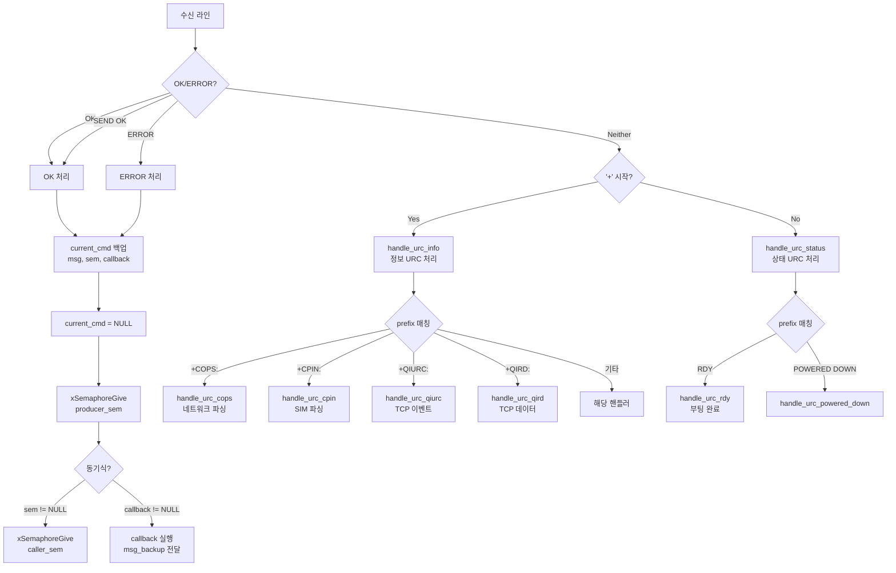
```mermaid
flowchart TD
    RECV[수신 라인] --> CHECK1{OK/ERROR?}

    CHECK1 -->|OK| OK_PROC[OK 처리]
    CHECK1 -->|SEND OK| OK_PROC
    CHECK1 -->|ERROR| ERR_PROC[ERROR 처리]
    CHECK1 -->|Neither| CHECK2{'+' 시작?}

    CHECK2 -->|Yes| URC_INFO[handle_urc_info<br/>정보 URC 처리]
    CHECK2 -->|No| URC_STAT[handle_urc_status<br/>상태 URC 처리]

    OK_PROC --> BACKUP[current_cmd 백업<br/>msg, sem, callback]
    BACKUP --> CLEAR[current_cmd = NULL]
    CLEAR --> WAKE_PROD[xSemaphoreGive<br/>producer_sem]
    WAKE_PROD --> CHECK_SYNC{동기식?}

    CHECK_SYNC -->|sem != NULL| WAKE_CALLER[xSemaphoreGive<br/>caller_sem]
    CHECK_SYNC -->|callback != NULL| CALL_CB[callback 실행<br/>msg_backup 전달]

    ERR_PROC --> BACKUP

    URC_INFO --> PREFIX_MATCH{prefix 매칭}
    PREFIX_MATCH -->|+COPS:| HANDLE_COPS[handle_urc_cops<br/>네트워크 파싱]
    PREFIX_MATCH -->|+CPIN:| HANDLE_CPIN[handle_urc_cpin<br/>SIM 파싱]
    PREFIX_MATCH -->|+QIURC:| HANDLE_QIURC[handle_urc_qiurc<br/>TCP 이벤트]
    PREFIX_MATCH -->|+QIRD:| HANDLE_QIRD[handle_urc_qird<br/>TCP 데이터]
    PREFIX_MATCH -->|기타| HANDLE_OTHER[해당 핸들러]

    URC_STAT --> STAT_MATCH{prefix 매칭}
    STAT_MATCH -->|RDY| HANDLE_RDY[handle_urc_rdy<br/>부팅 완료]
    STAT_MATCH -->|POWERED DOWN| HANDLE_PWR[handle_urc_powered_down]
```

---

## 6. URC (Unsolicited Result Code) 처리

### 6.1 URC란?

```
┌─────────────────────────────────────────────────────────────────┐
│  URC (Unsolicited Result Code)                                   │
│  = 모뎀이 자발적으로 보내는 응답 (요청 없이)                       │
├─────────────────────────────────────────────────────────────────┤
│  예시:                                                           │
│  - RDY                    : 모듈 부팅 완료                       │
│  - +QIURC: "recv",0       : 소켓 0에 데이터 도착                 │
│  - +QIURC: "closed",0     : 소켓 0 연결 종료                     │
│  - POWERED DOWN           : 모듈 전원 OFF                        │
├─────────────────────────────────────────────────────────────────┤
│  vs AT 응답:                                                     │
│  - AT+COPS?               → +COPS: 0,0,"SKT",7  (요청에 대한 응답)│
│  - (아무것도 안함)         → +QIURC: "recv",0   (자발적 알림)     │
└─────────────────────────────────────────────────────────────────┘
```

### 6.2 URC 핸들러 테이블

```c
/* 상태 URC ('+' 없이 시작) */
const urc_handler_entry_t urc_status_handlers[] = {
    {"RDY",          handle_urc_rdy},           // 모듈 준비 완료
    {"POWERED DOWN", handle_urc_powered_down},  // 전원 OFF
    {NULL, NULL}
};

/* 정보 URC ('+' 로 시작) */
const urc_handler_entry_t urc_info_handlers[] = {
    {"+CMEE: ",     handle_urc_cmee},      // 에러 코드
    {"+CGDCONT: ",  handle_urc_cgdcont},   // PDP Context
    {"+CPIN: ",     handle_urc_cpin},      // SIM 상태
    {"+COPS: ",     handle_urc_cops},      // 네트워크
    {"+QIOPEN: ",   handle_urc_qiopen},    // TCP 연결 결과
    {"+QICLOSE: ",  handle_urc_qiclose},   // TCP 종료
    {"+QISEND: ",   handle_urc_qisend},    // TCP 전송 결과
    {"+QIRD: ",     handle_urc_qird},      // TCP 수신 데이터
    {"+QISTATE: ",  handle_urc_qistate},   // 소켓 상태
    {"+QIURC: ",    handle_urc_qiurc},     // TCP 비동기 이벤트 ★
    {NULL, NULL}
};
```

### 6.3 URC vs AT 응답 통합 처리

핵심 설계: **하나의 핸들러가 URC와 AT 응답을 모두 처리**

```c
void handle_urc_cops(gsm_t *gsm, const char *data, size_t len) {
    gsm_msg_t *target;
    bool is_urc;
    gsm_msg_t local_msg = {0};

    // ★ AT 응답인지 URC인지 판단
    if (gsm->current_cmd && gsm->current_cmd->cmd == GSM_CMD_COPS) {
        // AT+COPS? 명령의 응답 → current_cmd의 msg에 저장
        target = &gsm->current_cmd->msg;
        is_urc = false;
    } else {
        // URC → 로컬 변수에 임시 저장
        target = &local_msg;
        is_urc = true;
    }

    // 파싱 (공통)
    // +COPS: 0,0,"SKT",7
    const char *p = data;
    target->cops.mode = parse_uint32(&p);
    target->cops.format = parse_uint32(&p);
    parse_string_quoted(&p, target->cops.oper, sizeof(target->cops.oper));
    target->cops.act = parse_uint32(&p);

    // URC 전용 처리
    if (is_urc && target->cops.oper[0]) {
        // 네트워크 변경 이벤트 발생 등
    }
}
```

### 6.4 +QIURC 처리 (TCP 비동기 이벤트)

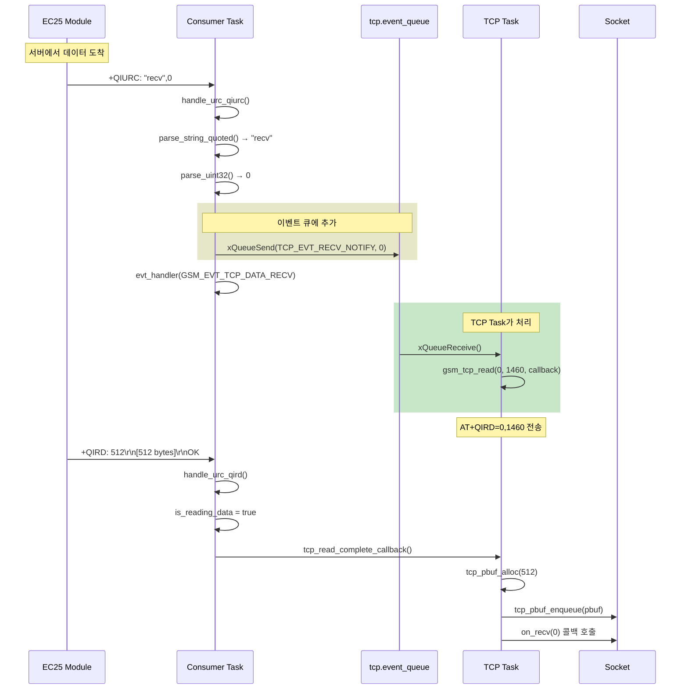
```mermaid
sequenceDiagram
    participant EC25 as EC25 Module
    participant CONSUMER as Consumer Task
    participant TCP_QUEUE as tcp.event_queue
    participant TCP_TASK as TCP Task
    participant SOCKET as Socket

    Note over EC25: 서버에서 데이터 도착
    EC25->>CONSUMER: +QIURC: "recv",0

    CONSUMER->>CONSUMER: handle_urc_qiurc()
    CONSUMER->>CONSUMER: parse_string_quoted() → "recv"
    CONSUMER->>CONSUMER: parse_uint32() → 0

    rect rgb(230, 230, 200)
        Note over CONSUMER,TCP_QUEUE: 이벤트 큐에 추가
        CONSUMER->>TCP_QUEUE: xQueueSend(TCP_EVT_RECV_NOTIFY, 0)
    end

    CONSUMER->>CONSUMER: evt_handler(GSM_EVT_TCP_DATA_RECV)

    rect rgb(200, 230, 200)
        Note over TCP_TASK: TCP Task가 처리
        TCP_QUEUE->>TCP_TASK: xQueueReceive()
        TCP_TASK->>TCP_TASK: gsm_tcp_read(0, 1460, callback)
    end

    Note over TCP_TASK: AT+QIRD=0,1460 전송

    EC25->>CONSUMER: +QIRD: 512\r\n[512 bytes]\r\nOK
    CONSUMER->>CONSUMER: handle_urc_qird()
    CONSUMER->>CONSUMER: is_reading_data = true

    CONSUMER->>TCP_TASK: tcp_read_complete_callback()
    TCP_TASK->>TCP_TASK: tcp_pbuf_alloc(512)
    TCP_TASK->>SOCKET: tcp_pbuf_enqueue(pbuf)
    TCP_TASK->>SOCKET: on_recv(0) 콜백 호출
```

---

## 7. TCP/IP 통신 동작방식

### 7.1 TCP 소켓 상태 머신

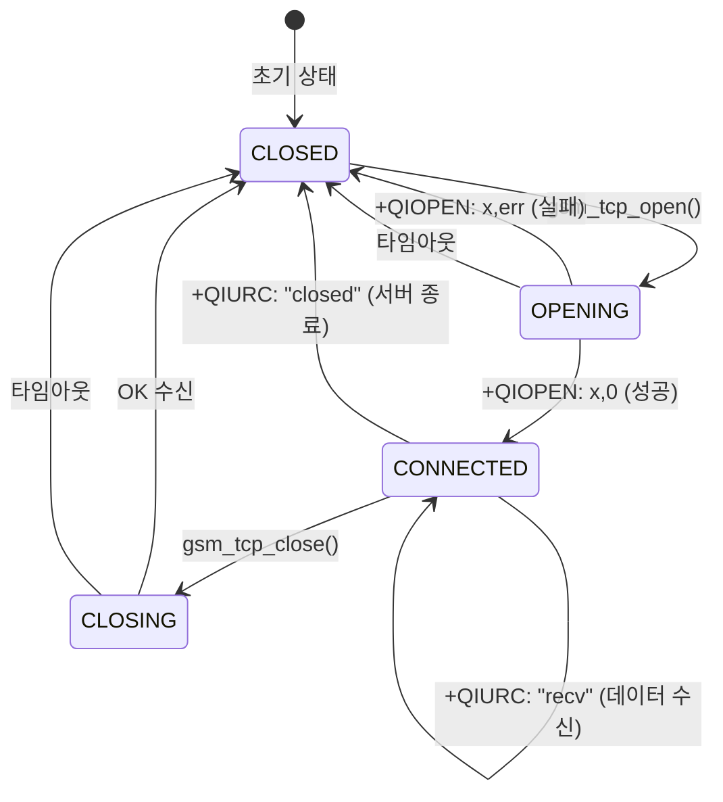
```mermaid
stateDiagram-v2
    [*] --> CLOSED: 초기 상태

    CLOSED --> OPENING: gsm_tcp_open()

    OPENING --> CONNECTED: +QIOPEN: x,0 (성공)
    OPENING --> CLOSED: +QIOPEN: x,err (실패)
    OPENING --> CLOSED: 타임아웃

    CONNECTED --> CONNECTED: gsm_tcp_send()
    CONNECTED --> CONNECTED: gsm_tcp_read()
    CONNECTED --> CONNECTED: +QIURC: "recv" (데이터 수신)
    CONNECTED --> CLOSING: gsm_tcp_close()
    CONNECTED --> CLOSED: +QIURC: "closed" (서버 종료)

    CLOSING --> CLOSED: OK 수신
    CLOSING --> CLOSED: 타임아웃
```

### 7.2 TCP 연결 흐름 (상세)

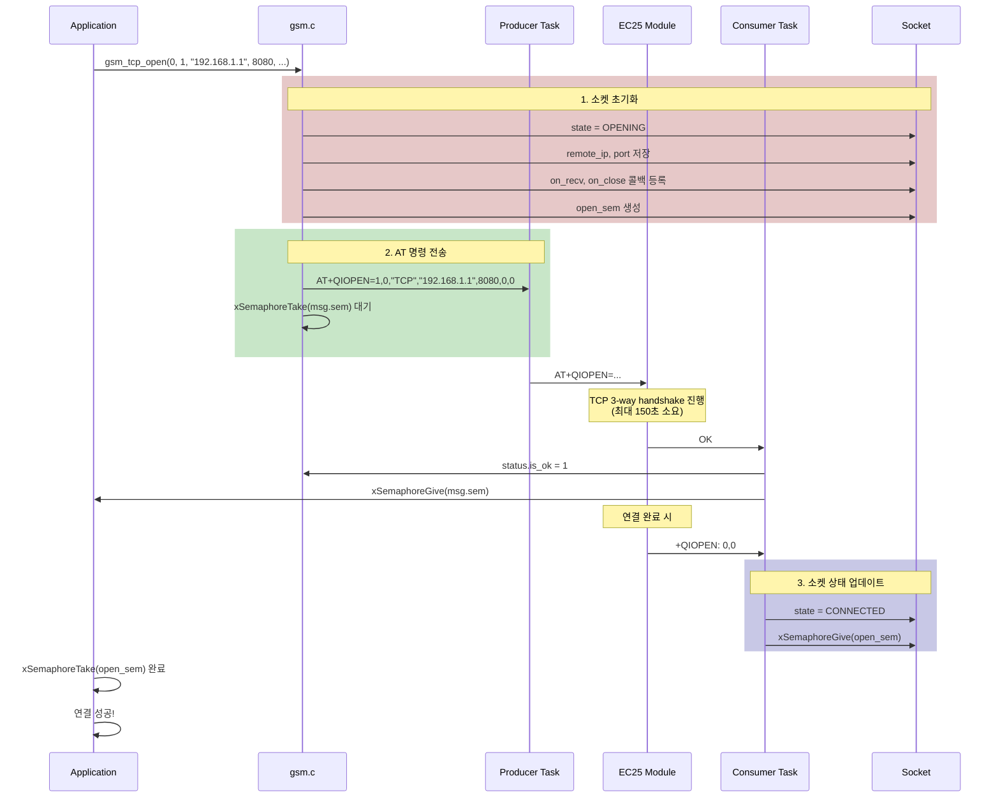
```mermaid
sequenceDiagram
    participant APP as Application
    participant GSM as gsm.c
    participant PRODUCER as Producer Task
    participant EC25 as EC25 Module
    participant CONSUMER as Consumer Task
    participant SOCKET as Socket

    APP->>GSM: gsm_tcp_open(0, 1, "192.168.1.1", 8080, ...)

    rect rgb(230, 200, 200)
        Note over GSM,SOCKET: 1. 소켓 초기화
        GSM->>SOCKET: state = OPENING
        GSM->>SOCKET: remote_ip, port 저장
        GSM->>SOCKET: on_recv, on_close 콜백 등록
        GSM->>SOCKET: open_sem 생성
    end

    rect rgb(200, 230, 200)
        Note over GSM,PRODUCER: 2. AT 명령 전송
        GSM->>PRODUCER: AT+QIOPEN=1,0,"TCP","192.168.1.1",8080,0,0
        GSM->>GSM: xSemaphoreTake(msg.sem) 대기
    end

    PRODUCER->>EC25: AT+QIOPEN=...

    Note over EC25: TCP 3-way handshake 진행<br/>(최대 150초 소요)

    EC25->>CONSUMER: OK
    CONSUMER->>GSM: status.is_ok = 1
    CONSUMER->>APP: xSemaphoreGive(msg.sem)

    Note over EC25: 연결 완료 시
    EC25->>CONSUMER: +QIOPEN: 0,0

    rect rgb(200, 200, 230)
        Note over CONSUMER,SOCKET: 3. 소켓 상태 업데이트
        CONSUMER->>SOCKET: state = CONNECTED
        CONSUMER->>SOCKET: xSemaphoreGive(open_sem)
    end

    APP->>APP: xSemaphoreTake(open_sem) 완료
    APP->>APP: 연결 성공!
```

### 7.3 TCP 데이터 전송 흐름 (QISEND)

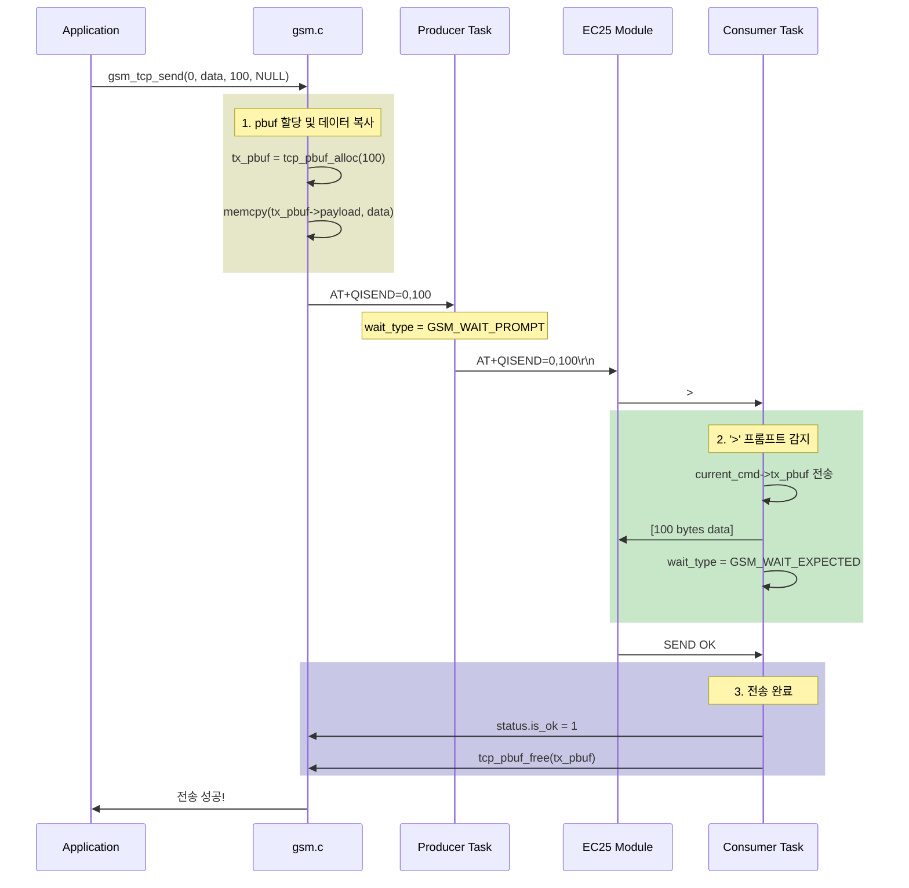
```mermaid
sequenceDiagram
    participant APP as Application
    participant GSM as gsm.c
    participant PRODUCER as Producer Task
    participant EC25 as EC25 Module
    participant CONSUMER as Consumer Task

    APP->>GSM: gsm_tcp_send(0, data, 100, NULL)

    rect rgb(230, 230, 200)
        Note over GSM: 1. pbuf 할당 및 데이터 복사
        GSM->>GSM: tx_pbuf = tcp_pbuf_alloc(100)
        GSM->>GSM: memcpy(tx_pbuf->payload, data)
    end

    GSM->>PRODUCER: AT+QISEND=0,100
    Note over PRODUCER: wait_type = GSM_WAIT_PROMPT

    PRODUCER->>EC25: AT+QISEND=0,100\r\n
    EC25->>CONSUMER: >

    rect rgb(200, 230, 200)
        Note over CONSUMER: 2. '>' 프롬프트 감지
        CONSUMER->>CONSUMER: current_cmd->tx_pbuf 전송
        CONSUMER->>EC25: [100 bytes data]
        CONSUMER->>CONSUMER: wait_type = GSM_WAIT_EXPECTED
    end

    EC25->>CONSUMER: SEND OK

    rect rgb(200, 200, 230)
        Note over CONSUMER: 3. 전송 완료
        CONSUMER->>GSM: status.is_ok = 1
        CONSUMER->>GSM: tcp_pbuf_free(tx_pbuf)
    end

    GSM->>APP: 전송 성공!
```

### 7.4 TCP 데이터 수신 흐름 (상세)

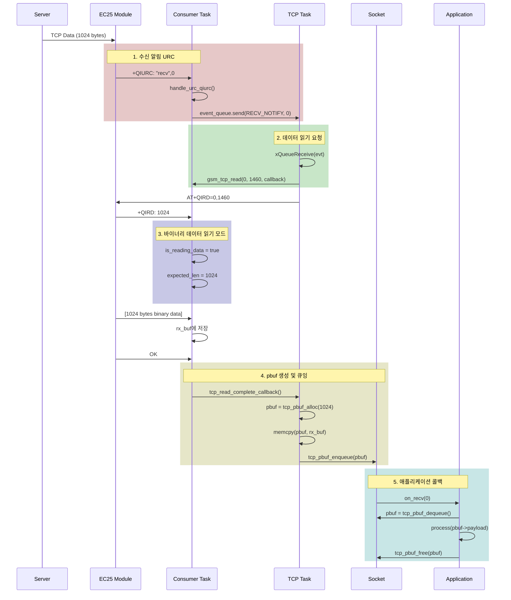
```mermaid
sequenceDiagram
    participant SERVER as Server
    participant EC25 as EC25 Module
    participant CONSUMER as Consumer Task
    participant TCP_TASK as TCP Task
    participant SOCKET as Socket
    participant APP as Application

    SERVER->>EC25: TCP Data (1024 bytes)

    rect rgb(230, 200, 200)
        Note over EC25,CONSUMER: 1. 수신 알림 URC
        EC25->>CONSUMER: +QIURC: "recv",0
        CONSUMER->>CONSUMER: handle_urc_qiurc()
        CONSUMER->>TCP_TASK: event_queue.send(RECV_NOTIFY, 0)
    end

    rect rgb(200, 230, 200)
        Note over TCP_TASK: 2. 데이터 읽기 요청
        TCP_TASK->>TCP_TASK: xQueueReceive(evt)
        TCP_TASK->>CONSUMER: gsm_tcp_read(0, 1460, callback)
    end

    TCP_TASK->>EC25: AT+QIRD=0,1460
    EC25->>CONSUMER: +QIRD: 1024

    rect rgb(200, 200, 230)
        Note over CONSUMER: 3. 바이너리 데이터 읽기 모드
        CONSUMER->>CONSUMER: is_reading_data = true
        CONSUMER->>CONSUMER: expected_len = 1024
    end

    EC25->>CONSUMER: [1024 bytes binary data]
    CONSUMER->>CONSUMER: rx_buf에 저장

    EC25->>CONSUMER: OK

    rect rgb(230, 230, 200)
        Note over CONSUMER,SOCKET: 4. pbuf 생성 및 큐잉
        CONSUMER->>TCP_TASK: tcp_read_complete_callback()
        TCP_TASK->>TCP_TASK: pbuf = tcp_pbuf_alloc(1024)
        TCP_TASK->>TCP_TASK: memcpy(pbuf, rx_buf)
        TCP_TASK->>SOCKET: tcp_pbuf_enqueue(pbuf)
    end

    rect rgb(200, 230, 230)
        Note over SOCKET,APP: 5. 애플리케이션 콜백
        SOCKET->>APP: on_recv(0)
        APP->>SOCKET: pbuf = tcp_pbuf_dequeue()
        APP->>APP: process(pbuf->payload)
        APP->>SOCKET: tcp_pbuf_free(pbuf)
    end
```

### 7.5 pbuf 메모리 관리

```c
// 할당
tcp_pbuf_t *tcp_pbuf_alloc(size_t len) {
    tcp_pbuf_t *pbuf = pvPortMalloc(sizeof(tcp_pbuf_t));
    pbuf->payload = pvPortMalloc(len);
    pbuf->len = len;
    pbuf->tot_len = len;
    pbuf->next = NULL;
    return pbuf;
}

// 해제
void tcp_pbuf_free(tcp_pbuf_t *pbuf) {
    vPortFree(pbuf->payload);
    vPortFree(pbuf);
}

// 큐에 추가 (오버플로우 방지)
int tcp_pbuf_enqueue(gsm_tcp_socket_t *socket, tcp_pbuf_t *pbuf) {
    // ★ 최대 16KB 제한 (실시간 스트리밍용)
    while (socket->pbuf_total_len + pbuf->len > GSM_TCP_PBUF_MAX_LEN) {
        // 가장 오래된 pbuf 삭제 (FIFO)
        tcp_pbuf_t *old = tcp_pbuf_dequeue(socket);
        if (old) tcp_pbuf_free(old);
    }

    // 링크드리스트 끝에 추가
    if (!socket->pbuf_head) {
        socket->pbuf_head = socket->pbuf_tail = pbuf;
    } else {
        socket->pbuf_tail->next = pbuf;
        socket->pbuf_tail = pbuf;
    }
    socket->pbuf_total_len += pbuf->len;
    return 0;
}

// 큐에서 꺼내기
tcp_pbuf_t *tcp_pbuf_dequeue(gsm_tcp_socket_t *socket) {
    tcp_pbuf_t *pbuf = socket->pbuf_head;
    if (pbuf) {
        socket->pbuf_head = pbuf->next;
        if (!socket->pbuf_head) socket->pbuf_tail = NULL;
        socket->pbuf_total_len -= pbuf->len;
        pbuf->next = NULL;
    }
    return pbuf;
}
```

**메모리 오버플로우 방지 전략:**

```
┌─────────────────────────────────────────────────────────────────┐
│  NTRIP 실시간 스트리밍 특성:                                     │
│  - 연속적으로 데이터가 도착                                      │
│  - 처리가 느리면 버퍼가 계속 증가                                 │
│  - 메모리 부족 → 시스템 크래시 위험                               │
├─────────────────────────────────────────────────────────────────┤
│  해결: 최대 16KB 제한 + 오래된 데이터 자동 삭제                    │
│                                                                  │
│  데이터 도착 순서: [A][B][C][D][E][F] (각 4KB)                   │
│                                                                  │
│  16KB 도달 시:                                                   │
│  Before: [A][B][C][D] = 16KB                                    │
│  New:    [E] = 4KB                                              │
│  After:  [B][C][D][E] = 16KB (A 삭제)                           │
│                                                                  │
│  → 최신 RTK 보정 데이터 유지, 오래된 데이터는 어차피 무의미       │
└─────────────────────────────────────────────────────────────────┘
```

---

## 8. 상세 동작 방식

### 8.1 전체 시스템 동작 개요

GSM 라이브러리는 **Producer-Consumer 패턴** 기반의 3-태스크 구조로 동작합니다.

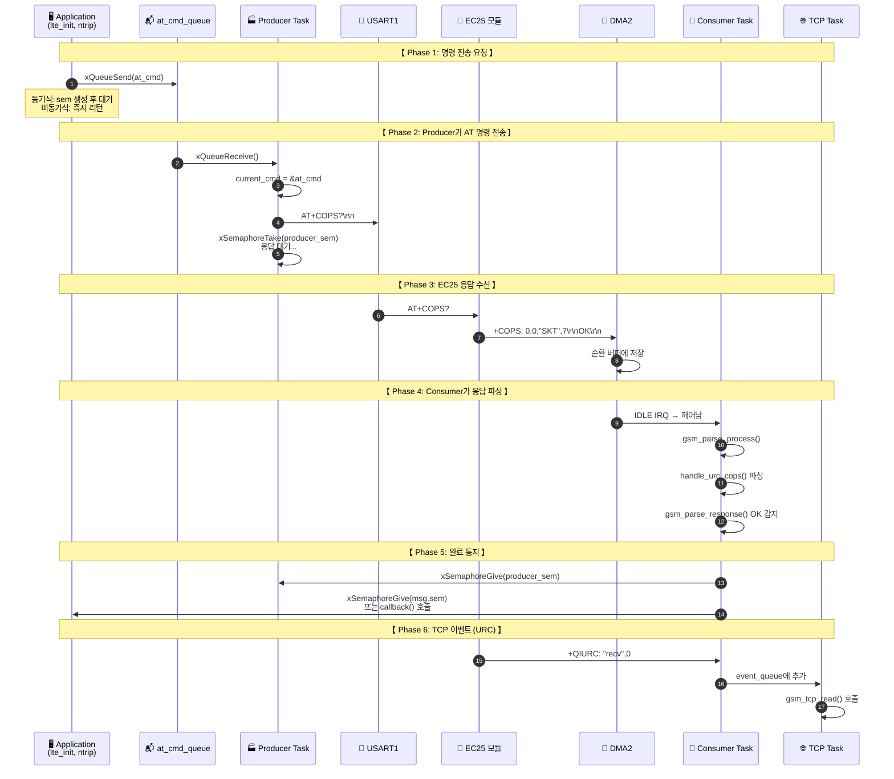
```mermaid
sequenceDiagram
    autonumber
    participant APP as 🖥️ Application<br/>(lte_init, ntrip)
    participant QUEUE as 📬 at_cmd_queue
    participant PRODUCER as 🏭 Producer Task
    participant UART as 🔌 USART1
    participant EC25 as 📡 EC25 모듈
    participant DMA as 💾 DMA2
    participant CONSUMER as 🔄 Consumer Task
    participant TCP_TASK as 🌐 TCP Task

    Note over APP,TCP_TASK: 【 Phase 1: 명령 전송 요청 】
    APP->>QUEUE: xQueueSend(at_cmd)
    Note over APP: 동기식: sem 생성 후 대기<br/>비동기식: 즉시 리턴

    Note over APP,TCP_TASK: 【 Phase 2: Producer가 AT 명령 전송 】
    QUEUE->>PRODUCER: xQueueReceive()
    PRODUCER->>PRODUCER: current_cmd = &at_cmd
    PRODUCER->>UART: AT+COPS?\r\n
    PRODUCER->>PRODUCER: xSemaphoreTake(producer_sem)<br/>응답 대기...

    Note over APP,TCP_TASK: 【 Phase 3: EC25 응답 수신 】
    UART->>EC25: AT+COPS?
    EC25->>DMA: +COPS: 0,0,"SKT",7\r\nOK\r\n
    DMA->>DMA: 순환 버퍼에 저장

    Note over APP,TCP_TASK: 【 Phase 4: Consumer가 응답 파싱 】
    DMA->>CONSUMER: IDLE IRQ → 깨어남
    CONSUMER->>CONSUMER: gsm_parse_process()
    CONSUMER->>CONSUMER: handle_urc_cops() 파싱
    CONSUMER->>CONSUMER: gsm_parse_response() OK 감지

    Note over APP,TCP_TASK: 【 Phase 5: 완료 통지 】
    CONSUMER->>PRODUCER: xSemaphoreGive(producer_sem)
    CONSUMER->>APP: xSemaphoreGive(msg.sem)<br/>또는 callback() 호출

    Note over APP,TCP_TASK: 【 Phase 6: TCP 이벤트 (URC) 】
    EC25->>CONSUMER: +QIURC: "recv",0
    CONSUMER->>TCP_TASK: event_queue에 추가
    TCP_TASK->>TCP_TASK: gsm_tcp_read() 호출
```

### 8.2 AT 명령 생명주기 상세 시퀀스

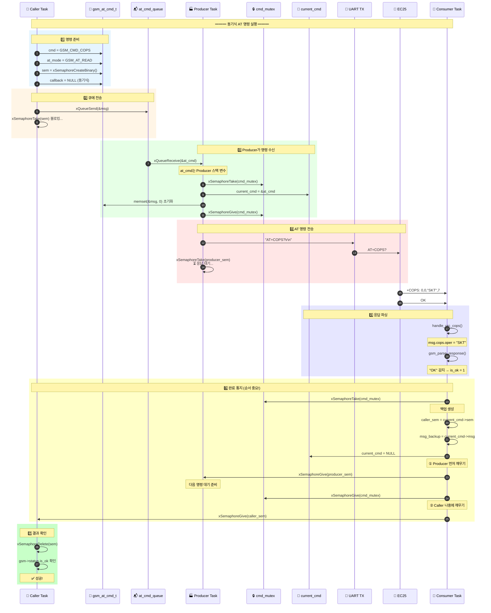
```mermaid
sequenceDiagram
    autonumber
    participant CALLER as 📱 Caller Task
    participant MSG as 📝 gsm_at_cmd_t
    participant QUEUE as 📬 at_cmd_queue
    participant PRODUCER as 🏭 Producer Task
    participant MUTEX as 🔒 cmd_mutex
    participant CURRENT as 📌 current_cmd
    participant UART as 🔌 UART TX
    participant EC25 as 📡 EC25
    participant CONSUMER as 🔄 Consumer Task

    Note over CALLER,CONSUMER: ━━━ 동기식 AT 명령 실행 ━━━

    rect rgb(230, 245, 255)
        Note over CALLER,MSG: 1️⃣ 명령 준비
        CALLER->>MSG: cmd = GSM_CMD_COPS
        CALLER->>MSG: at_mode = GSM_AT_READ
        CALLER->>MSG: sem = xSemaphoreCreateBinary()
        CALLER->>MSG: callback = NULL (동기식)
    end

    rect rgb(255, 245, 230)
        Note over CALLER,QUEUE: 2️⃣ 큐에 전송
        CALLER->>QUEUE: xQueueSend(&msg)
        CALLER->>CALLER: xSemaphoreTake(sem) 블로킹...
    end

    rect rgb(230, 255, 230)
        Note over PRODUCER,CURRENT: 3️⃣ Producer가 명령 수신
        QUEUE->>PRODUCER: xQueueReceive(&at_cmd)
        Note over PRODUCER: at_cmd는 Producer 스택 변수

        PRODUCER->>MUTEX: xSemaphoreTake(cmd_mutex)
        PRODUCER->>CURRENT: current_cmd = &at_cmd
        PRODUCER->>MSG: memset(&msg, 0) 초기화
        PRODUCER->>MUTEX: xSemaphoreGive(cmd_mutex)
    end

    rect rgb(255, 230, 230)
        Note over PRODUCER,EC25: 4️⃣ AT 명령 전송
        PRODUCER->>UART: "AT+COPS?\r\n"
        UART->>EC25: AT+COPS?
        PRODUCER->>PRODUCER: xSemaphoreTake(producer_sem)<br/>⏳ 응답 대기...
    end

    EC25->>CONSUMER: +COPS: 0,0,"SKT",7
    EC25->>CONSUMER: OK

    rect rgb(230, 230, 255)
        Note over CONSUMER,CURRENT: 5️⃣ 응답 파싱
        CONSUMER->>CONSUMER: handle_urc_cops()
        Note over CONSUMER: msg.cops.oper = "SKT"
        CONSUMER->>CONSUMER: gsm_parse_response()
        Note over CONSUMER: "OK" 감지 → is_ok = 1
    end

    rect rgb(255, 255, 200)
        Note over CONSUMER,CALLER: 6️⃣ 완료 통지 (순서 중요!)
        CONSUMER->>MUTEX: xSemaphoreTake(cmd_mutex)

        Note over CONSUMER: 백업 생성
        CONSUMER->>CONSUMER: caller_sem = current_cmd->sem
        CONSUMER->>CONSUMER: msg_backup = current_cmd->msg
        CONSUMER->>CURRENT: current_cmd = NULL

        Note over CONSUMER: ① Producer 먼저 깨우기
        CONSUMER->>PRODUCER: xSemaphoreGive(producer_sem)
        Note over PRODUCER: 다음 명령 대기 준비

        CONSUMER->>MUTEX: xSemaphoreGive(cmd_mutex)

        Note over CONSUMER: ② Caller 나중에 깨우기
        CONSUMER->>CALLER: xSemaphoreGive(caller_sem)
    end

    rect rgb(200, 255, 200)
        Note over CALLER: 7️⃣ 결과 확인
        CALLER->>CALLER: vSemaphoreDelete(sem)
        CALLER->>CALLER: gsm->status.is_ok 확인
        Note over CALLER: ✅ 성공!
    end
```

### 8.3 비동기식 AT 명령 체인 시퀀스

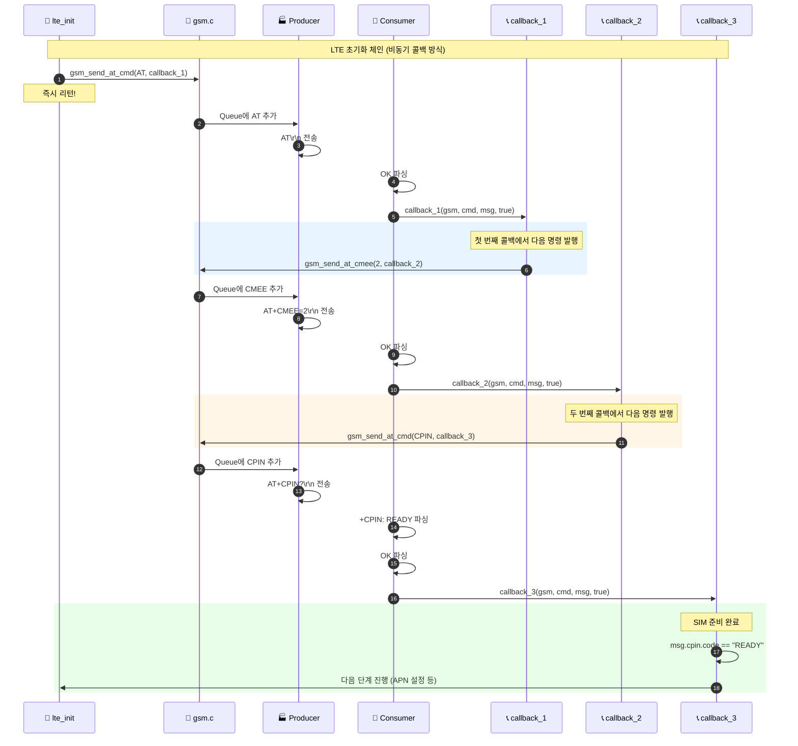
```mermaid
sequenceDiagram
    autonumber
    participant LTE as 🚀 lte_init
    participant GSM as 📡 gsm.c
    participant PRODUCER as 🏭 Producer
    participant CONSUMER as 🔄 Consumer
    participant CB1 as 📞 callback_1
    participant CB2 as 📞 callback_2
    participant CB3 as 📞 callback_3

    Note over LTE,CB3: LTE 초기화 체인 (비동기 콜백 방식)

    LTE->>GSM: gsm_send_at_cmd(AT, callback_1)
    Note over LTE: 즉시 리턴!

    GSM->>PRODUCER: Queue에 AT 추가
    PRODUCER->>PRODUCER: AT\r\n 전송
    CONSUMER->>CONSUMER: OK 파싱
    CONSUMER->>CB1: callback_1(gsm, cmd, msg, true)

    rect rgb(230, 245, 255)
        Note over CB1: 첫 번째 콜백에서 다음 명령 발행
        CB1->>GSM: gsm_send_at_cmee(2, callback_2)
    end

    GSM->>PRODUCER: Queue에 CMEE 추가
    PRODUCER->>PRODUCER: AT+CMEE=2\r\n 전송
    CONSUMER->>CONSUMER: OK 파싱
    CONSUMER->>CB2: callback_2(gsm, cmd, msg, true)

    rect rgb(255, 245, 230)
        Note over CB2: 두 번째 콜백에서 다음 명령 발행
        CB2->>GSM: gsm_send_at_cmd(CPIN, callback_3)
    end

    GSM->>PRODUCER: Queue에 CPIN 추가
    PRODUCER->>PRODUCER: AT+CPIN?\r\n 전송
    CONSUMER->>CONSUMER: +CPIN: READY 파싱
    CONSUMER->>CONSUMER: OK 파싱
    CONSUMER->>CB3: callback_3(gsm, cmd, msg, true)

    rect rgb(230, 255, 230)
        Note over CB3: SIM 준비 완료
        CB3->>CB3: msg.cpin.code == "READY"
        CB3->>LTE: 다음 단계 진행 (APN 설정 등)
    end
```

### 8.4 TCP 데이터 송수신 상세 시퀀스

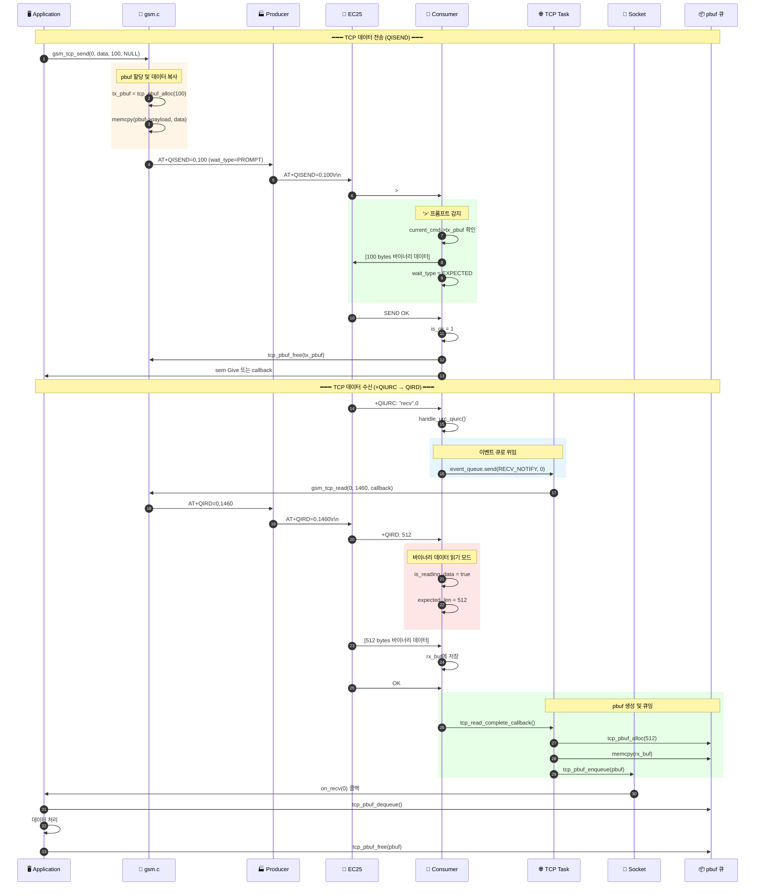
```mermaid
sequenceDiagram
    autonumber
    participant APP as 🖥️ Application
    participant GSM as 📡 gsm.c
    participant PRODUCER as 🏭 Producer
    participant EC25 as 📡 EC25
    participant CONSUMER as 🔄 Consumer
    participant TCP_TASK as 🌐 TCP Task
    participant SOCKET as 🔌 Socket
    participant PBUF as 📦 pbuf 큐

    Note over APP,PBUF: ━━━ TCP 데이터 전송 (QISEND) ━━━

    APP->>GSM: gsm_tcp_send(0, data, 100, NULL)

    rect rgb(255, 245, 230)
        Note over GSM: pbuf 할당 및 데이터 복사
        GSM->>GSM: tx_pbuf = tcp_pbuf_alloc(100)
        GSM->>GSM: memcpy(pbuf->payload, data)
    end

    GSM->>PRODUCER: AT+QISEND=0,100 (wait_type=PROMPT)
    PRODUCER->>EC25: AT+QISEND=0,100\r\n
    EC25->>CONSUMER: >

    rect rgb(230, 255, 230)
        Note over CONSUMER: '>' 프롬프트 감지
        CONSUMER->>CONSUMER: current_cmd->tx_pbuf 확인
        CONSUMER->>EC25: [100 bytes 바이너리 데이터]
        CONSUMER->>CONSUMER: wait_type = EXPECTED
    end

    EC25->>CONSUMER: SEND OK
    CONSUMER->>CONSUMER: is_ok = 1
    CONSUMER->>GSM: tcp_pbuf_free(tx_pbuf)
    CONSUMER->>APP: sem Give 또는 callback

    Note over APP,PBUF: ━━━ TCP 데이터 수신 (+QIURC → QIRD) ━━━

    EC25->>CONSUMER: +QIURC: "recv",0
    CONSUMER->>CONSUMER: handle_urc_qiurc()

    rect rgb(230, 245, 255)
        Note over CONSUMER,TCP_TASK: 이벤트 큐로 위임
        CONSUMER->>TCP_TASK: event_queue.send(RECV_NOTIFY, 0)
    end

    TCP_TASK->>GSM: gsm_tcp_read(0, 1460, callback)
    GSM->>PRODUCER: AT+QIRD=0,1460
    PRODUCER->>EC25: AT+QIRD=0,1460\r\n
    EC25->>CONSUMER: +QIRD: 512

    rect rgb(255, 230, 230)
        Note over CONSUMER: 바이너리 데이터 읽기 모드
        CONSUMER->>CONSUMER: is_reading_data = true
        CONSUMER->>CONSUMER: expected_len = 512
    end

    EC25->>CONSUMER: [512 bytes 바이너리 데이터]
    CONSUMER->>CONSUMER: rx_buf에 저장
    EC25->>CONSUMER: OK

    rect rgb(230, 255, 230)
        Note over TCP_TASK,PBUF: pbuf 생성 및 큐잉
        CONSUMER->>TCP_TASK: tcp_read_complete_callback()
        TCP_TASK->>PBUF: tcp_pbuf_alloc(512)
        TCP_TASK->>PBUF: memcpy(rx_buf)
        TCP_TASK->>SOCKET: tcp_pbuf_enqueue(pbuf)
    end

    SOCKET->>APP: on_recv(0) 콜백
    APP->>PBUF: tcp_pbuf_dequeue()
    APP->>APP: 데이터 처리
    APP->>PBUF: tcp_pbuf_free(pbuf)
```

### 8.5 +QIURC 이벤트 처리 상세 시퀀스

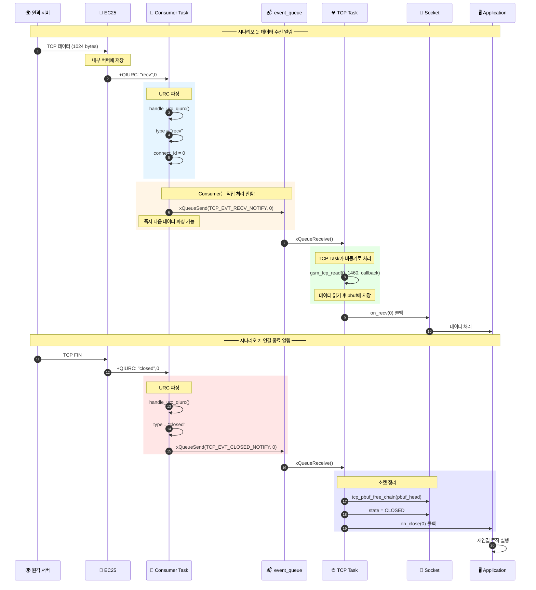
```mermaid
sequenceDiagram
    autonumber
    participant SERVER as 🌍 원격 서버
    participant EC25 as 📡 EC25
    participant CONSUMER as 🔄 Consumer Task
    participant EVT_QUEUE as 📬 event_queue
    participant TCP_TASK as 🌐 TCP Task
    participant SOCKET as 🔌 Socket
    participant APP as 🖥️ Application

    Note over SERVER,APP: ━━━ 시나리오 1: 데이터 수신 알림 ━━━

    SERVER->>EC25: TCP 데이터 (1024 bytes)
    Note over EC25: 내부 버퍼에 저장

    EC25->>CONSUMER: +QIURC: "recv",0

    rect rgb(230, 245, 255)
        Note over CONSUMER: URC 파싱
        CONSUMER->>CONSUMER: handle_urc_qiurc()
        CONSUMER->>CONSUMER: type = "recv"
        CONSUMER->>CONSUMER: connect_id = 0
    end

    rect rgb(255, 245, 230)
        Note over CONSUMER,EVT_QUEUE: Consumer는 직접 처리 안함!
        CONSUMER->>EVT_QUEUE: xQueueSend(TCP_EVT_RECV_NOTIFY, 0)
        Note over CONSUMER: 즉시 다음 데이터 파싱 가능
    end

    EVT_QUEUE->>TCP_TASK: xQueueReceive()

    rect rgb(230, 255, 230)
        Note over TCP_TASK: TCP Task가 비동기로 처리
        TCP_TASK->>TCP_TASK: gsm_tcp_read(0, 1460, callback)
        Note over TCP_TASK: 데이터 읽기 후 pbuf에 저장
    end

    TCP_TASK->>SOCKET: on_recv(0) 콜백
    SOCKET->>APP: 데이터 처리

    Note over SERVER,APP: ━━━ 시나리오 2: 연결 종료 알림 ━━━

    SERVER->>EC25: TCP FIN
    EC25->>CONSUMER: +QIURC: "closed",0

    rect rgb(255, 230, 230)
        Note over CONSUMER: URC 파싱
        CONSUMER->>CONSUMER: handle_urc_qiurc()
        CONSUMER->>CONSUMER: type = "closed"
        CONSUMER->>EVT_QUEUE: xQueueSend(TCP_EVT_CLOSED_NOTIFY, 0)
    end

    EVT_QUEUE->>TCP_TASK: xQueueReceive()

    rect rgb(230, 230, 255)
        Note over TCP_TASK,SOCKET: 소켓 정리
        TCP_TASK->>SOCKET: tcp_pbuf_free_chain(pbuf_head)
        TCP_TASK->>SOCKET: state = CLOSED
        TCP_TASK->>APP: on_close(0) 콜백
    end

    APP->>APP: 재연결 로직 실행
```

### 8.6 pbuf 메모리 관리 시퀀스

```
┌─────────────────────────────────────────────────────────────────────────────┐
│                         pbuf 메모리 관리 동작 원리                           │
├─────────────────────────────────────────────────────────────────────────────┤
│                                                                              │
│  ★ 실시간 스트리밍(NTRIP)에서의 메모리 오버플로우 방지 전략                  │
│                                                                              │
│  [최대 제한: 16KB per socket]                                               │
│                                                                              │
│  ┌─────────────────────────────────────────────────────────────────────┐   │
│  │  정상 상태: pbuf_total_len < 16KB                                    │   │
│  │                                                                       │   │
│  │  pbuf_head → [pbuf A] → [pbuf B] → [pbuf C] → NULL ← pbuf_tail      │   │
│  │               4KB        4KB        4KB                               │   │
│  │                                                                       │   │
│  │  total_len = 12KB (여유 있음)                                        │   │
│  └─────────────────────────────────────────────────────────────────────┘   │
│                                                                              │
│  ┌─────────────────────────────────────────────────────────────────────┐   │
│  │  오버플로우 임박: 새 pbuf D (4KB) 추가 요청                          │   │
│  │                                                                       │   │
│  │  현재: 12KB + 새 4KB = 16KB (제한 도달)                              │   │
│  │                                                                       │   │
│  │  while (total_len + new_len > 16KB) {                                │   │
│  │      old = tcp_pbuf_dequeue(socket);  // 가장 오래된 것 제거          │   │
│  │      tcp_pbuf_free(old);                                             │   │
│  │  }                                                                    │   │
│  │                                                                       │   │
│  │  결과:                                                                │   │
│  │  pbuf_head → [pbuf B] → [pbuf C] → [pbuf D] → NULL ← pbuf_tail      │   │
│  │               4KB        4KB        4KB                               │   │
│  │                                                                       │   │
│  │  ✓ 오래된 데이터(A) 버림, 최신 데이터(D) 유지                         │   │
│  │  ✓ RTK 보정 데이터는 최신만 의미있으므로 문제없음                     │   │
│  └─────────────────────────────────────────────────────────────────────┘   │
│                                                                              │
│  ★ pbuf 할당/해제 흐름:                                                     │
│                                                                              │
│  1. tcp_pbuf_alloc(len)                                                     │
│     └─ pvPortMalloc(sizeof(tcp_pbuf_t))                                    │
│     └─ pvPortMalloc(len)  ← payload 별도 할당                               │
│                                                                              │
│  2. tcp_pbuf_free(pbuf)                                                     │
│     └─ vPortFree(pbuf->payload)                                            │
│     └─ vPortFree(pbuf)                                                     │
│                                                                              │
│  3. tcp_pbuf_enqueue(socket, pbuf)                                         │
│     └─ 오버플로우 체크 → 필요시 dequeue/free                               │
│     └─ 링크드리스트 tail에 추가                                            │
│                                                                              │
│  4. tcp_pbuf_dequeue(socket)                                               │
│     └─ head에서 제거                                                        │
│     └─ total_len 감소                                                       │
│                                                                              │
└─────────────────────────────────────────────────────────────────────────────┘
```

### 8.7 동기화 메커니즘 상호작용

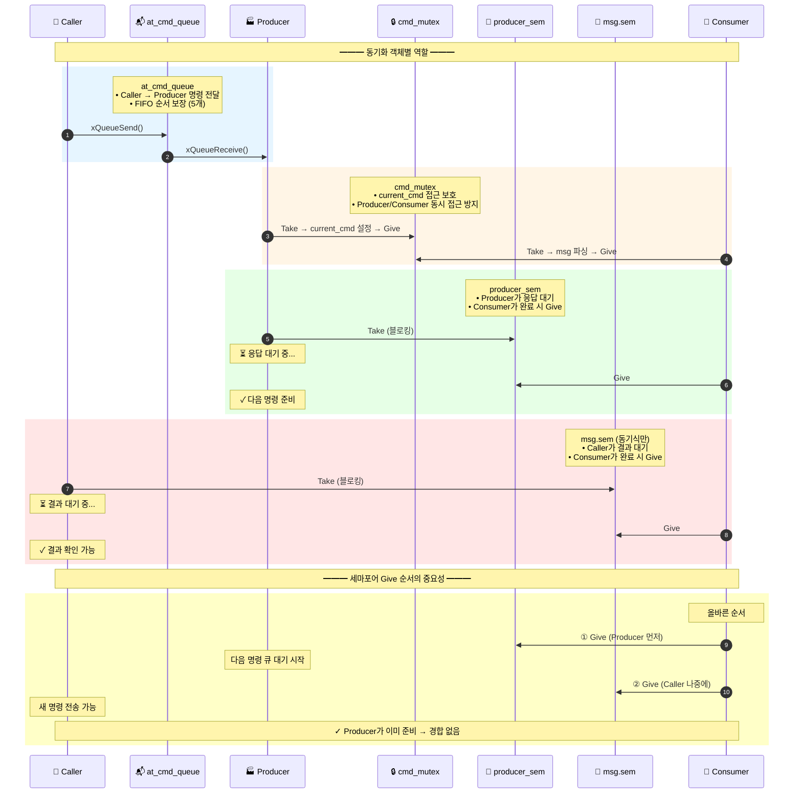
```mermaid
sequenceDiagram
    autonumber
    participant CALLER as 📱 Caller
    participant QUEUE as 📬 at_cmd_queue
    participant PRODUCER as 🏭 Producer
    participant CMD_MUTEX as 🔒 cmd_mutex
    participant PROD_SEM as 🚦 producer_sem
    participant CALLER_SEM as 🚦 msg.sem
    participant CONSUMER as 🔄 Consumer

    Note over CALLER,CONSUMER: ━━━ 동기화 객체별 역할 ━━━

    rect rgb(230, 245, 255)
        Note over QUEUE: at_cmd_queue<br/>• Caller → Producer 명령 전달<br/>• FIFO 순서 보장 (5개)
        CALLER->>QUEUE: xQueueSend()
        QUEUE->>PRODUCER: xQueueReceive()
    end

    rect rgb(255, 245, 230)
        Note over CMD_MUTEX: cmd_mutex<br/>• current_cmd 접근 보호<br/>• Producer/Consumer 동시 접근 방지
        PRODUCER->>CMD_MUTEX: Take → current_cmd 설정 → Give
        CONSUMER->>CMD_MUTEX: Take → msg 파싱 → Give
    end

    rect rgb(230, 255, 230)
        Note over PROD_SEM: producer_sem<br/>• Producer가 응답 대기<br/>• Consumer가 완료 시 Give
        PRODUCER->>PROD_SEM: Take (블로킹)
        Note over PRODUCER: ⏳ 응답 대기 중...
        CONSUMER->>PROD_SEM: Give
        Note over PRODUCER: ✓ 다음 명령 준비
    end

    rect rgb(255, 230, 230)
        Note over CALLER_SEM: msg.sem (동기식만)<br/>• Caller가 결과 대기<br/>• Consumer가 완료 시 Give
        CALLER->>CALLER_SEM: Take (블로킹)
        Note over CALLER: ⏳ 결과 대기 중...
        CONSUMER->>CALLER_SEM: Give
        Note over CALLER: ✓ 결과 확인 가능
    end

    Note over CALLER,CONSUMER: ━━━ 세마포어 Give 순서의 중요성 ━━━

    rect rgb(255, 255, 200)
        Note over CONSUMER: 올바른 순서
        CONSUMER->>PROD_SEM: ① Give (Producer 먼저)
        Note over PRODUCER: 다음 명령 큐 대기 시작
        CONSUMER->>CALLER_SEM: ② Give (Caller 나중에)
        Note over CALLER: 새 명령 전송 가능
        Note over CALLER,CONSUMER: ✓ Producer가 이미 준비 → 경합 없음
    end
```

---

## 9. LTE 초기화 시퀀스

### 8.1 전체 초기화 흐름

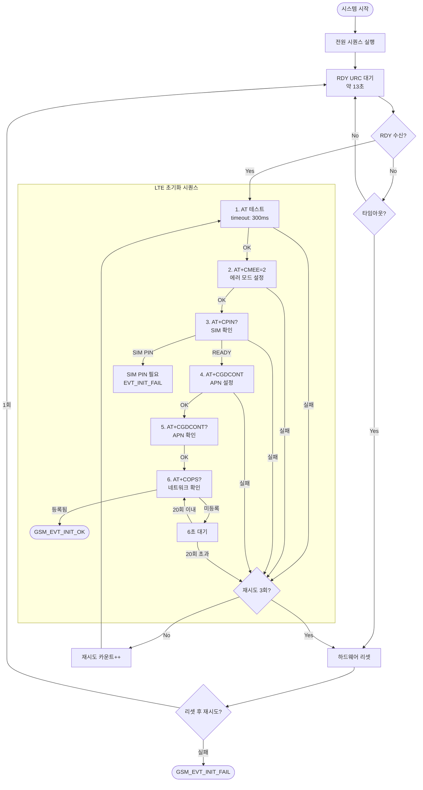
```mermaid
flowchart TD
    START([시스템 시작]) --> POWER_ON[전원 시퀀스 실행]
    POWER_ON --> WAIT_RDY[RDY URC 대기<br/>약 13초]

    WAIT_RDY --> RDY_RECV{RDY 수신?}
    RDY_RECV -->|No| TIMEOUT1{타임아웃?}
    TIMEOUT1 -->|No| WAIT_RDY
    TIMEOUT1 -->|Yes| HW_RESET
    RDY_RECV -->|Yes| AT_TEST

    subgraph init_sequence[" LTE 초기화 시퀀스 "]
        AT_TEST[1. AT 테스트<br/>timeout: 300ms]
        AT_TEST -->|OK| CMEE[2. AT+CMEE=2<br/>에러 모드 설정]
        AT_TEST -->|실패| RETRY1{재시도 3회?}

        CMEE -->|OK| CPIN[3. AT+CPIN?<br/>SIM 확인]
        CMEE -->|실패| RETRY1

        CPIN -->|READY| APN_SET[4. AT+CGDCONT<br/>APN 설정]
        CPIN -->|SIM PIN| PIN_ERR[SIM PIN 필요<br/>EVT_INIT_FAIL]
        CPIN -->|실패| RETRY1

        APN_SET -->|OK| APN_VERIFY[5. AT+CGDCONT?<br/>APN 확인]
        APN_SET -->|실패| RETRY1

        APN_VERIFY -->|OK| COPS[6. AT+COPS?<br/>네트워크 확인]

        COPS -->|등록됨| INIT_OK([GSM_EVT_INIT_OK])
        COPS -->|미등록| WAIT_NET[6초 대기]
        WAIT_NET -->|20회 이내| COPS
        WAIT_NET -->|20회 초과| RETRY1
    end

    RETRY1 -->|No| NEXT_RETRY[재시도 카운트++]
    NEXT_RETRY --> AT_TEST

    RETRY1 -->|Yes| HW_RESET[하드웨어 리셋]
    HW_RESET --> HW_RETRY{리셋 후 재시도?}
    HW_RETRY -->|1회| WAIT_RDY
    HW_RETRY -->|실패| INIT_FAIL([GSM_EVT_INIT_FAIL])
```

### 8.2 재시도 메커니즘

| 단계 | 최대 재시도 | 대기 시간 | 실패 시 |
|------|-------------|-----------|---------|
| AT 테스트 | 3회 | 즉시 | 다음 재시도 |
| CMEE 설정 | 3회 | 즉시 | 다음 재시도 |
| SIM 확인 | 3회 | 즉시 | 다음 재시도 |
| APN 설정 | 3회 | 즉시 | 다음 재시도 |
| 네트워크 등록 | 20회 | 6초 | 하드웨어 리셋 |
| 하드웨어 리셋 | 1회 | 3초 + RDY대기 | 최종 실패 |

### 8.3 네트워크 등록 대기

```c
// lte_init.c: 네트워크 체크 타이머 콜백
void lte_network_check_timer_callback(TimerHandle_t xTimer) {
    // AT+COPS? 명령 전송 (비동기)
    gsm_send_at_cmd(gsm, GSM_CMD_COPS, GSM_AT_READ, NULL,
                    lte_network_check_callback);
}

void lte_network_check_callback(gsm_t *gsm, gsm_cmd_t cmd, void *msg, bool is_ok) {
    if (is_ok) {
        gsm_msg_t *m = (gsm_msg_t *)msg;

        if (m->cops.oper[0] != '\0') {
            // 네트워크 등록 성공!
            LOG_INFO("네트워크 등록: %s (act=%d)", m->cops.oper, m->cops.act);
            gsm->evt_handler.handler(GSM_EVT_INIT_OK, NULL);
            return;
        }
    }

    // 재시도
    if (network_check_count++ < 20) {
        xTimerStart(network_timer, 0);  // 6초 후 재시도
    } else {
        // 실패 → 하드웨어 리셋
        gsm->ops->reset();
    }
}
```

---

## 9. 하드웨어 인터페이스

### 9.1 핀 매핑

```
┌─────────────────────────────────────────────────────────────────┐
│  STM32F4 ←→ EC25 연결                                           │
├─────────────────────────────────────────────────────────────────┤
│                                                                  │
│  ┌──────────────┐              ┌──────────────┐                 │
│  │   STM32F4    │              │    EC25      │                 │
│  │              │              │              │                 │
│  │   PA9 (TX) ──┼──────────────┼──► RX        │                 │
│  │   PA10 (RX)◄─┼──────────────┼── TX         │                 │
│  │              │              │              │                 │
│  │   PB3 ───────┼──────────────┼──► PWRKEY    │                 │
│  │   PB4 ───────┼──────────────┼──► RESET_N   │                 │
│  │   PB5 ───────┼──────────────┼──► W_DISABLE │                 │
│  │   PB6 ───────┼──────────────┼──► DTR       │                 │
│  │              │              │              │                 │
│  └──────────────┘              └──────────────┘                 │
│                                                                  │
│  UART: USART1, 115200 8N1, No Flow Control                      │
│  DMA:  DMA2 Stream2 Channel4 (RX)                               │
└─────────────────────────────────────────────────────────────────┘
```

### 9.2 UART 설정

```c
// gsm_port.c
USART_InitStruct.BaudRate = 115200;
USART_InitStruct.DataWidth = LL_USART_DATAWIDTH_8B;
USART_InitStruct.StopBits = LL_USART_STOPBITS_1;
USART_InitStruct.Parity = LL_USART_PARITY_NONE;
USART_InitStruct.TransferDirection = LL_USART_DIRECTION_TX_RX;
USART_InitStruct.HardwareFlowControl = LL_USART_HWCONTROL_NONE;
```

### 9.3 DMA 순환 버퍼

```c
// DMA 설정 (순환 모드)
LL_DMA_SetMode(DMA2, LL_DMA_STREAM_2, LL_DMA_MODE_CIRCULAR);

// 버퍼 크기: 2KB
extern char gsm_mem[2048];

LL_DMA_SetMemoryAddress(DMA2, LL_DMA_STREAM_2, (uint32_t)&gsm_mem);
LL_DMA_SetDataLength(DMA2, LL_DMA_STREAM_2, sizeof(gsm_mem));

// 인터럽트 활성화
LL_DMA_EnableIT_HT(DMA2, LL_DMA_STREAM_2);   // Half Transfer
LL_DMA_EnableIT_TC(DMA2, LL_DMA_STREAM_2);   // Transfer Complete
LL_USART_EnableIT_IDLE(USART1);               // IDLE Line
```

### 9.4 IDLE 인터럽트 처리

```c
void USART1_IRQHandler(void) {
    LL_USART_ClearFlag_IDLE(USART1);
    // ... 기타 플래그 클리어

    // Consumer Task 깨우기
    if (gsm_queue != NULL) {
        uint8_t dummy = 0;
        xQueueSendFromISR(gsm_queue, &dummy, &xHigherPriorityTaskWoken);
        portYIELD_FROM_ISR(xHigherPriorityTaskWoken);
    }
}
```

### 9.5 전원 시퀀스

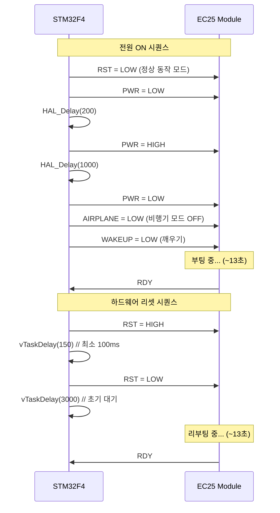
```mermaid
sequenceDiagram
    participant MCU as STM32F4
    participant EC25 as EC25 Module

    Note over MCU,EC25: 전원 ON 시퀀스
    MCU->>EC25: RST = LOW (정상 동작 모드)
    MCU->>EC25: PWR = LOW
    MCU->>MCU: HAL_Delay(200)
    MCU->>EC25: PWR = HIGH
    MCU->>MCU: HAL_Delay(1000)
    MCU->>EC25: PWR = LOW
    MCU->>EC25: AIRPLANE = LOW (비행기 모드 OFF)
    MCU->>EC25: WAKEUP = LOW (깨우기)

    Note over EC25: 부팅 중... (~13초)
    EC25->>MCU: RDY

    Note over MCU,EC25: 하드웨어 리셋 시퀀스
    MCU->>EC25: RST = HIGH
    MCU->>MCU: vTaskDelay(150) // 최소 100ms
    MCU->>EC25: RST = LOW
    MCU->>MCU: vTaskDelay(3000) // 초기 대기

    Note over EC25: 리부팅 중... (~13초)
    EC25->>MCU: RDY
```

---

## 10. API 레퍼런스

### 10.1 초기화 API

```c
/**
 * @brief GSM 라이브러리 초기화
 *
 * @param gsm       GSM 핸들
 * @param handler   이벤트 핸들러 콜백
 * @param args      콜백 인자
 *
 * @pre  없음
 * @post gsm 구조체 초기화 완료, TCP 초기화 완료
 *
 * @note 태스크 생성 전에 호출해야 함
 */
void gsm_init(gsm_t *gsm, evt_handler_t handler, void *args);

/**
 * @brief GSM 하드웨어 초기화 (UART, DMA)
 * @pre  gsm_init() 호출 완료
 */
void gsm_port_init(void);

/**
 * @brief GSM 통신 및 전원 시작
 * @pre  gsm_port_init() 호출 완료
 */
void gsm_start(void);
```

### 10.2 AT 명령 API

```c
/**
 * @brief 범용 AT 명령 전송
 *
 * @param gsm       GSM 핸들
 * @param cmd       명령 타입 (GSM_CMD_xxx)
 * @param at_mode   실행 모드 (EXECUTE/READ/WRITE/TEST)
 * @param params    파라미터 문자열 (NULL 가능)
 * @param callback  완료 콜백 (NULL이면 동기식)
 *
 * @pre  gsm_init() 완료
 * @post 동기식: gsm->status에 결과
 *       비동기식: 콜백으로 결과 전달
 *
 * 사용 예시 (동기식):
 * @code
 * gsm_send_at_cmd(&gsm, GSM_CMD_COPS, GSM_AT_READ, NULL, NULL);
 * if (gsm.status.is_ok) {
 *     printf("Network: %s\n", gsm.current_cmd->msg.cops.oper);
 * }
 * @endcode
 *
 * 사용 예시 (비동기식):
 * @code
 * void my_callback(gsm_t *gsm, gsm_cmd_t cmd, void *msg, bool is_ok) {
 *     if (is_ok) {
 *         gsm_msg_t *m = (gsm_msg_t *)msg;
 *         printf("Network: %s\n", m->cops.oper);
 *     }
 * }
 * gsm_send_at_cmd(&gsm, GSM_CMD_COPS, GSM_AT_READ, NULL, my_callback);
 * @endcode
 */
void gsm_send_at_cmd(gsm_t *gsm, gsm_cmd_t cmd, gsm_at_mode_t at_mode,
                     const char *params, at_cmd_handler callback);
```

### 10.3 TCP 소켓 API

```c
/**
 * @brief TCP 소켓 열기
 *
 * @param gsm         GSM 핸들
 * @param connect_id  소켓 ID (0-11)
 * @param context_id  PDP context ID (보통 1)
 * @param remote_ip   서버 IP 주소
 * @param remote_port 서버 포트
 * @param local_port  로컬 포트 (0=자동)
 * @param on_recv     데이터 수신 콜백
 * @param on_close    연결 종료 콜백
 * @param callback    AT 완료 콜백 (NULL이면 동기식)
 * @return int        0: 성공, -1: 실패
 *
 * @pre  LTE 초기화 완료 (GSM_EVT_INIT_OK)
 * @post 소켓 state = CONNECTED (성공 시)
 */
int gsm_tcp_open(gsm_t *gsm, uint8_t connect_id, uint8_t context_id,
                 const char *remote_ip, uint16_t remote_port,
                 uint16_t local_port, tcp_recv_callback_t on_recv,
                 tcp_close_callback_t on_close, at_cmd_handler callback);

/**
 * @brief TCP 데이터 전송
 *
 * @param gsm         GSM 핸들
 * @param connect_id  소켓 ID
 * @param data        전송 데이터
 * @param len         데이터 길이 (최대 1460)
 * @param callback    AT 완료 콜백 (NULL이면 동기식)
 * @return int        0: 성공, -1: 실패
 *
 * @pre  소켓 state = CONNECTED
 * @note 내부적으로 pbuf 할당하여 데이터 복사 (race condition 방지)
 */
int gsm_tcp_send(gsm_t *gsm, uint8_t connect_id, const uint8_t *data,
                 size_t len, at_cmd_handler callback);

/**
 * @brief TCP 데이터 읽기
 *
 * @param gsm         GSM 핸들
 * @param connect_id  소켓 ID
 * @param max_len     최대 읽기 길이 (최대 1500)
 * @param callback    AT 완료 콜백 (NULL이면 동기식)
 * @return int        0: 성공, -1: 실패
 *
 * @note 보통 +QIURC: "recv" URC 수신 후 TCP Task가 자동 호출
 */
int gsm_tcp_read(gsm_t *gsm, uint8_t connect_id, size_t max_len,
                 at_cmd_handler callback);

/**
 * @brief TCP 소켓 닫기
 */
int gsm_tcp_close(gsm_t *gsm, uint8_t connect_id, at_cmd_handler callback);

/**
 * @brief TCP 소켓 포인터 가져오기
 */
gsm_tcp_socket_t *gsm_tcp_get_socket(gsm_t *gsm, uint8_t connect_id);
```

### 10.4 pbuf 관리 API

```c
/**
 * @brief pbuf 할당
 * @param len   데이터 길이
 * @return      pbuf 포인터 (NULL이면 실패)
 */
tcp_pbuf_t *tcp_pbuf_alloc(size_t len);

/**
 * @brief pbuf 해제 (단일)
 */
void tcp_pbuf_free(tcp_pbuf_t *pbuf);

/**
 * @brief pbuf 체인 전체 해제
 */
void tcp_pbuf_free_chain(tcp_pbuf_t *pbuf);

/**
 * @brief 소켓 pbuf 큐에 추가
 * @note  16KB 초과 시 오래된 데이터 자동 삭제
 */
int tcp_pbuf_enqueue(gsm_tcp_socket_t *socket, tcp_pbuf_t *pbuf);

/**
 * @brief 소켓 pbuf 큐에서 꺼내기
 * @return pbuf 포인터 (NULL이면 비어있음)
 */
tcp_pbuf_t *tcp_pbuf_dequeue(gsm_tcp_socket_t *socket);
```

---

## 11. 사용 예제

### 11.1 기본 초기화

```c
#include "gsm.h"
#include "gsm_port.h"

gsm_t gsm_handle;

void gsm_evt_callback(gsm_evt_t evt, void *args) {
    switch (evt) {
    case GSM_EVT_RDY:
        printf("EC25 부팅 완료\n");
        // LTE 초기화 시작 (lte_init에서 처리)
        break;

    case GSM_EVT_INIT_OK:
        printf("LTE 초기화 성공!\n");
        // TCP 연결 등 시작
        start_tcp_client();
        break;

    case GSM_EVT_INIT_FAIL:
        printf("LTE 초기화 실패!\n");
        // 재시도 로직 또는 에러 처리
        break;

    case GSM_EVT_TCP_DATA_RECV:
        printf("TCP 데이터 도착: socket %d\n", *(uint8_t*)args);
        break;

    case GSM_EVT_TCP_CLOSED:
        printf("TCP 연결 종료: socket %d\n", *(uint8_t*)args);
        break;
    }
}

void gsm_task(void *arg) {
    gsm_init(&gsm_handle, gsm_evt_callback, NULL);
    gsm_port_init();
    gsm_start();

    // Consumer Task 메인 루프
    while (1) {
        // UART 데이터 수신 및 파싱
        // ...
    }
}
```

### 11.2 동기식 AT 명령

```c
// 네트워크 확인 (블로킹)
gsm_send_at_cmd(&gsm_handle, GSM_CMD_COPS, GSM_AT_READ, NULL, NULL);

if (gsm_handle.status.is_ok) {
    printf("네트워크: %s\n", gsm_handle.current_cmd->msg.cops.oper);
    printf("접속 기술: %s\n",
           gsm_handle.current_cmd->msg.cops.act == 7 ? "LTE" : "기타");
} else if (gsm_handle.status.is_err) {
    printf("에러 발생\n");
} else if (gsm_handle.status.is_timeout) {
    printf("타임아웃\n");
}
```

### 11.3 비동기식 AT 명령

```c
void cops_callback(gsm_t *gsm, gsm_cmd_t cmd, void *msg, bool is_ok) {
    if (!is_ok) {
        printf("COPS 실패\n");
        return;
    }

    gsm_msg_t *m = (gsm_msg_t *)msg;
    printf("네트워크: %s (act=%d)\n", m->cops.oper, m->cops.act);

    // 다음 작업 시작
    start_tcp_connection();
}

// 비동기 호출 (즉시 리턴)
gsm_send_at_cmd(&gsm_handle, GSM_CMD_COPS, GSM_AT_READ, NULL, cops_callback);
printf("명령 전송 완료, 다른 작업 수행 가능\n");
```

### 11.4 TCP 클라이언트 (NTRIP)

```c
void on_ntrip_data(uint8_t connect_id) {
    gsm_tcp_socket_t *socket = gsm_tcp_get_socket(&gsm_handle, connect_id);
    tcp_pbuf_t *pbuf;

    while ((pbuf = tcp_pbuf_dequeue(socket)) != NULL) {
        // RTCM 데이터 처리
        process_rtcm_data(pbuf->payload, pbuf->len);
        tcp_pbuf_free(pbuf);
    }
}

void on_ntrip_closed(uint8_t connect_id) {
    printf("NTRIP 연결 종료: %d\n", connect_id);
    // 재연결 시도
    reconnect_ntrip();
}

void start_ntrip_client(void) {
    // TCP 연결 (동기식)
    int ret = gsm_tcp_open(&gsm_handle, 0, 1,
                           "rtk2go.com", 2101, 0,
                           on_ntrip_data, on_ntrip_closed, NULL);

    if (ret != 0) {
        printf("TCP 연결 실패\n");
        return;
    }

    // NTRIP 요청 전송
    const char *request =
        "GET /MOUNTPOINT HTTP/1.0\r\n"
        "User-Agent: NTRIP Client\r\n"
        "Authorization: Basic xxxxx\r\n"
        "\r\n";

    gsm_tcp_send(&gsm_handle, 0, (uint8_t*)request, strlen(request), NULL);
    printf("NTRIP 요청 전송 완료\n");
}
```

---

## 12. 디버깅

### 12.1 로그 레벨

```c
LOG_DEBUG("RX: %u bytes", len);           // 수신 바이트 수
LOG_DEBUG_RAW("RAW: ", data, len);        // 원시 데이터 (hex dump)
LOG_ERR("+QIURC 파싱 실패");              // 에러
LOG_INFO("LTE 초기화 성공");              // 정보
```

### 12.2 일반적인 문제 및 해결

| 증상 | 원인 | 해결방법 |
|------|------|----------|
| RDY 없음 | 전원 시퀀스 오류 | GPIO 타이밍 확인 (PWR 펄스 500ms 이상) |
| AT 무응답 | UART 설정 오류 | 보드레이트 115200, 8N1 확인 |
| +CPIN: ERROR | SIM 미장착 | SIM 카드 확인, 접촉 불량 |
| +COPS: 0 | 네트워크 미등록 | 안테나, 커버리지, APN 설정 확인 |
| TCP 연결 실패 | APN/네트워크 문제 | CGDCONT 설정, COPS? 확인 |
| 데이터 수신 안됨 | +QIURC 놓침 | Consumer Task 우선순위, 로그 확인 |
| pbuf 메모리 부족 | 데이터 처리 느림 | on_recv 콜백 최적화, 버퍼 크기 조정 |

### 12.3 에러 코드 (AT+CMEE=2)

| 에러 | 의미 |
|------|------|
| +CME ERROR: 10 | SIM not inserted |
| +CME ERROR: 11 | SIM PIN required |
| +CME ERROR: 30 | No network service |
| +CME ERROR: 50 | Incorrect parameters |

---

## 13. 메모리 사용량

| 항목 | 크기 | 설명 |
|------|------|------|
| `gsm_t` 구조체 | ~8 KB | GSM 핸들 (TCP 포함) |
| DMA 수신 버퍼 | 2048 bytes | UART 순환 버퍼 (gsm_mem) |
| TCP RX/TX 버퍼 | 3000 bytes | 각 1500 bytes |
| TCP 이벤트 큐 | 10 × 8 bytes | tcp_event_t |
| AT 명령 큐 | 5 × ~300 bytes | gsm_at_cmd_t |
| pbuf 풀 | 동적 | 최대 16KB/소켓 |
| **태스크 스택** | | |
| - gsm_process_task | 2048 words | Consumer Task |
| - gsm_at_cmd_process_task | 2048 words | Producer Task |
| - gsm_tcp_task | 2048 words | TCP Task |
| **총 정적 RAM** | ~25 KB | pbuf 제외 |
| **총 동적 RAM (최대)** | ~32 KB | 2소켓 × 16KB pbuf |

---

## 14. 참고 자료

- Quectel EC25 AT Commands Manual (Document Version: 1.3)
- Quectel EC25 Hardware Design Guide
- lwcell - Lightweight GSM AT parser library (GitHub)
- FreeRTOS API Reference Manual
- STM32F4 Reference Manual (RM0090)
- 3GPP TS 27.007 - AT command set for User Equipment
