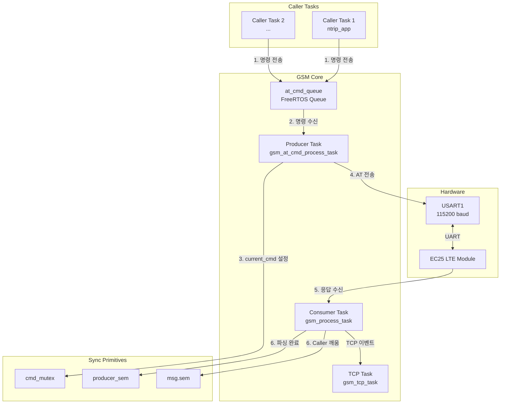
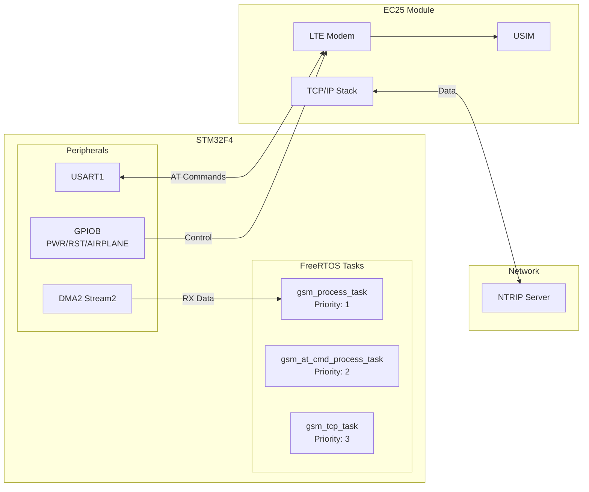
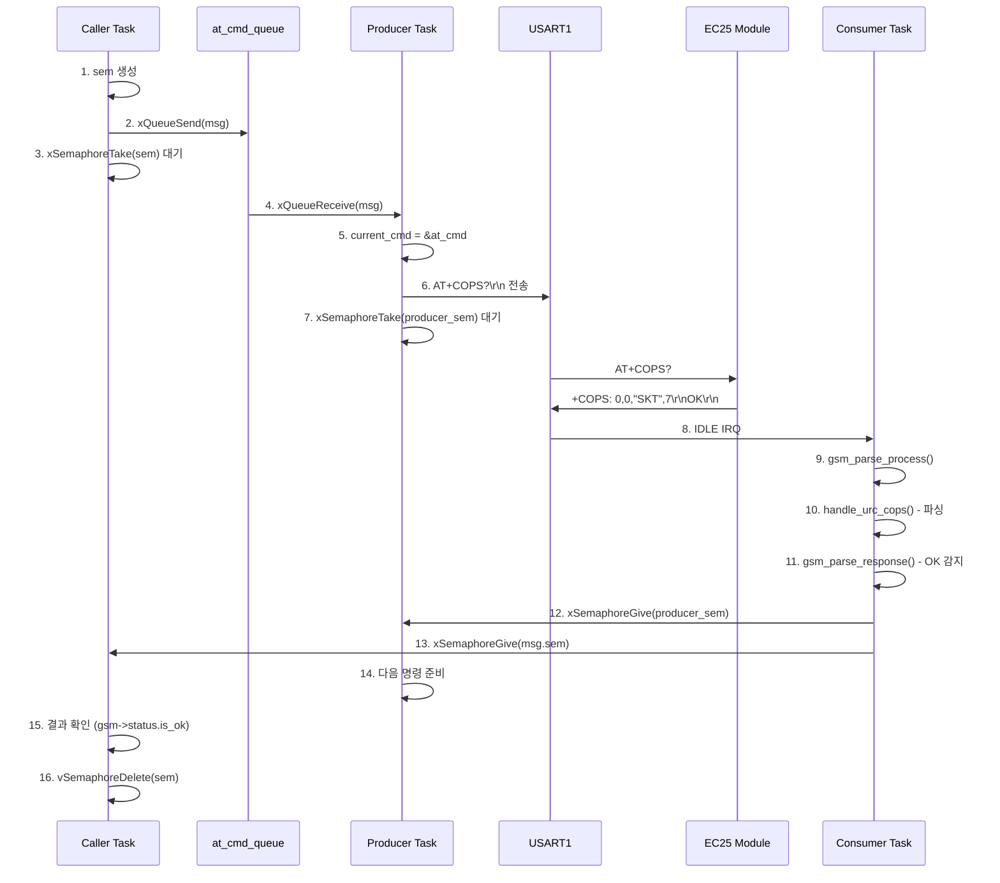
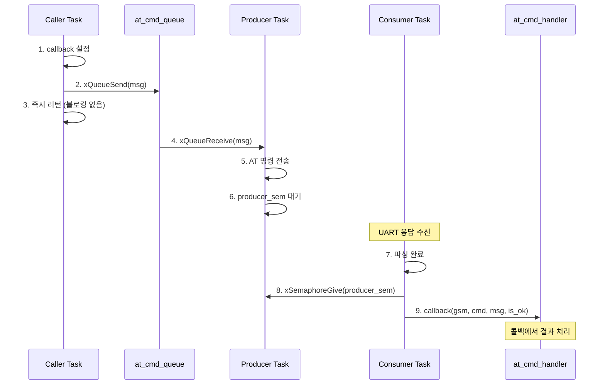
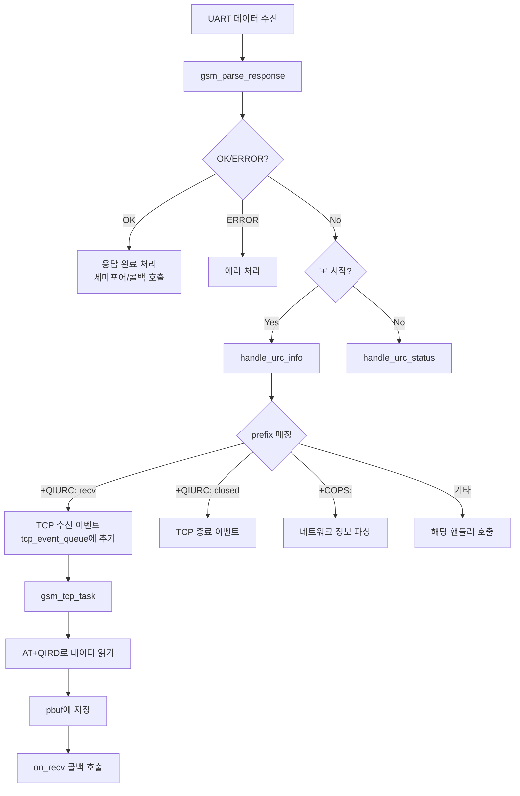
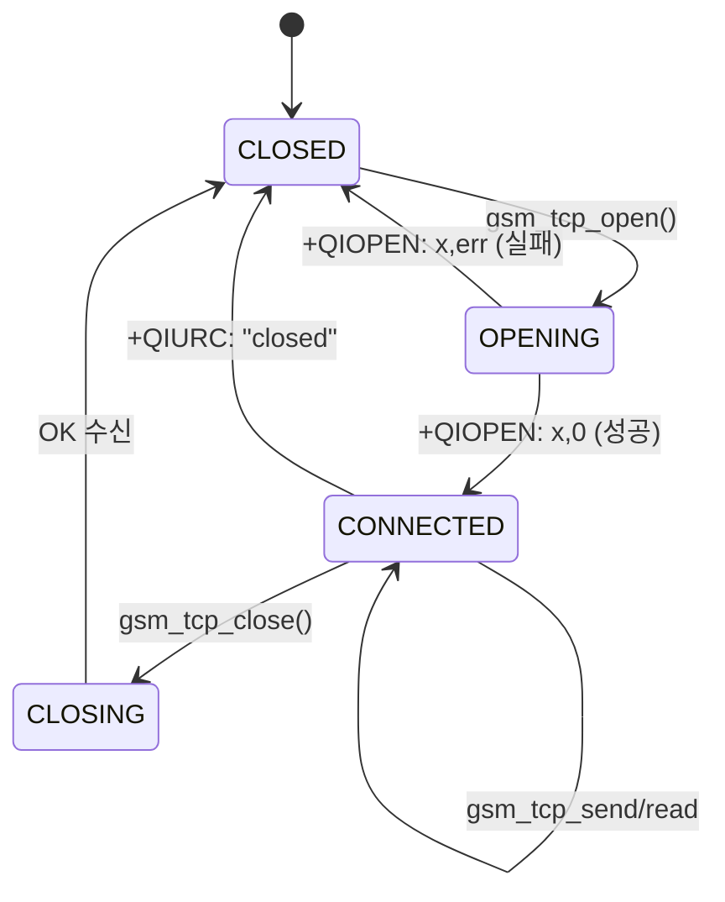
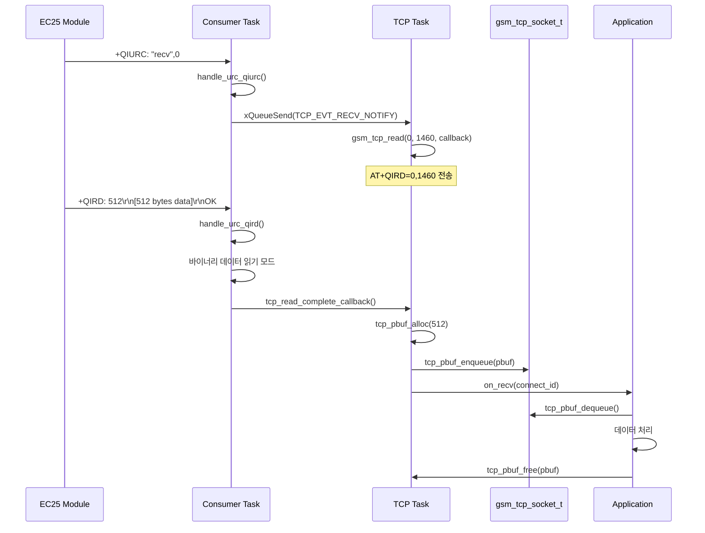
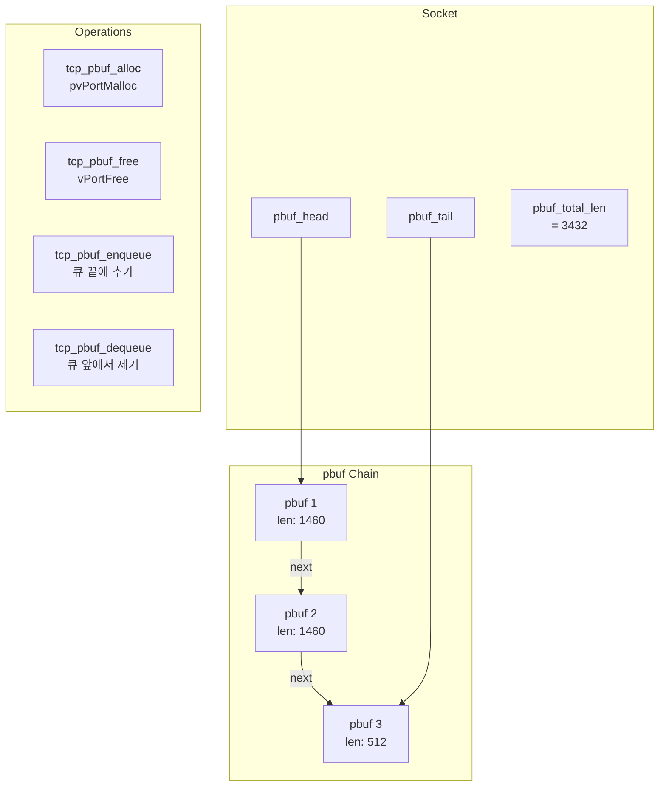
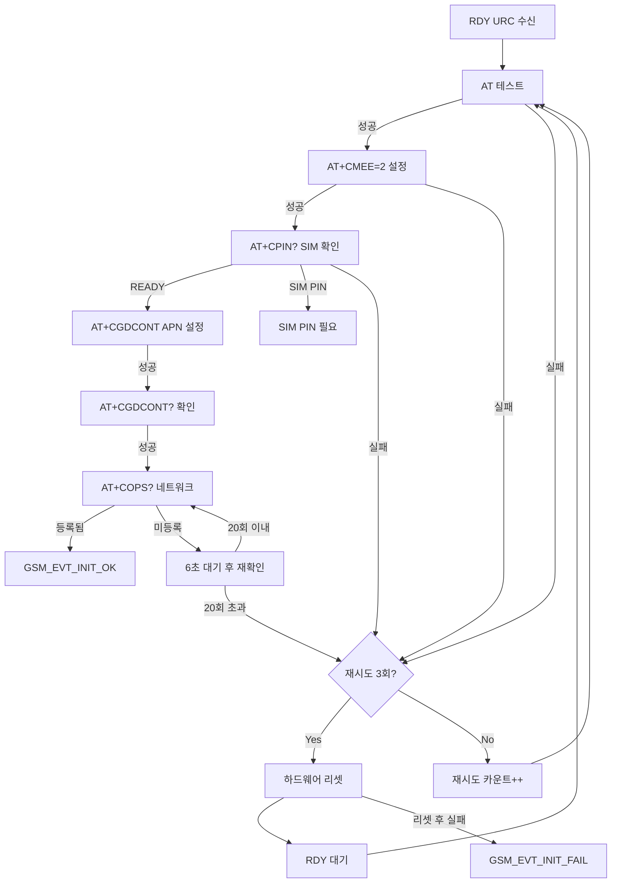
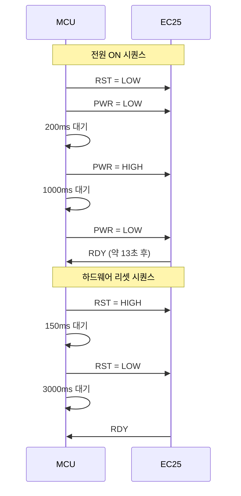

# GSM/LTE 라이브러리 기술 문서

## 1. 개요

GSM 라이브러리는 Quectel EC25 LTE 모듈과의 통신을 담당하는 라이브러리입니다. AT 명령어 기반 제어, TCP/IP 소켓 통신, 비동기 이벤트 처리를 지원하며 lwcell 라이브러리의 Producer-Consumer 패턴을 참고하여 설계되었습니다.

### 1.1 주요 특징
- **AT 명령어 프레임워크**: 동기/비동기 AT 명령 실행 지원
- **TCP/IP 스택**: pbuf 기반 메모리 관리로 효율적인 데이터 처리
- **URC 핸들링**: Unsolicited Result Code 자동 파싱 및 이벤트 발생
- **Producer-Consumer 패턴**: 명령 순차 처리 및 응답 혼선 방지
- **FreeRTOS 기반**: 멀티태스킹 안전성 보장

---

## 2. 아키텍처

### 2.1 계층 구조

```
┌─────────────────────────────────────────────────────────────────────┐
│                       Application Layer                              │
│                        (gsm_app.c/h)                                 │
│                    ┌─────────────────────┐                          │
│                    │     ntrip_app       │                          │
│                    │   (TCP 클라이언트)   │                          │
│                    └─────────────────────┘                          │
├─────────────────────────────────────────────────────────────────────┤
│                       Library Layer                                  │
│  ┌────────────────────────────────────────────────────────────────┐ │
│  │                        gsm.c/h                                  │ │
│  │  ┌──────────────┬──────────────┬──────────────────────────┐   │ │
│  │  │  AT Parser   │  URC Handler │     TCP/IP Stack         │   │ │
│  │  │ (AT 파서)     │ (URC 핸들러)  │    (소켓 관리)            │   │ │
│  │  └──────────────┴──────────────┴──────────────────────────┘   │ │
│  │  ┌──────────────────────────────────────────────────────────┐ │ │
│  │  │                   pbuf 메모리 관리                        │ │ │
│  │  └──────────────────────────────────────────────────────────┘ │ │
│  └────────────────────────────────────────────────────────────────┘ │
├─────────────────────────────────────────────────────────────────────┤
│                         HAL Layer                                    │
│                       (gsm_port.c/h)                                 │
│                     (UART + DMA + GPIO)                              │
└─────────────────────────────────────────────────────────────────────┘
```

### 2.2 Producer-Consumer 아키텍처



### 2.3 시스템 구성도



---

## 3. 파일 구조

| 파일 | 경로 | 설명 |
|------|------|------|
| `gsm.h` | lib/gsm/ | GSM 라이브러리 메인 헤더 |
| `gsm.c` | lib/gsm/ | AT 파서, URC 핸들러, TCP 관리 |
| `gsm_port.h` | modules/gsm/ | HAL 헤더 |
| `gsm_port.c` | modules/gsm/ | UART, DMA, GPIO 드라이버 |
| `gsm_app.h` | modules/gsm/ | 애플리케이션 헤더 |
| `gsm_app.c` | modules/gsm/ | 태스크 관리, 이벤트 핸들러 |

---

## 4. 핵심 데이터 구조

### 4.1 GSM 메인 구조체 (`gsm_t`)

```c
typedef struct gsm_s {
    /* 수신 버퍼 */
    gsm_recv_t recv;                    // 수신 데이터 버퍼
    gsm_status_t status;                // 상태 플래그 (is_ok, is_err, ...)

    /* 이벤트 핸들러 */
    gsm_evt_handler_t evt_handler;      // 사용자 이벤트 콜백

    /* AT 명령 처리 */
    gsm_at_cmd_t *current_cmd;          // 현재 처리중인 AT 명령
    SemaphoreHandle_t cmd_mutex;        // current_cmd 접근 보호
    SemaphoreHandle_t producer_sem;     // Producer 응답 대기

    /* HAL 및 테이블 */
    const gsm_hal_ops_t *ops;           // HAL 함수 포인터
    const gsm_at_cmd_entry_t *at_tbl;   // AT 명령 테이블
    const urc_handler_entry_t *urc_stat_tbl;  // 상태 URC 핸들러
    const urc_handler_entry_t *urc_info_tbl;  // 정보 URC 핸들러
    QueueHandle_t at_cmd_queue;         // AT 명령 큐

    /* TCP 관리 */
    gsm_tcp_t tcp;                      // TCP 소켓 관리 구조체
} gsm_t;
```

### 4.2 AT 명령 구조체 (`gsm_at_cmd_t`)

```c
typedef struct {
    gsm_cmd_t cmd;                      // 명령 타입
    char params[GSM_AT_CMD_PARAM_SIZE]; // 파라미터 문자열
    at_cmd_handler callback;            // 비동기 완료 콜백
    gsm_wait_type_t wait_type;          // 대기 타입
    gsm_at_mode_t at_mode;              // 실행/읽기/쓰기 모드
    SemaphoreHandle_t sem;              // 동기식 대기 세마포어
    uint32_t timeout_ms;                // 타임아웃

    gsm_msg_t msg;                      // 파싱 결과 (Union)

    tcp_pbuf_t *tx_pbuf;                // TCP 전송용 데이터 버퍼
} gsm_at_cmd_t;
```

### 4.3 TCP 소켓 구조체 (`gsm_tcp_socket_t`)

```c
typedef struct {
    uint8_t connect_id;                 // 소켓 ID (0-11)
    gsm_tcp_state_t state;              // 연결 상태
    char remote_ip[64];                 // 원격 IP
    uint16_t remote_port;               // 원격 포트
    uint16_t local_port;                // 로컬 포트

    /* pbuf 체인 (수신 데이터 큐) */
    tcp_pbuf_t *pbuf_head;              // 수신 pbuf 헤드
    tcp_pbuf_t *pbuf_tail;              // 수신 pbuf 테일
    size_t pbuf_total_len;              // 큐에 쌓인 총 바이트

    /* 콜백 */
    tcp_recv_callback_t on_recv;        // 데이터 수신 콜백
    tcp_close_callback_t on_close;      // 연결 종료 콜백

    SemaphoreHandle_t open_sem;         // 연결 완료 대기
} gsm_tcp_socket_t;
```

### 4.4 메시지 Union (`gsm_msg_t`)

```c
typedef union {
    /* AT+CGDCONT 결과 */
    struct {
        gsm_pdp_context_t contexts[5];
        size_t count;
    } cgdcont;

    /* AT+COPS 결과 */
    struct {
        uint8_t mode;
        uint8_t format;
        char oper[32];      // 네트워크 이름 (SKT, KT, LGU+)
        uint8_t act;        // 접속 기술 (7=LTE)
    } cops;

    /* AT+CPIN 결과 */
    struct {
        char code[16];      // "READY", "SIM PIN"
    } cpin;

    /* AT+QIOPEN 결과 */
    struct {
        uint8_t connect_id;
        int32_t result;     // 0: 성공
    } qiopen;

    /* AT+QIRD 결과 */
    struct {
        uint8_t connect_id;
        uint16_t read_actual_length;
        uint8_t *data;      // 수신 데이터 포인터
    } qird;

    /* ... 기타 명령 결과 ... */
} gsm_msg_t;
```

---

## 5. AT 명령어 처리 흐름

### 5.1 동기식 AT 명령 실행



### 5.2 비동기식 AT 명령 실행



### 5.3 지원하는 AT 명령어

| 명령어 | 열거값 | 설명 | 타임아웃 |
|--------|--------|------|----------|
| `AT` | `GSM_CMD_AT` | 모듈 동작 확인 | 300ms |
| `ATE` | `GSM_CMD_ATE` | 에코 설정 | 300ms |
| `AT+CMEE` | `GSM_CMD_CMEE` | 에러 보고 모드 | 300ms |
| `AT+CGDCONT` | `GSM_CMD_CGDCONT` | APN 설정 | 300ms |
| `AT+CPIN` | `GSM_CMD_CPIN` | SIM 상태 확인 | 5000ms |
| `AT+COPS` | `GSM_CMD_COPS` | 네트워크 등록 확인 | 180000ms |
| `AT+QIOPEN` | `GSM_CMD_QIOPEN` | TCP 소켓 열기 | 150000ms |
| `AT+QICLOSE` | `GSM_CMD_QICLOSE` | TCP 소켓 닫기 | 10000ms |
| `AT+QISEND` | `GSM_CMD_QISEND` | TCP 데이터 전송 | 5000ms |
| `AT+QIRD` | `GSM_CMD_QIRD` | TCP 데이터 읽기 | 5000ms |
| `AT+QISTATE` | `GSM_CMD_QISTATE` | 소켓 상태 조회 | 300ms |

---

## 6. URC (Unsolicited Result Code) 처리

### 6.1 URC 핸들러 테이블

```c
const urc_handler_entry_t urc_status_handlers[] = {
    {"RDY", handle_urc_rdy},                // 모듈 준비 완료
    {"POWERED DOWN", handle_urc_powered_down},
    {NULL, NULL}
};

const urc_handler_entry_t urc_info_handlers[] = {
    {"+CMEE: ", handle_urc_cmee},           // 에러 코드
    {"+CGDCONT: ", handle_urc_cgdcont},     // PDP Context
    {"+CPIN: ", handle_urc_cpin},           // SIM 상태
    {"+COPS: ", handle_urc_cops},           // 네트워크
    {"+QIOPEN: ", handle_urc_qiopen},       // TCP 연결 결과
    {"+QICLOSE: ", handle_urc_qiclose},     // TCP 종료
    {"+QISEND: ", handle_urc_qisend},       // TCP 전송 결과
    {"+QIRD: ", handle_urc_qird},           // TCP 수신 데이터
    {"+QISTATE: ", handle_urc_qistate},     // 소켓 상태
    {"+QIURC: ", handle_urc_qiurc},         // TCP 비동기 이벤트
    {NULL, NULL}
};
```

### 6.2 URC 처리 흐름



### 6.3 주요 이벤트

```c
typedef enum {
    GSM_EVT_NONE = 0,
    GSM_EVT_POWERED_DOWN,       // 모듈 전원 OFF
    GSM_EVT_RDY,                // 모듈 부팅 완료
    GSM_EVT_INIT_OK,            // LTE 초기화 성공
    GSM_EVT_INIT_FAIL,          // LTE 초기화 실패
    GSM_EVT_TCP_CONNECTED,      // TCP 연결 완료
    GSM_EVT_TCP_CLOSED,         // TCP 연결 종료
    GSM_EVT_TCP_DATA_RECV,      // TCP 데이터 수신
    GSM_EVT_TCP_SEND_OK,        // TCP 전송 완료
} gsm_evt_t;
```

---

## 7. TCP/IP 통신

### 7.1 TCP 소켓 상태 머신



### 7.2 TCP 데이터 수신 흐름



### 7.3 pbuf 메모리 관리



### 7.4 pbuf 오버플로우 방지

```c
// 소켓당 최대 16KB 제한
#define GSM_TCP_PBUF_MAX_LEN (16 * 1024)

int tcp_pbuf_enqueue(gsm_tcp_socket_t *socket, tcp_pbuf_t *pbuf) {
    // 메모리 초과 시 오래된 데이터 버림 (NTRIP 실시간 스트리밍용)
    while (socket->pbuf_total_len + pbuf->len > GSM_TCP_PBUF_MAX_LEN) {
        tcp_pbuf_t *old = tcp_pbuf_dequeue(socket);
        if (old) tcp_pbuf_free(old);
    }
    // 새 pbuf 추가
    ...
}
```

---

## 8. LTE 초기화 시퀀스

### 8.1 초기화 흐름



### 8.2 재시도 메커니즘

| 단계 | 최대 재시도 | 대기 시간 | 실패 시 |
|------|-------------|-----------|---------|
| AT 테스트 | 3회 | 즉시 | 다음 재시도 |
| SIM 확인 | 3회 | 즉시 | 다음 재시도 |
| APN 설정 | 3회 | 즉시 | 다음 재시도 |
| 네트워크 등록 | 20회 | 6초 | 하드웨어 리셋 |
| 하드웨어 리셋 | 1회 | 3초 | 최종 실패 |

---

## 9. API 레퍼런스

### 9.1 초기화

```c
/**
 * @brief GSM 라이브러리 초기화
 * @param gsm GSM 핸들
 * @param handler 이벤트 핸들러 콜백
 * @param args 콜백 인자
 */
void gsm_init(gsm_t *gsm, evt_handler_t handler, void *args);
```

### 9.2 AT 명령 전송

```c
/**
 * @brief 범용 AT 명령 전송
 * @param gsm GSM 핸들
 * @param cmd 명령 타입
 * @param at_mode 실행 모드 (EXECUTE/READ/WRITE/TEST)
 * @param params 파라미터 문자열 (NULL 가능)
 * @param callback 완료 콜백 (NULL이면 동기식)
 */
void gsm_send_at_cmd(gsm_t *gsm, gsm_cmd_t cmd, gsm_at_mode_t at_mode,
                     const char *params, at_cmd_handler callback);
```

### 9.3 TCP 소켓 API

```c
/**
 * @brief TCP 소켓 열기
 * @param gsm GSM 핸들
 * @param connect_id 소켓 ID (0-11)
 * @param context_id PDP context ID
 * @param remote_ip 서버 IP
 * @param remote_port 서버 포트
 * @param local_port 로컬 포트 (0=자동)
 * @param on_recv 수신 콜백
 * @param on_close 종료 콜백
 * @param callback AT 완료 콜백
 * @return 0: 성공, -1: 실패
 */
int gsm_tcp_open(gsm_t *gsm, uint8_t connect_id, uint8_t context_id,
                 const char *remote_ip, uint16_t remote_port,
                 uint16_t local_port, tcp_recv_callback_t on_recv,
                 tcp_close_callback_t on_close, at_cmd_handler callback);

/**
 * @brief TCP 데이터 전송
 * @param gsm GSM 핸들
 * @param connect_id 소켓 ID
 * @param data 전송 데이터
 * @param len 데이터 길이 (최대 1460)
 * @param callback AT 완료 콜백
 * @return 0: 성공, -1: 실패
 */
int gsm_tcp_send(gsm_t *gsm, uint8_t connect_id, const uint8_t *data,
                 size_t len, at_cmd_handler callback);

/**
 * @brief TCP 데이터 읽기
 */
int gsm_tcp_read(gsm_t *gsm, uint8_t connect_id, size_t max_len,
                 at_cmd_handler callback);

/**
 * @brief TCP 소켓 닫기
 */
int gsm_tcp_close(gsm_t *gsm, uint8_t connect_id, at_cmd_handler callback);
```

### 9.4 pbuf 관리 API

```c
tcp_pbuf_t *tcp_pbuf_alloc(size_t len);      // 할당
void tcp_pbuf_free(tcp_pbuf_t *pbuf);        // 해제
void tcp_pbuf_free_chain(tcp_pbuf_t *pbuf);  // 체인 전체 해제
int tcp_pbuf_enqueue(gsm_tcp_socket_t *socket, tcp_pbuf_t *pbuf);
tcp_pbuf_t *tcp_pbuf_dequeue(gsm_tcp_socket_t *socket);
```

---

## 10. 하드웨어 인터페이스

### 10.1 핀 매핑

| 인터페이스 | STM32 핀 | EC25 핀 | 설명 |
|-----------|---------|---------|------|
| USART1_TX | PA9 | RX | AT 명령 전송 |
| USART1_RX | PA10 | TX | 응답 수신 |
| PWR | PB3 | PWRKEY | 전원 ON/OFF |
| RST | PB4 | RESET_N | 하드웨어 리셋 |
| AIRPLANE | PB5 | W_DISABLE | 비행기 모드 |
| WAKEUP | PB6 | DTR | 슬립 해제 |

### 10.2 UART 설정

```c
USART_InitStruct.BaudRate = 115200;
USART_InitStruct.DataWidth = LL_USART_DATAWIDTH_8B;
USART_InitStruct.StopBits = LL_USART_STOPBITS_1;
USART_InitStruct.Parity = LL_USART_PARITY_NONE;
```

### 10.3 전원 시퀀스



---

## 11. 사용 예제

### 11.1 기본 초기화

```c
#include "gsm.h"
#include "gsm_port.h"

gsm_t gsm_handle;

void gsm_evt_callback(gsm_evt_t evt, void *args) {
    switch (evt) {
    case GSM_EVT_RDY:
        printf("EC25 부팅 완료\n");
        break;
    case GSM_EVT_INIT_OK:
        printf("LTE 연결 성공\n");
        // TCP 연결 시작
        break;
    case GSM_EVT_TCP_DATA_RECV:
        printf("데이터 수신: socket %d\n", *(uint8_t*)args);
        break;
    }
}

void init_gsm(void) {
    gsm_init(&gsm_handle, gsm_evt_callback, NULL);
    gsm_port_init();
    gsm_start();
}
```

### 11.2 동기식 AT 명령

```c
// 네트워크 확인 (블로킹)
gsm_send_at_cmd(&gsm_handle, GSM_CMD_COPS, GSM_AT_READ, NULL, NULL);

if (gsm_handle.status.is_ok) {
    printf("네트워크: %s\n", gsm_handle.current_cmd->msg.cops.oper);
}
```

### 11.3 TCP 클라이언트

```c
void on_data_received(uint8_t connect_id) {
    gsm_tcp_socket_t *socket = gsm_tcp_get_socket(&gsm_handle, connect_id);
    tcp_pbuf_t *pbuf;

    while ((pbuf = tcp_pbuf_dequeue(socket)) != NULL) {
        // 데이터 처리
        process_data(pbuf->payload, pbuf->len);
        tcp_pbuf_free(pbuf);
    }
}

void on_connection_closed(uint8_t connect_id) {
    printf("연결 종료: %d\n", connect_id);
}

void tcp_example(void) {
    // TCP 연결
    gsm_tcp_open(&gsm_handle, 0, 1,
                 "192.168.1.100", 8080, 0,
                 on_data_received, on_connection_closed, NULL);

    // 데이터 전송
    const char *msg = "Hello, Server!";
    gsm_tcp_send(&gsm_handle, 0, (uint8_t*)msg, strlen(msg), NULL);
}
```

---

## 12. 디버깅

### 12.1 로그 레벨

```c
LOG_DEBUG("RX: %u bytes", len);           // 수신 바이트 수
LOG_DEBUG_RAW("RAW: ", data, len);        // 원시 데이터
LOG_ERR("+QIURC 파싱 실패");              // 에러
LOG_INFO("LTE 초기화 성공");              // 정보
```

### 12.2 일반적인 문제

| 증상 | 원인 | 해결방법 |
|------|------|----------|
| RDY 없음 | 전원 시퀀스 오류 | GPIO 타이밍 확인 |
| AT 무응답 | UART 설정 오류 | 보드레이트 115200 확인 |
| +CPIN: ERROR | SIM 미장착 | SIM 카드 확인 |
| +COPS: 0 | 네트워크 미등록 | 안테나, 커버리지 확인 |
| TCP 연결 실패 | APN 설정 오류 | CGDCONT 설정 확인 |

---

## 13. 메모리 사용량

| 항목 | 크기 | 설명 |
|------|------|------|
| `gsm_t` 구조체 | ~8 KB | GSM 핸들 (TCP 포함) |
| DMA 수신 버퍼 | 2048 bytes | UART 순환 버퍼 |
| TCP RX/TX 버퍼 | 3000 bytes | TCP 버퍼 |
| 태스크 스택 | 2048 × 3 words | 3개 태스크 |
| AT 명령 큐 | 5 × ~300 bytes | 명령 버퍼 |
| pbuf 풀 | 동적 | 최대 16KB/소켓 |
| **총 RAM 사용** | ~25 KB | 정적 + 동적 |

---

## 14. 참고 자료

- Quectel EC25 AT Commands Manual
- Quectel EC25 Hardware Design Guide
- lwcell - Lightweight GSM AT parser library
- FreeRTOS API Reference
- STM32F4 Reference Manual (RM0090)
