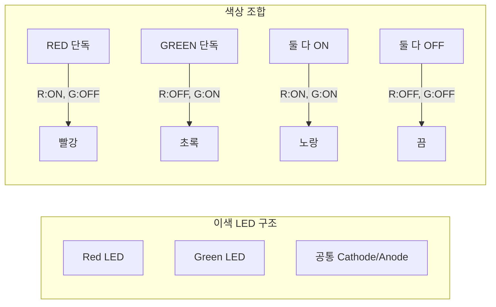
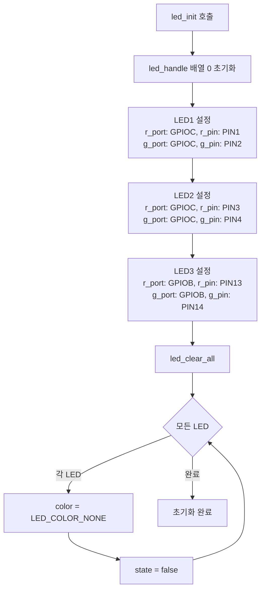
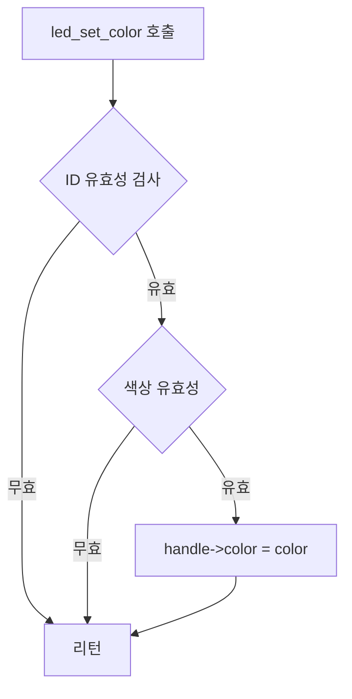
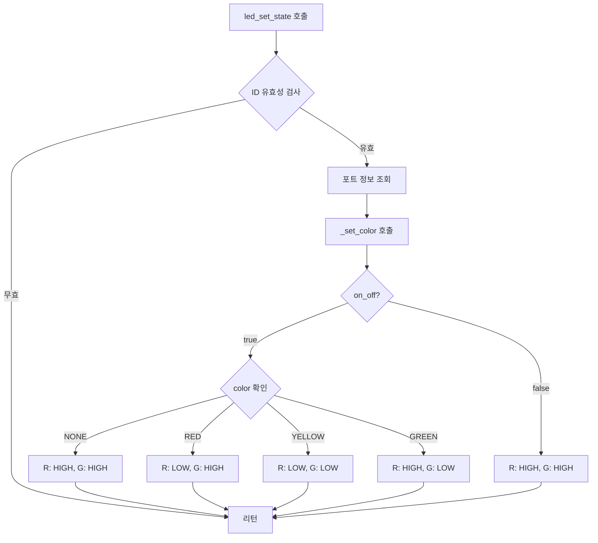
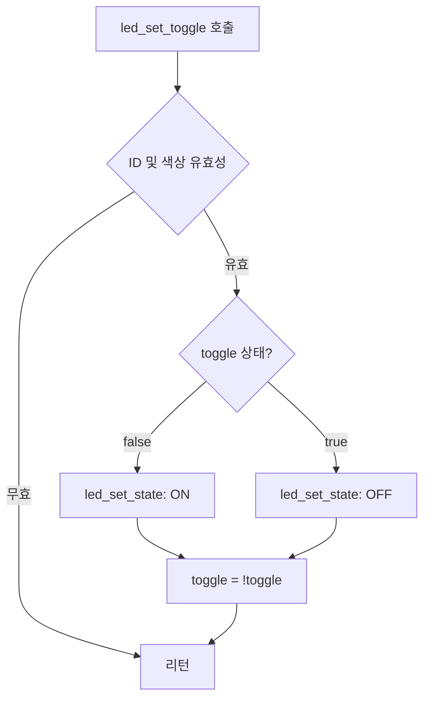
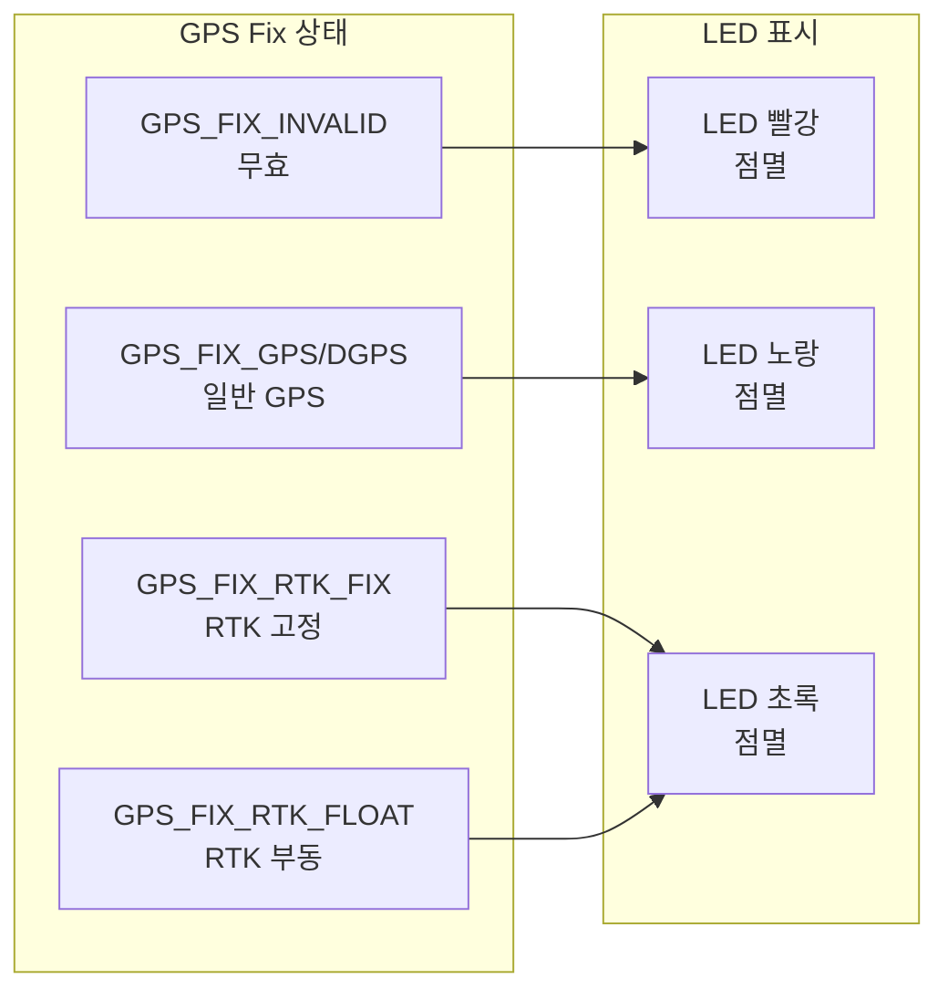

# LED 라이브러리 기술 문서

## 1. 개요

LED 라이브러리는 STM32F4 기반 임베디드 시스템에서 이색(Bi-color) LED를 제어하는 라이브러리입니다. Red/Green 조합으로 빨강, 노랑, 초록 3가지 색상을 표현할 수 있으며, 토글 기능으로 점멸 효과를 구현합니다.

### 1.1 주요 특징
- **이색 LED 지원**: Red + Green 조합으로 3색 표현
- **3개 LED 독립 제어**: 각 LED 개별 색상 및 상태 관리
- **토글 기능**: 점멸 효과 간편 구현
- **Active-Low 구동**: GPIO LOW에서 LED ON

---

## 2. 아키텍처

### 2.1 시스템 구성

```mermaid
graph TB
    subgraph "STM32F4"
        subgraph "GPIO"
            PC1[PC1 - LED1_R]
            PC2[PC2 - LED1_G]
            PC3[PC3 - LED2_R]
            PC4[PC4 - LED2_G]
            PB13[PB13 - LED3_R]
            PB14[PB14 - LED3_G]
        end

        subgraph "LED Library"
            INIT[led_init]
            SET_COLOR[led_set_color]
            SET_STATE[led_set_state]
            TOGGLE[led_set_toggle]
            CLEAR[led_clear_all]
        end

        subgraph "Data"
            HANDLE[led_handle\[3\]]
        end
    end

    subgraph "Hardware"
        LED1[LED 1<br/>이색 LED]
        LED2[LED 2<br/>이색 LED]
        LED3[LED 3<br/>이색 LED]
    end

    PC1 --> LED1
    PC2 --> LED1
    PC3 --> LED2
    PC4 --> LED2
    PB13 --> LED3
    PB14 --> LED3

    INIT --> HANDLE
    SET_COLOR --> HANDLE
    SET_STATE --> HANDLE
    TOGGLE --> HANDLE
```

### 2.2 LED 색상 구현 원리



---

## 3. 파일 구조

| 파일 | 경로 | 설명 |
|------|------|------|
| `led.h` | lib/led/ | LED 라이브러리 헤더 |
| `led.c` | lib/led/ | LED 제어 구현 |

---

## 4. 데이터 구조

### 4.1 LED ID 열거형

```c
typedef enum {
    LED_ID_NONE,        // 사용하지 않음
    LED_ID_1 = 1,       // LED 1
    LED_ID_2,           // LED 2
    LED_ID_3,           // LED 3
    LED_ID_MAX
} led_id_t;
```

### 4.2 LED 색상 열거형

```c
typedef enum {
    LED_COLOR_NONE = 0,     // 끔
    LED_COLOR_RED,          // 빨강
    LED_COLOR_YELLOW,       // 노랑 (빨강 + 초록)
    LED_COLOR_GREEN,        // 초록
    LED_COLOR_MAX
} led_color_t;
```

### 4.3 LED 포트 구조체

```c
typedef struct {
    GPIO_TypeDef* r_port;   // Red LED GPIO 포트
    GPIO_TypeDef* g_port;   // Green LED GPIO 포트
    uint16_t r_pin;         // Red LED 핀 번호
    uint16_t g_pin;         // Green LED 핀 번호
    led_color_t color;      // 현재 색상
    bool toggle;            // 토글 상태
} led_port_t;
```

---

## 5. 하드웨어 매핑

### 5.1 GPIO 핀 매핑

| LED | Red 포트 | Red 핀 | Green 포트 | Green 핀 |
|-----|----------|--------|------------|----------|
| LED 1 | GPIOC | PIN 1 | GPIOC | PIN 2 |
| LED 2 | GPIOC | PIN 3 | GPIOC | PIN 4 |
| LED 3 | GPIOB | PIN 13 | GPIOB | PIN 14 |

### 5.2 GPIO 상태와 LED 상태 매핑 (Active-Low)

```
┌─────────────────────────────────────────────────────────────────┐
│                   Active-Low LED 구동                           │
├─────────────────────────────────────────────────────────────────┤
│   GPIO 상태        LED 상태          설명                        │
├─────────────────────────────────────────────────────────────────┤
│   GPIO_PIN_RESET   LED ON           LOW → 전류 흐름 → LED 점등  │
│   GPIO_PIN_SET     LED OFF          HIGH → 전류 차단 → LED 소등 │
└─────────────────────────────────────────────────────────────────┘
```

### 5.3 색상별 GPIO 설정

| 색상 | Red GPIO | Green GPIO | 결과 |
|------|----------|------------|------|
| `LED_COLOR_NONE` | HIGH (SET) | HIGH (SET) | 꺼짐 |
| `LED_COLOR_RED` | LOW (RESET) | HIGH (SET) | 빨강 |
| `LED_COLOR_GREEN` | HIGH (SET) | LOW (RESET) | 초록 |
| `LED_COLOR_YELLOW` | LOW (RESET) | LOW (RESET) | 노랑 |

---

## 6. 동작 흐름

### 6.1 초기화 흐름



### 6.2 색상 변경 흐름



### 6.3 LED 상태 변경 흐름



### 6.4 토글 동작 흐름



---

## 7. API 레퍼런스

### 7.1 초기화

```c
/**
 * @brief LED 라이브러리 초기화
 *
 * 모든 LED의 GPIO 포트/핀 설정 및 초기 상태 (끔) 적용
 */
void led_init(void);
```

### 7.2 색상 설정

```c
/**
 * @brief LED 색상 설정
 *
 * @param id LED ID (LED_ID_1, LED_ID_2, LED_ID_3)
 * @param color 색상 (LED_COLOR_NONE, RED, YELLOW, GREEN)
 *
 * @note 색상만 저장하며, 실제 LED 점등은 led_set_state() 필요
 */
void led_set_color(led_id_t id, led_color_t color);
```

### 7.3 상태 설정

```c
/**
 * @brief LED 점등/소등 제어
 *
 * @param id LED ID
 * @param on_off true: 점등, false: 소등
 *
 * @note 현재 설정된 color에 따라 GPIO 출력
 */
void led_set_state(led_id_t id, bool on_off);
```

### 7.4 토글

```c
/**
 * @brief LED 상태 토글 (점멸)
 *
 * @param id LED ID
 *
 * @note LED_COLOR_NONE/MAX 일 때는 동작하지 않음
 *       호출할 때마다 ON/OFF 교대
 */
void led_set_toggle(led_id_t id);
```

### 7.5 전체 끄기

```c
/**
 * @brief 모든 LED 끄기
 *
 * 모든 LED의 색상을 NONE으로 설정하고 소등
 */
void led_clear_all(void);
```

---

## 8. GPS 상태 표시 연동

GPS 라이브러리와 연동하여 Fix 상태를 LED로 표시합니다.

### 8.1 상태 매핑



### 8.2 GPS 태스크 코드 예시

```c
// gps_app.c 에서 발췌
if(gps_handle.nmea_data.gga.fix == GPS_FIX_INVALID) {
    led_set_color(2, LED_COLOR_RED);
}
else if(gps_handle.nmea_data.gga.fix < GPS_FIX_RTK_FIX) {
    led_set_color(2, LED_COLOR_YELLOW);
}
else if(gps_handle.nmea_data.gga.fix < GPS_FIX_RTK_FLOAT) {
    led_set_color(2, LED_COLOR_GREEN);
}
else {
    led_set_color(2, LED_COLOR_NONE);
}

led_set_toggle(2);  // 매 GPS 데이터 수신 시 토글
```

---

## 9. 사용 예제

### 9.1 기본 사용법

```c
#include "led.h"

void led_example(void) {
    // 초기화
    led_init();

    // LED 1: 빨간색 점등
    led_set_color(LED_ID_1, LED_COLOR_RED);
    led_set_state(LED_ID_1, true);

    // LED 2: 노란색 점등
    led_set_color(LED_ID_2, LED_COLOR_YELLOW);
    led_set_state(LED_ID_2, true);

    // LED 3: 초록색 점등
    led_set_color(LED_ID_3, LED_COLOR_GREEN);
    led_set_state(LED_ID_3, true);
}
```

### 9.2 점멸 효과

```c
#include "led.h"
#include "FreeRTOS.h"
#include "task.h"

void blink_task(void *param) {
    led_init();
    led_set_color(LED_ID_1, LED_COLOR_RED);

    while (1) {
        led_set_toggle(LED_ID_1);  // ON/OFF 교대
        vTaskDelay(pdMS_TO_TICKS(500));  // 500ms 간격
    }
}
```

### 9.3 상태 표시 패턴

```c
void status_indicator(system_status_t status) {
    switch (status) {
    case STATUS_ERROR:
        // 빨강 점등
        led_set_color(LED_ID_1, LED_COLOR_RED);
        led_set_state(LED_ID_1, true);
        break;

    case STATUS_WARNING:
        // 노랑 점등
        led_set_color(LED_ID_1, LED_COLOR_YELLOW);
        led_set_state(LED_ID_1, true);
        break;

    case STATUS_OK:
        // 초록 점등
        led_set_color(LED_ID_1, LED_COLOR_GREEN);
        led_set_state(LED_ID_1, true);
        break;

    case STATUS_IDLE:
        // 꺼짐
        led_set_color(LED_ID_1, LED_COLOR_NONE);
        led_set_state(LED_ID_1, false);
        break;
    }
}
```

### 9.4 순차 점등 (Knight Rider)

```c
void knight_rider(void) {
    led_color_t colors[] = {LED_COLOR_RED, LED_COLOR_YELLOW, LED_COLOR_GREEN};

    while (1) {
        // 왼쪽 → 오른쪽
        for (int i = LED_ID_1; i < LED_ID_MAX; i++) {
            led_clear_all();
            led_set_color(i, colors[i - 1]);
            led_set_state(i, true);
            vTaskDelay(pdMS_TO_TICKS(200));
        }

        // 오른쪽 → 왼쪽
        for (int i = LED_ID_3; i >= LED_ID_1; i--) {
            led_clear_all();
            led_set_color(i, colors[i - 1]);
            led_set_state(i, true);
            vTaskDelay(pdMS_TO_TICKS(200));
        }
    }
}
```

---

## 10. 타이밍 다이어그램

### 10.1 토글 타이밍

```
Time (ms):   0    500   1000  1500  2000  2500  3000
             │     │     │     │     │     │     │
LED State:   ┌─────┐     ┌─────┐     ┌─────┐
             │ ON  │ OFF │ ON  │ OFF │ ON  │ OFF
             └─────┴─────┴─────┴─────┴─────┴─────

toggle():    ↑     ↑     ↑     ↑     ↑     ↑
             call  call  call  call  call  call
```

### 10.2 색상 전환 타이밍

```
Action:      set_color(RED)    set_state(ON)    set_color(GREEN)    set_state(ON)
                  │                 │                  │                  │
GPIO_R:     ──────┬─────────────────┬──────────────────┬──────────────────┐
                  │                 │ LOW              │                  │ HIGH

GPIO_G:     ──────┬─────────────────┬──────────────────┬──────────────────┐
                  │                 │ HIGH             │                  │ LOW

LED Color:  [OFF] │ [OFF]           │ [RED]            │ [RED]            │ [GREEN]
```

---

## 11. 회로도 참고

### 11.1 이색 LED 연결 (Common Cathode 예시)

```
         VCC (3.3V)
            │
           ┌┴┐
           │R│ 330Ω
           └┬┘
            │
            ├───────┐
            │       │
           ─┼─     ─┼─
          ╱ │ ╲   ╱ │ ╲
         ╱  │  ╲ ╱  │  ╲    (LED 심볼)
         ───┼───────┼───
            │   │   │
            │  GND  │
            │       │
            ▼       ▼
        GPIO_R   GPIO_G
       (Active-Low)
```

### 11.2 실제 회로 (Active-Low, Open Drain)

```
      GPIO_R (PC1)                GPIO_G (PC2)
          │                           │
          │    ┌────────────┐         │
          └────┤    RED     ├─────────┘
               │    LED     │
               └──────┬─────┘
                      │
                     ┌┴┐
                     │R│ Current Limiting
                     └┬┘
                      │
                     GND
```

---

## 12. 메모리 사용량

| 항목 | 크기 | 설명 |
|------|------|------|
| `led_handle[3]` | 72 bytes | 3개 LED 핸들 (24 bytes × 3) |
| 코드 크기 | ~500 bytes | Flash 사용량 |
| **총 RAM 사용** | 72 bytes | |

---

## 13. 제약사항 및 주의사항

### 13.1 제약사항

1. **최대 3개 LED 지원**: `LED_ID_MAX`로 제한됨
2. **색상 3가지**: Red, Yellow, Green만 지원 (Blue 미지원)
3. **GPIO 설정 필요**: HAL_GPIO_Init()은 별도 수행 필요
4. **ISR에서 사용 주의**: HAL_GPIO_WritePin은 ISR에서 사용 가능하나 권장하지 않음

### 13.2 주의사항

```c
// ❌ 잘못된 사용: 색상 설정 없이 점등
led_set_state(LED_ID_1, true);  // color가 LED_COLOR_NONE이면 아무것도 안 켜짐

// ✅ 올바른 사용: 색상 먼저 설정
led_set_color(LED_ID_1, LED_COLOR_RED);
led_set_state(LED_ID_1, true);
```

```c
// ❌ 잘못된 사용: 유효하지 않은 ID
led_set_color(LED_ID_NONE, LED_COLOR_RED);  // 무시됨
led_set_color(LED_ID_MAX, LED_COLOR_RED);   // 무시됨

// ✅ 올바른 사용: 유효한 ID
led_set_color(LED_ID_1, LED_COLOR_RED);
led_set_color(LED_ID_2, LED_COLOR_GREEN);
led_set_color(LED_ID_3, LED_COLOR_YELLOW);
```

---

## 14. 확장 가능성

### 14.1 PWM 밝기 조절 추가

```c
// 향후 추가 가능한 API
void led_set_brightness(led_id_t id, uint8_t brightness);  // 0-100%
```

### 14.2 RGB LED 지원 확장

```c
// 향후 확장 가능한 구조체
typedef struct {
    GPIO_TypeDef* r_port;
    GPIO_TypeDef* g_port;
    GPIO_TypeDef* b_port;    // Blue 추가
    uint16_t r_pin;
    uint16_t g_pin;
    uint16_t b_pin;          // Blue 핀 추가
    // ...
} led_rgb_port_t;
```

### 14.3 패턴 시퀀스 기능

```c
// 향후 추가 가능한 API
typedef struct {
    led_color_t color;
    uint16_t duration_ms;
} led_pattern_step_t;

void led_play_pattern(led_id_t id, const led_pattern_step_t *pattern, size_t len);
```

---

## 15. 참고 자료

- STM32F4 Reference Manual (RM0090)
- STM32F4 HAL Driver User Manual
- LED Bicolor/Tricolor Application Notes
