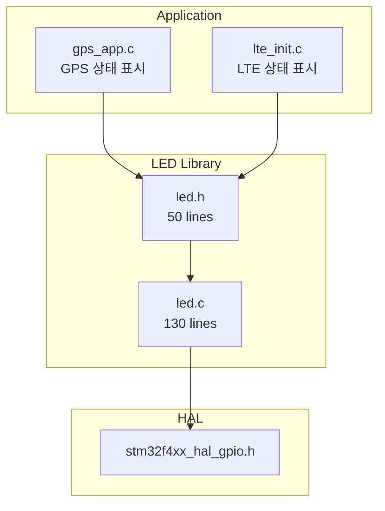
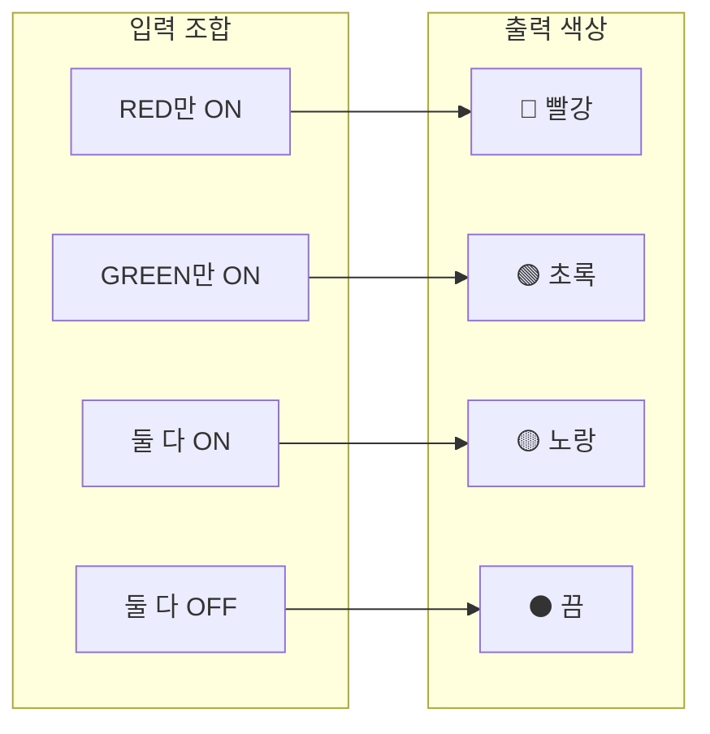
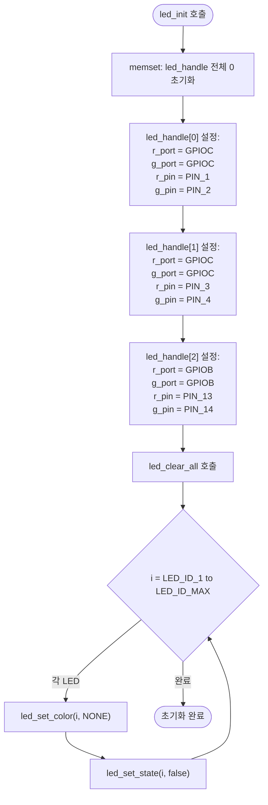
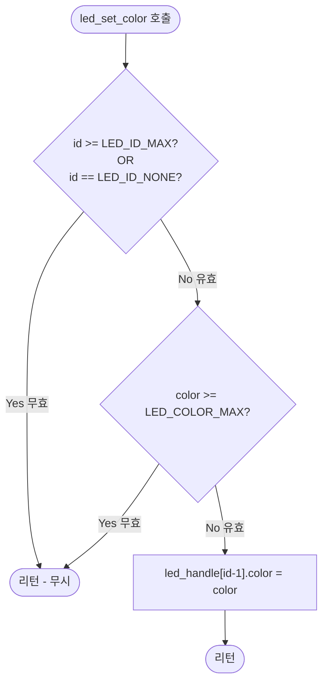
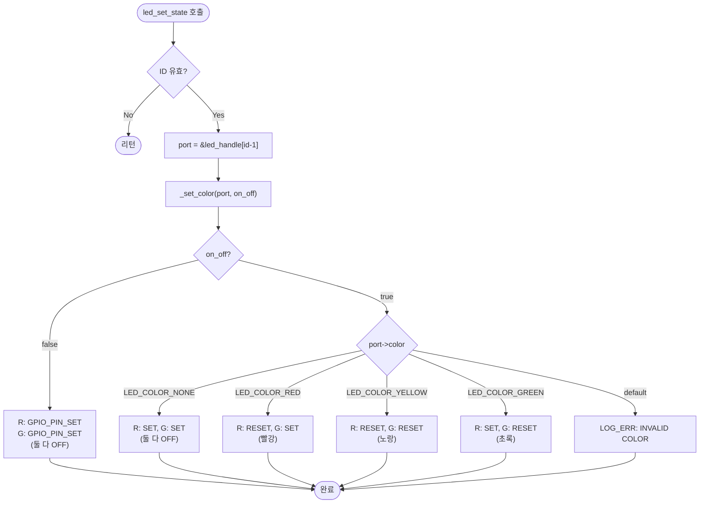
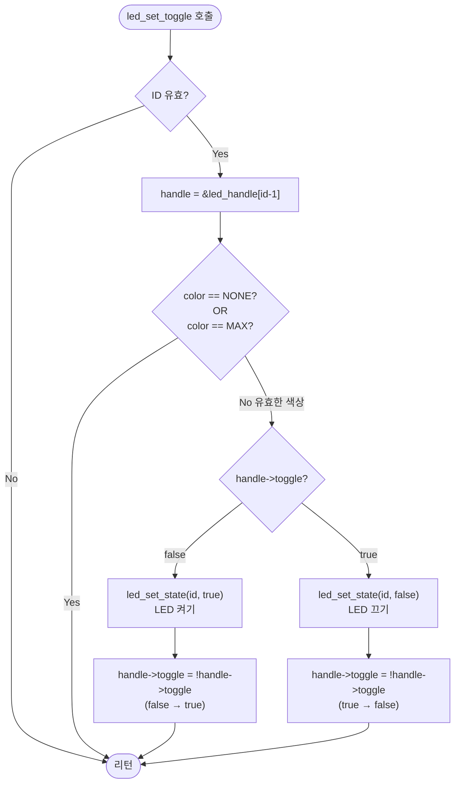
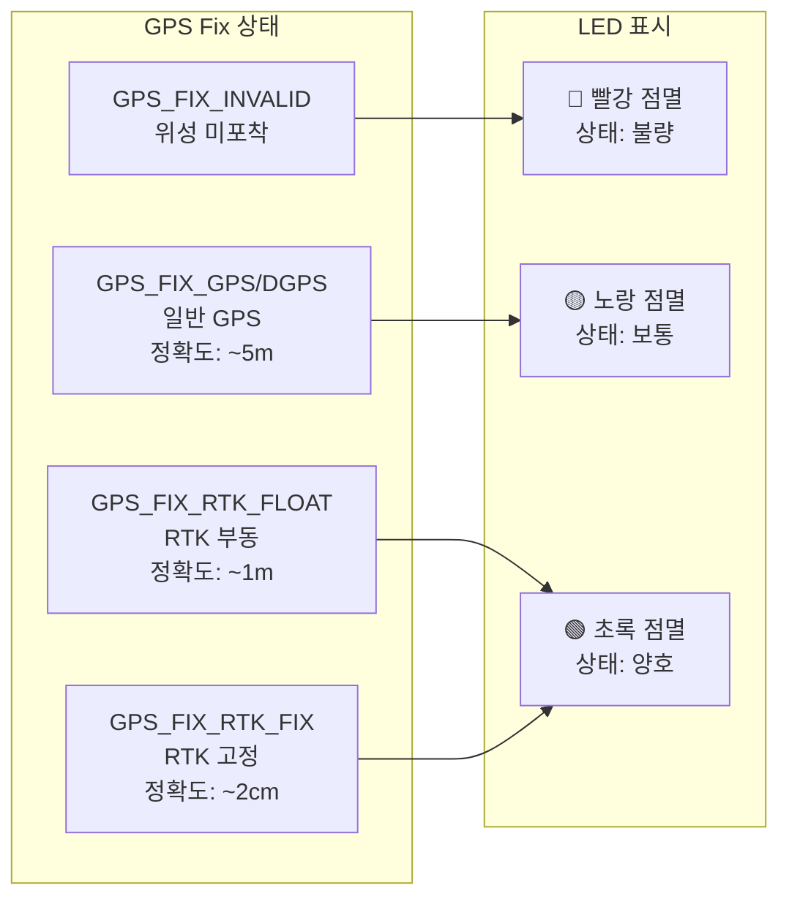

# LED 라이브러리 기술 문서

## 1. 개요

LED 라이브러리는 STM32F4 기반 임베디드 시스템에서 **이색(Bi-color) LED**를 제어하는 라이브러리입니다. Red/Green 조합으로 빨강, 노랑, 초록 3가지 색상을 표현할 수 있으며, 토글 기능으로 점멸 효과를 구현합니다.

### 1.1 주요 특징

| 특징 | 설명 |
|------|------|
| **이색 LED 지원** | Red + Green 조합으로 3색 표현 |
| **3개 LED 독립 제어** | 각 LED 개별 색상 및 상태 관리 |
| **토글 기능** | 점멸 효과 간편 구현 |
| **Active-Low 구동** | GPIO LOW에서 LED ON |
| **상태 저장** | 색상과 토글 상태 내부 관리 |

### 1.2 성능 사양

| 항목 | 값 | 비고 |
|------|-----|------|
| 지원 LED 개수 | 3개 | LED_ID_1 ~ LED_ID_3 |
| 지원 색상 | 4가지 | OFF, RED, YELLOW, GREEN |
| RAM 사용량 | 72 bytes | led_handle[3] |
| Flash 사용량 | ~500 bytes | 코드 크기 |
| GPIO 핀 | 6개 | 3 LED × 2핀 (R, G) |

---

## 2. 아키텍처

### 2.1 시스템 구성

```
┌─────────────────────────────────────────────────────────────────────┐
│                         Application Layer                            │
│  ┌─────────────────┐  ┌─────────────────┐  ┌─────────────────────┐ │
│  │   gps_app.c     │  │   lte_init.c    │  │   사용자 앱 ...     │ │
│  │ (GPS 상태 LED)   │  │ (LTE 상태 LED)  │  │                     │ │
│  └─────────────────┘  └─────────────────┘  └─────────────────────┘ │
├─────────────────────────────────────────────────────────────────────┤
│                        LED Library (led.c/h)                         │
│  ┌────────────────────────────────────────────────────────────────┐ │
│  │                        API Functions                            │ │
│  │  ┌──────────────┬──────────────┬──────────────┬────────────┐   │ │
│  │  │  led_init()  │led_set_color │led_set_state │led_set_toggle│  │ │
│  │  └──────────────┴──────────────┴──────────────┴────────────┘   │ │
│  │  ┌──────────────────────────────────────────────────────────┐  │ │
│  │  │               Internal: _set_color()                      │  │ │
│  │  └──────────────────────────────────────────────────────────┘  │ │
│  │  ┌──────────────────────────────────────────────────────────┐  │ │
│  │  │           Data: led_handle[3] (led_port_t)               │  │ │
│  │  └──────────────────────────────────────────────────────────┘  │ │
│  └────────────────────────────────────────────────────────────────┘ │
├─────────────────────────────────────────────────────────────────────┤
│                         HAL Layer (STM32)                            │
│  ┌────────────────────────────────────────────────────────────────┐ │
│  │              HAL_GPIO_WritePin(port, pin, state)               │ │
│  └────────────────────────────────────────────────────────────────┘ │
├─────────────────────────────────────────────────────────────────────┤
│                         Hardware Layer                               │
│  ┌──────────────┐  ┌──────────────┐  ┌──────────────┐              │
│  │    LED 1     │  │    LED 2     │  │    LED 3     │              │
│  │   PC1/PC2    │  │   PC3/PC4    │  │  PB13/PB14   │              │
│  │   (R/G)      │  │   (R/G)      │  │   (R/G)      │              │
│  └──────────────┘  └──────────────┘  └──────────────┘              │
└─────────────────────────────────────────────────────────────────────┘
```

### 2.2 파일 구조



### 2.3 파일 상세

| 파일 | 경로 | 크기 | 설명 |
|------|------|------|------|
| `led.h` | lib/led/ | 50 lines | 헤더, 열거형/구조체/API 정의 |
| `led.c` | lib/led/ | 130 lines | GPIO 제어 구현 |

---

## 3. 이색 LED 동작 원리

### 3.1 이색 LED 구조

```
┌─────────────────────────────────────────────────────────────────┐
│  이색 (Bi-color) LED 구조                                        │
├─────────────────────────────────────────────────────────────────┤
│                                                                  │
│    ┌───────────────────────────────────────────┐                │
│    │                LED Package                 │                │
│    │   ┌─────────────┐    ┌─────────────┐      │                │
│    │   │   RED LED   │    │  GREEN LED  │      │                │
│    │   │    (빨강)    │    │   (초록)     │      │                │
│    │   └──────┬──────┘    └──────┬──────┘      │                │
│    │          │                  │              │                │
│    │          └────────┬─────────┘              │                │
│    │                   │                        │                │
│    │              [공통 단자]                    │                │
│    └───────────────────┼───────────────────────┘                │
│                        │                                         │
│                       GND                                        │
│                                                                  │
│  - 내부에 두 개의 LED가 병렬로 연결됨                             │
│  - 각각 독립적으로 제어 가능                                      │
│  - 동시에 켜면 혼합색 (노랑) 출력                                 │
└─────────────────────────────────────────────────────────────────┘
```

### 3.2 색상 혼합 원리



### 3.3 Active-Low 구동 방식

```
┌─────────────────────────────────────────────────────────────────┐
│  Active-Low LED 구동 원리                                        │
├─────────────────────────────────────────────────────────────────┤
│                                                                  │
│   VCC (3.3V)                                                     │
│      │                                                           │
│     ┌┴┐                                                          │
│     │R│ 330Ω (전류 제한 저항)                                    │
│     └┬┘                                                          │
│      │                                                           │
│      ▼                                                           │
│    ┌───┐                                                         │
│    │LED│ (순방향 전압 ~2V)                                       │
│    └─┬─┘                                                         │
│      │                                                           │
│      ▼                                                           │
│    GPIO ──────────────────────────────────────────┐              │
│                                                    │              │
│    GPIO = LOW (0V)  → 전류 흐름 → LED ON  ─────┤  Active-Low    │
│    GPIO = HIGH (3.3V) → 전류 없음 → LED OFF ───┤                 │
│                                                                  │
│  ★ STM32 HAL 매핑:                                               │
│    - GPIO_PIN_RESET (0) = LOW  = LED ON                         │
│    - GPIO_PIN_SET   (1) = HIGH = LED OFF                        │
└─────────────────────────────────────────────────────────────────┘
```

### 3.4 색상별 GPIO 출력 테이블

| 색상 | Red GPIO | Green GPIO | Red LED | Green LED | 결과 색상 |
|------|----------|------------|---------|-----------|-----------|
| `LED_COLOR_NONE` | **SET** (HIGH) | **SET** (HIGH) | OFF | OFF | ⚫ 끔 |
| `LED_COLOR_RED` | **RESET** (LOW) | **SET** (HIGH) | ON | OFF | 🔴 빨강 |
| `LED_COLOR_GREEN` | **SET** (HIGH) | **RESET** (LOW) | OFF | ON | 🟢 초록 |
| `LED_COLOR_YELLOW` | **RESET** (LOW) | **RESET** (LOW) | ON | ON | 🟡 노랑 |

---

## 4. 데이터 구조

### 4.1 LED ID 열거형 (`led_id_t`)

```c
typedef enum {
    LED_ID_NONE,        // 0: 사용하지 않음 (유효성 검사용)
    LED_ID_1 = 1,       // 1: LED 1
    LED_ID_2,           // 2: LED 2
    LED_ID_3,           // 3: LED 3
    LED_ID_MAX          // 4: 범위 검사용
} led_id_t;
```

**배열 인덱스 변환:**
```
led_handle[id - 1]  →  LED_ID_1(1) → index 0
                       LED_ID_2(2) → index 1
                       LED_ID_3(3) → index 2
```

### 4.2 LED 색상 열거형 (`led_color_t`)

```c
typedef enum {
    LED_COLOR_NONE = 0,     // 끔 (R:OFF, G:OFF)
    LED_COLOR_RED,          // 빨강 (R:ON, G:OFF)
    LED_COLOR_YELLOW,       // 노랑 (R:ON, G:ON)
    LED_COLOR_GREEN,        // 초록 (R:OFF, G:ON)
    LED_COLOR_MAX           // 범위 검사용
} led_color_t;
```

### 4.3 LED 포트 구조체 (`led_port_t`)

```c
typedef struct {
    GPIO_TypeDef* r_port;   // Red LED GPIO 포트 (GPIOB, GPIOC 등)
    GPIO_TypeDef* g_port;   // Green LED GPIO 포트
    uint16_t r_pin;         // Red LED 핀 번호 (GPIO_PIN_1 등)
    uint16_t g_pin;         // Green LED 핀 번호
    led_color_t color;      // 현재 설정된 색상
    bool toggle;            // 토글 상태 (true: 다음에 OFF, false: 다음에 ON)
} led_port_t;
```

**구조체 크기 계산:**
```
sizeof(led_port_t) = 4 + 4 + 2 + 2 + 4 + 1 + padding = 약 24 bytes
led_handle[3] = 24 × 3 = 72 bytes
```

### 4.4 메모리 레이아웃

```
┌─────────────────────────────────────────────────────────────────┐
│  led_handle[3] 메모리 구조 (static 전역 변수)                    │
├─────────────────────────────────────────────────────────────────┤
│                                                                  │
│  led_handle[0] (LED_ID_1):                                       │
│  ┌──────────┬──────────┬────────┬────────┬───────┬────────┐    │
│  │ r_port   │ g_port   │ r_pin  │ g_pin  │ color │ toggle │    │
│  │ GPIOC    │ GPIOC    │ PIN_1  │ PIN_2  │   ?   │ false  │    │
│  └──────────┴──────────┴────────┴────────┴───────┴────────┘    │
│                                                                  │
│  led_handle[1] (LED_ID_2):                                       │
│  ┌──────────┬──────────┬────────┬────────┬───────┬────────┐    │
│  │ r_port   │ g_port   │ r_pin  │ g_pin  │ color │ toggle │    │
│  │ GPIOC    │ GPIOC    │ PIN_3  │ PIN_4  │   ?   │ false  │    │
│  └──────────┴──────────┴────────┴────────┴───────┴────────┘    │
│                                                                  │
│  led_handle[2] (LED_ID_3):                                       │
│  ┌──────────┬──────────┬────────┬────────┬───────┬────────┐    │
│  │ r_port   │ g_port   │ r_pin  │ g_pin  │ color │ toggle │    │
│  │ GPIOB    │ GPIOB    │ PIN_13 │ PIN_14 │   ?   │ false  │    │
│  └──────────┴──────────┴────────┴────────┴───────┴────────┘    │
│                                                                  │
└─────────────────────────────────────────────────────────────────┘
```

---

## 5. 하드웨어 인터페이스

### 5.1 GPIO 핀 매핑

```
┌─────────────────────────────────────────────────────────────────┐
│  STM32F4 GPIO → LED 연결                                         │
├─────────────────────────────────────────────────────────────────┤
│                                                                  │
│   ┌──────────────────────────┐    ┌──────────────────────────┐  │
│   │       STM32F4            │    │      LED Board           │  │
│   │                          │    │                          │  │
│   │  GPIOC Pin 1  (PC1) ─────┼────┼──► LED1 Red              │  │
│   │  GPIOC Pin 2  (PC2) ─────┼────┼──► LED1 Green            │  │
│   │                          │    │                          │  │
│   │  GPIOC Pin 3  (PC3) ─────┼────┼──► LED2 Red              │  │
│   │  GPIOC Pin 4  (PC4) ─────┼────┼──► LED2 Green            │  │
│   │                          │    │                          │  │
│   │  GPIOB Pin 13 (PB13) ────┼────┼──► LED3 Red              │  │
│   │  GPIOB Pin 14 (PB14) ────┼────┼──► LED3 Green            │  │
│   │                          │    │                          │  │
│   └──────────────────────────┘    └──────────────────────────┘  │
│                                                                  │
└─────────────────────────────────────────────────────────────────┘
```

### 5.2 핀 정의 (led.c)

```c
// LED 1: GPIOC
#define LED1_R_PORT GPIOC
#define LED1_R_PIN  GPIO_PIN_1
#define LED1_G_PORT GPIOC
#define LED1_G_PIN  GPIO_PIN_2

// LED 2: GPIOC
#define LED2_R_PORT GPIOC
#define LED2_R_PIN  GPIO_PIN_3
#define LED2_G_PORT GPIOC
#define LED2_G_PIN  GPIO_PIN_4

// LED 3: GPIOB
#define LED3_R_PORT GPIOB
#define LED3_R_PIN  GPIO_PIN_13
#define LED3_G_PORT GPIOB
#define LED3_G_PIN  GPIO_PIN_14
```

### 5.3 회로도

```
        VCC (3.3V)
           │
          ┌┴┐
          │R│ 330Ω
          └┬┘
           │
           ├─────────────────────────┐
           │                         │
          ─┼─                       ─┼─
         ╱ │ ╲                     ╱ │ ╲
        ╱  │  ╲                   ╱  │  ╲
       ╱  RED  ╲                 ╱ GREEN ╲
       ────┼─────────────────────────┼────
           │                         │
           │                         │
           ▼                         ▼
       GPIO_R                    GPIO_G
       (PC1)                     (PC2)
       Active-Low                Active-Low

    GPIO LOW  = LED ON  (전류 Sink)
    GPIO HIGH = LED OFF (전류 없음)
```

---

## 6. 동작방식 상세

### 6.1 초기화 흐름 (`led_init`)



**초기화 코드 분석:**

```c
void led_init(void) {
    // 1. 전체 배열 0으로 초기화 (color=0, toggle=false)
    memset(led_handle, 0, sizeof(led_handle));

    // 2. LED 1 포트/핀 설정
    led_handle[0].r_port = LED1_R_PORT;  // GPIOC
    led_handle[0].g_port = LED1_G_PORT;  // GPIOC
    led_handle[0].r_pin = LED1_R_PIN;    // GPIO_PIN_1
    led_handle[0].g_pin = LED1_G_PIN;    // GPIO_PIN_2

    // 3. LED 2 포트/핀 설정
    led_handle[1].r_port = LED2_R_PORT;  // GPIOC
    led_handle[1].g_port = LED2_G_PORT;  // GPIOC
    led_handle[1].r_pin = LED2_R_PIN;    // GPIO_PIN_3
    led_handle[1].g_pin = LED2_G_PIN;    // GPIO_PIN_4

    // 4. LED 3 포트/핀 설정
    led_handle[2].r_port = LED3_R_PORT;  // GPIOB
    led_handle[2].g_port = LED3_G_PORT;  // GPIOB
    led_handle[2].r_pin = LED3_R_PIN;    // GPIO_PIN_13
    led_handle[2].g_pin = LED3_G_PIN;    // GPIO_PIN_14

    // 5. 모든 LED 끄기
    led_clear_all();
}
```

### 6.2 색상 설정 흐름 (`led_set_color`)



**핵심 로직:**

```c
void led_set_color(led_id_t id, led_color_t color) {
    // ID 유효성 검사: LED_ID_1(1) ~ LED_ID_3(3) 범위
    if (id < LED_ID_MAX && id != LED_ID_NONE) {
        // 색상 유효성 검사: LED_COLOR_NONE(0) ~ LED_COLOR_GREEN(3)
        if (color < LED_COLOR_MAX) {
            // ★ 색상만 저장, GPIO는 건드리지 않음!
            led_handle[id - 1].color = color;
        }
    }
}
```

### 6.3 상태 설정 흐름 (`led_set_state`)



**내부 함수 `_set_color` 분석:**

```c
void _set_color(led_port_t* port, bool on_off) {
    if (on_off) {
        // LED 켜기 - 색상에 따라 GPIO 설정
        switch (port->color) {
            case LED_COLOR_NONE:
                // 색상 없음 = 둘 다 끄기
                HAL_GPIO_WritePin(port->r_port, port->r_pin, GPIO_PIN_SET);   // R OFF
                HAL_GPIO_WritePin(port->g_port, port->g_pin, GPIO_PIN_SET);   // G OFF
                break;

            case LED_COLOR_RED:
                // 빨강 = Red만 켜기
                HAL_GPIO_WritePin(port->r_port, port->r_pin, GPIO_PIN_RESET); // R ON
                HAL_GPIO_WritePin(port->g_port, port->g_pin, GPIO_PIN_SET);   // G OFF
                break;

            case LED_COLOR_YELLOW:
                // 노랑 = 둘 다 켜기
                HAL_GPIO_WritePin(port->r_port, port->r_pin, GPIO_PIN_RESET); // R ON
                HAL_GPIO_WritePin(port->g_port, port->g_pin, GPIO_PIN_RESET); // G ON
                break;

            case LED_COLOR_GREEN:
                // 초록 = Green만 켜기
                HAL_GPIO_WritePin(port->r_port, port->r_pin, GPIO_PIN_SET);   // R OFF
                HAL_GPIO_WritePin(port->g_port, port->g_pin, GPIO_PIN_RESET); // G ON
                break;

            default:
                LOG_ERR("INVALID LED COLOR : %d", port->color);
        }
    } else {
        // LED 끄기 - 색상 무관하게 둘 다 OFF
        HAL_GPIO_WritePin(port->r_port, port->r_pin, GPIO_PIN_SET);   // R OFF
        HAL_GPIO_WritePin(port->g_port, port->g_pin, GPIO_PIN_SET);   // G OFF
    }
}
```

### 6.4 토글 동작 흐름 (`led_set_toggle`)



**토글 상태 머신:**

```
┌─────────────────────────────────────────────────────────────────┐
│  토글 상태 머신                                                   │
├─────────────────────────────────────────────────────────────────┤
│                                                                  │
│  초기 상태: toggle = false                                        │
│                                                                  │
│       led_set_toggle()                                           │
│             │                                                    │
│             ▼                                                    │
│    ┌────────────────┐         ┌────────────────┐                │
│    │  toggle=false  │ ─────►  │  toggle=true   │                │
│    │   LED OFF      │         │   LED ON       │                │
│    └────────────────┘ ◄───── └────────────────┘                │
│                                                                  │
│  호출 순서:                                                       │
│  1. toggle=false → LED ON  → toggle=true                        │
│  2. toggle=true  → LED OFF → toggle=false                       │
│  3. toggle=false → LED ON  → toggle=true                        │
│  ... (반복)                                                      │
│                                                                  │
└─────────────────────────────────────────────────────────────────┘
```

### 6.5 전체 끄기 흐름 (`led_clear_all`)

```c
void led_clear_all(void) {
    for (int i = LED_ID_1; i < LED_ID_MAX; i++) {
        led_set_color(i, LED_COLOR_NONE);  // 색상 초기화
        led_set_state(i, false);           // GPIO OFF
    }
}
```

---

## 7. API 레퍼런스

### 7.1 초기화

```c
/**
 * @brief LED 라이브러리 초기화
 *
 * @pre   GPIO 클럭 및 핀 설정이 완료되어야 함 (CubeMX/HAL)
 * @post  led_handle[3] 초기화, 모든 LED OFF
 *
 * @note  시스템 시작 시 한 번만 호출
 *        GPIO 설정(Output, Push-Pull)은 별도로 필요
 */
void led_init(void);
```

### 7.2 색상 설정

```c
/**
 * @brief LED 색상 설정
 *
 * @param id     LED ID (LED_ID_1, LED_ID_2, LED_ID_3)
 * @param color  색상 (LED_COLOR_NONE, RED, YELLOW, GREEN)
 *
 * @pre   led_init() 호출 완료
 * @post  led_handle[id-1].color에 색상 저장
 *
 * @note  색상만 저장하며, 실제 LED 점등은 led_set_state() 필요
 *        유효하지 않은 id/color는 무시됨
 *
 * @code
 * led_set_color(LED_ID_1, LED_COLOR_RED);    // LED1 색상 = 빨강
 * led_set_state(LED_ID_1, true);             // 실제 점등
 * @endcode
 */
void led_set_color(led_id_t id, led_color_t color);
```

### 7.3 상태 설정

```c
/**
 * @brief LED 점등/소등 제어
 *
 * @param id      LED ID
 * @param on_off  true: 점등, false: 소등
 *
 * @pre   led_init() 및 led_set_color() 완료
 * @post  GPIO 출력 변경, LED 상태 변경
 *
 * @note  현재 설정된 color에 따라 GPIO 출력
 *        on_off=true + color=NONE → LED는 꺼진 상태
 *        on_off=false → color 무관하게 LED OFF
 */
void led_set_state(led_id_t id, bool on_off);
```

### 7.4 토글

```c
/**
 * @brief LED 상태 토글 (점멸 효과)
 *
 * @param id  LED ID
 *
 * @pre   led_init() 및 led_set_color() 완료
 * @post  LED ON↔OFF 전환, toggle 상태 반전
 *
 * @note  LED_COLOR_NONE/MAX 일 때는 동작하지 않음
 *        주기적으로 호출하면 점멸 효과
 *
 * @code
 * // 500ms 간격 점멸
 * while (1) {
 *     led_set_toggle(LED_ID_1);
 *     vTaskDelay(pdMS_TO_TICKS(500));
 * }
 * @endcode
 */
void led_set_toggle(led_id_t id);
```

### 7.5 전체 끄기

```c
/**
 * @brief 모든 LED 끄기
 *
 * @pre   led_init() 호출 완료
 * @post  모든 LED color=NONE, GPIO=OFF
 *
 * @note  시스템 종료, 에러 상태 등에서 사용
 */
void led_clear_all(void);
```

---

## 8. 시스템 연동

### 8.1 GPS 상태 표시

GPS Fix 상태에 따라 LED 색상을 변경하여 위치 정확도를 시각적으로 표시합니다.



**gps_app.c 코드 예시:**

```c
void update_gps_led(gps_fix_t fix) {
    if (fix == GPS_FIX_INVALID) {
        led_set_color(LED_ID_2, LED_COLOR_RED);
    }
    else if (fix < GPS_FIX_RTK_FIX) {
        // GPS, DGPS
        led_set_color(LED_ID_2, LED_COLOR_YELLOW);
    }
    else {
        // RTK_FIX, RTK_FLOAT
        led_set_color(LED_ID_2, LED_COLOR_GREEN);
    }

    // 매 GPS 데이터 수신마다 토글 (1Hz 점멸)
    led_set_toggle(LED_ID_2);
}
```

### 8.2 LTE 상태 표시

LTE 초기화 및 연결 상태를 LED로 표시합니다.

| 상태 | LED | 동작 |
|------|-----|------|
| 초기화 중 | LED1 | 🟡 노랑 점멸 |
| 초기화 실패 | LED1 | 🔴 빨강 점등 |
| 네트워크 연결됨 | LED1 | 🟢 초록 점등 |
| TCP 데이터 송수신 | LED1 | 🟢 초록 점멸 |

---

## 9. 사용 예제

### 9.1 기본 사용법

```c
#include "led.h"

void led_basic_example(void) {
    // 1. 초기화
    led_init();

    // 2. LED 1: 빨간색 점등
    led_set_color(LED_ID_1, LED_COLOR_RED);
    led_set_state(LED_ID_1, true);

    // 3. LED 2: 노란색 점등
    led_set_color(LED_ID_2, LED_COLOR_YELLOW);
    led_set_state(LED_ID_2, true);

    // 4. LED 3: 초록색 점등
    led_set_color(LED_ID_3, LED_COLOR_GREEN);
    led_set_state(LED_ID_3, true);
}
```

### 9.2 점멸 효과 (FreeRTOS)

```c
#include "led.h"
#include "FreeRTOS.h"
#include "task.h"

void blink_task(void *param) {
    led_init();
    led_set_color(LED_ID_1, LED_COLOR_RED);

    while (1) {
        led_set_toggle(LED_ID_1);  // ON↔OFF 교대
        vTaskDelay(pdMS_TO_TICKS(500));  // 500ms = 1Hz 점멸
    }
}

// 태스크 생성
xTaskCreate(blink_task, "blink", 128, NULL, 1, NULL);
```

### 9.3 상태 표시 패턴

```c
typedef enum {
    STATUS_ERROR,
    STATUS_WARNING,
    STATUS_OK,
    STATUS_IDLE
} system_status_t;

void status_indicator(system_status_t status) {
    switch (status) {
    case STATUS_ERROR:
        led_set_color(LED_ID_1, LED_COLOR_RED);
        led_set_state(LED_ID_1, true);
        break;

    case STATUS_WARNING:
        led_set_color(LED_ID_1, LED_COLOR_YELLOW);
        led_set_state(LED_ID_1, true);
        break;

    case STATUS_OK:
        led_set_color(LED_ID_1, LED_COLOR_GREEN);
        led_set_state(LED_ID_1, true);
        break;

    case STATUS_IDLE:
        led_clear_all();
        break;
    }
}
```

### 9.4 순차 점등 (Knight Rider)

```c
void knight_rider_task(void *param) {
    led_init();

    while (1) {
        // 왼쪽 → 오른쪽
        for (int i = LED_ID_1; i < LED_ID_MAX; i++) {
            led_clear_all();
            led_set_color(i, LED_COLOR_RED);
            led_set_state(i, true);
            vTaskDelay(pdMS_TO_TICKS(150));
        }

        // 오른쪽 → 왼쪽
        for (int i = LED_ID_3; i >= LED_ID_1; i--) {
            led_clear_all();
            led_set_color(i, LED_COLOR_RED);
            led_set_state(i, true);
            vTaskDelay(pdMS_TO_TICKS(150));
        }
    }
}
```

### 9.5 색상 순환

```c
void color_cycle_task(void *param) {
    led_init();
    led_color_t colors[] = {LED_COLOR_RED, LED_COLOR_YELLOW, LED_COLOR_GREEN};
    int color_idx = 0;

    while (1) {
        led_set_color(LED_ID_1, colors[color_idx]);
        led_set_state(LED_ID_1, true);

        color_idx = (color_idx + 1) % 3;  // 0 → 1 → 2 → 0 ...
        vTaskDelay(pdMS_TO_TICKS(1000));
    }
}
```

---

## 10. 타이밍 다이어그램

### 10.1 토글 타이밍

```
Time (ms):   0    500   1000  1500  2000  2500  3000
             │     │     │     │     │     │     │
toggle state:F     T     F     T     F     T     F

LED State:   ┌─────┐     ┌─────┐     ┌─────┐
             │ ON  │ OFF │ ON  │ OFF │ ON  │ OFF │
             └─────┴─────┴─────┴─────┴─────┴─────┴─────

toggle()     ↑     ↑     ↑     ↑     ↑     ↑     ↑
call         1     2     3     4     5     6     7
```

### 10.2 색상 설정 → 상태 설정 흐름

```
Time:        T0              T1              T2              T3
             │               │               │               │
Action:      set_color(RED)  set_state(ON)   set_color(GRN)  set_state(ON)
             │               │               │               │
GPIO_R:      ────────────────┐               ┌────────────────────
             HIGH            │ LOW           │ HIGH
                             └───────────────┘

GPIO_G:      ────────────────────────────────┐
             HIGH                            │ LOW
                                             └───────────────────

LED:         [OFF]           [RED]           [RED]           [GREEN]

             ★ set_color만으로는 GPIO 변화 없음!
             ★ set_state(ON) 호출 시점에 GPIO 변경
```

### 10.3 초기화 시퀀스

```
Time:        T0          T1          T2          T3          T4
             │           │           │           │           │
Action:      led_init()  memset      config      clear_all   완료
             │           │           │           │           │
             │           └──────────►└──────────►│           │
             │                                   │           │
GPIO_R1:     ?           ?           ?           SET (OFF)   SET
GPIO_G1:     ?           ?           ?           SET (OFF)   SET
GPIO_R2:     ?           ?           ?           SET (OFF)   SET
GPIO_G2:     ?           ?           ?           SET (OFF)   SET
GPIO_R3:     ?           ?           ?           SET (OFF)   SET
GPIO_G3:     ?           ?           ?           SET (OFF)   SET
```

---

## 11. 주의사항 및 제약사항

### 11.1 올바른 사용법

```c
// ✅ 올바른 사용: 색상 먼저 설정 후 점등
led_set_color(LED_ID_1, LED_COLOR_RED);
led_set_state(LED_ID_1, true);

// ✅ 토글 전 색상 설정
led_set_color(LED_ID_1, LED_COLOR_GREEN);
led_set_toggle(LED_ID_1);  // 첫 호출: ON
led_set_toggle(LED_ID_1);  // 두 번째: OFF

// ✅ 전체 끄기 후 다시 켜기
led_clear_all();
led_set_color(LED_ID_1, LED_COLOR_YELLOW);
led_set_state(LED_ID_1, true);
```

### 11.2 잘못된 사용법

```c
// ❌ 잘못된 사용: 색상 설정 없이 점등
led_set_state(LED_ID_1, true);  // color가 NONE이면 아무것도 안 켜짐!

// ❌ 잘못된 사용: 유효하지 않은 ID
led_set_color(LED_ID_NONE, LED_COLOR_RED);  // 무시됨
led_set_color(LED_ID_MAX, LED_COLOR_RED);   // 무시됨
led_set_color(5, LED_COLOR_RED);            // 무시됨

// ❌ 잘못된 사용: 유효하지 않은 색상
led_set_color(LED_ID_1, LED_COLOR_MAX);     // 무시됨
led_set_color(LED_ID_1, 10);                // 무시됨

// ❌ 잘못된 사용: 토글에 NONE 색상
led_set_color(LED_ID_1, LED_COLOR_NONE);
led_set_toggle(LED_ID_1);  // 동작하지 않음!
```

### 11.3 제약사항

| 항목 | 제약 | 비고 |
|------|------|------|
| LED 개수 | 최대 3개 | `LED_ID_MAX`로 제한 |
| 색상 | 3가지만 | Red, Yellow, Green (Blue 미지원) |
| GPIO 설정 | 별도 필요 | HAL_GPIO_Init() 필요 |
| ISR 사용 | 주의 | HAL_GPIO_WritePin은 가능하나 비권장 |
| PWM | 미지원 | 밝기 조절 불가 |

---

## 12. 메모리 사용량

| 항목 | 크기 | 설명 |
|------|------|------|
| `led_handle[3]` | 72 bytes | 3개 LED 핸들 (24 bytes × 3) |
| 코드 크기 | ~500 bytes | Flash 사용량 |
| **총 RAM 사용** | **72 bytes** | 정적 변수 |

**구조체 크기 상세:**

```
led_port_t:
  r_port:  4 bytes (pointer)
  g_port:  4 bytes (pointer)
  r_pin:   2 bytes (uint16_t)
  g_pin:   2 bytes (uint16_t)
  color:   4 bytes (enum)
  toggle:  1 byte (bool)
  padding: 7 bytes (alignment)
  ─────────────────────
  Total:   24 bytes

led_handle[3] = 24 × 3 = 72 bytes
```

---

## 13. 확장 가능성

### 13.1 PWM 밝기 조절

```c
// 향후 추가 가능한 API
typedef struct {
    // 기존 필드...
    TIM_HandleTypeDef* tim;  // PWM 타이머
    uint32_t r_channel;      // Red PWM 채널
    uint32_t g_channel;      // Green PWM 채널
    uint8_t brightness;      // 0-100%
} led_pwm_port_t;

void led_set_brightness(led_id_t id, uint8_t percent);
```

### 13.2 RGB LED 확장

```c
// 향후 확장 가능한 구조체
typedef struct {
    GPIO_TypeDef* r_port;
    GPIO_TypeDef* g_port;
    GPIO_TypeDef* b_port;    // Blue 추가
    uint16_t r_pin;
    uint16_t g_pin;
    uint16_t b_pin;          // Blue 핀 추가
    // 8가지 색상 가능: OFF, R, G, B, RG(Y), RB(M), GB(C), RGB(W)
} led_rgb_port_t;
```

### 13.3 패턴 시퀀스

```c
// 향후 추가 가능한 API
typedef struct {
    led_color_t color;
    uint16_t duration_ms;
    bool on;
} led_pattern_step_t;

void led_play_pattern(led_id_t id, const led_pattern_step_t *pattern, size_t len);
void led_stop_pattern(led_id_t id);
```

---

## 14. 참고 자료

- STM32F4 Reference Manual (RM0090)
- STM32F4 HAL Driver User Manual (UM1725)
- LED Bicolor/Tricolor Application Notes
- GPIO Output Push-Pull Configuration Guide
